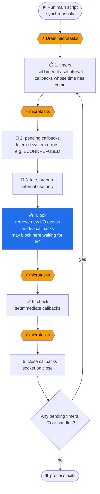
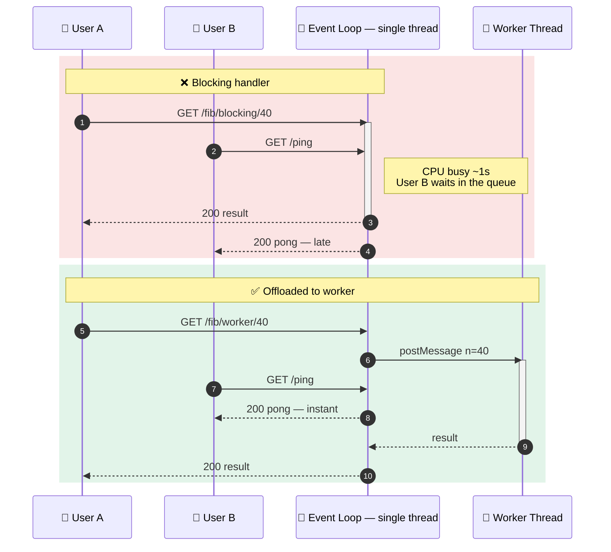

> 📍 **ITEX 320** › **Unit 2** › [**2.1 Backend Foundations: Concepts**](README.md) › The Node.js Event Loop

# 🔄 The Node.js Event Loop

### B.1 The mental model

Node.js runs **your JavaScript on a single main thread**. It still handles thousands of concurrent requests because it **never waits**. Slow work (network, disk, DNS, crypto) is handed off, and your callback runs when the result is ready.

| Layer | What it is | Handles |
|-------|-----------|---------|
| **V8** | Google's JavaScript engine | Executes JS, manages the heap and call stack, runs the **microtask queue** (Promises) |
| **libuv** | C library for cross-platform async I/O | The **event loop phases**, timers, and a **thread pool** (4 threads by default) |
| **OS kernel** | `epoll` (Linux), `kqueue` (macOS), IOCP (Windows) | **Network sockets**, which are truly async and don't use the thread pool |

> 🎯 **Key Concept:** Network I/O is async **at the OS level**. Only `fs.*`, `dns.lookup`, some `crypto` functions (`pbkdf2`, `scrypt`, `randomBytes`) and `zlib` use libuv's **thread pool** (size set by `UV_THREADPOOL_SIZE`, default 4). Five concurrent `bcrypt` hashes on a default pool means one of them waits in line.

### B.2 The phases of one loop iteration ("tick")



The **⚡ microtask checkpoint** runs after **every single callback** from any phase (Node ≥ 11), not just between phases. At each checkpoint Node drains, in this order:

1. The **`process.nextTick` queue** (Node-specific, highest priority)
2. The **Promise microtask queue** (`.then`, `await` continuations, `queueMicrotask`)

### B.3 Microtasks vs. macrotasks

| | **Microtasks** | **Macrotasks** (a.k.a. tasks) |
|---|---|---|
| Sources | `process.nextTick`, `Promise.then/catch/finally`, `await`, `queueMicrotask` | `setTimeout`, `setInterval`, `setImmediate`, I/O callbacks, `close` events |
| Owner | V8 (Promises) + Node (`nextTick`) | libuv event-loop phases |
| When they run | **Immediately** after the current callback, before the loop moves on | One per phase slot, as the loop cycles |
| Drained? | **Completely**, including microtasks queued *by* microtasks | One batch per phase per tick |
| Danger | A recursive microtask **starves** the loop forever (no I/O ever runs) | Long callbacks delay everything behind them |

### B.4 Predict the output 🧠

Save as `order.cjs` and run with `node order.cjs`. **Write down your prediction first!**

```js
// order.cjs — CommonJS on purpose (see the ESM twist below)
const { readFile } = require('node:fs');

console.log('A sync start');

setTimeout(() => console.log('F timeout'), 0);          // macrotask: timers phase
setImmediate(() => console.log('G immediate'));        // macrotask: check phase
process.nextTick(() => console.log('C nextTick'));     // microtask: nextTick queue
Promise.resolve().then(() => console.log('D promise')); // microtask: promise queue
queueMicrotask(() => console.log('E queueMicrotask')); // microtask: promise queue

console.log('B sync end');

readFile(__filename, () => {
  // We are now INSIDE the poll phase.
  console.log('--- inside I/O callback ---');
  setTimeout(() => console.log('I/O timeout'), 0);
  setImmediate(() => console.log('I/O immediate'));
  process.nextTick(() => console.log('I/O nextTick'));
  Promise.resolve().then(() => console.log('I/O promise'));
});
```

<details>
<summary><b>👉 Click to reveal the actual output (Node 22+)</b></summary>

```text
A sync start
B sync end
C nextTick
D promise
E queueMicrotask
F timeout          ← ⚠️ F and G may swap on some runs (see below)
G immediate
--- inside I/O callback ---
I/O nextTick
I/O promise
I/O immediate      ← ✅ ALWAYS before "I/O timeout"
I/O timeout
```

**Why?**

1. **A, B**: all synchronous code runs to completion first. Nothing interrupts the call stack.
2. **C**: `nextTick` queue drains before the Promise queue.
3. **D, E**: Promise microtasks, in FIFO order.
4. **F vs. G are non-deterministic in the main module.** `setTimeout(fn, 0)` is really 1 ms. Whether 1 ms has passed by the time the loop enters the *timers* phase depends on process startup speed. Run it 10 times and you may see both orders.
5. **Inside the I/O callback we are in the *poll* phase.** The next phase is always *check* (`setImmediate`), and *timers* come only on the next iteration. That's why `setImmediate` **always** wins inside I/O callbacks.

</details>

> ⚠️ **ESM Gotcha:** Rename the file to `order.mjs` (and use `import`) and the output becomes `A, B, D, E, C, …`. **Promises run before `nextTick`**. ES modules are evaluated *inside* a Promise job, so the Promise microtask queue is already being drained when your top-level code finishes, and the `nextTick` queue has to wait. Don't write code that depends on the relative order of `nextTick` and Promises.

### B.5 Blocking the event loop (the #1 Node.js production bug)

Because there is **one** JS thread, **any CPU-heavy synchronous code freezes every user**: huge `JSON.parse`, synchronous crypto, regex backtracking (ReDoS), image resizing in JS, or `fs.readFileSync` inside a handler.



```js
// src/blocking-demo.js — run: node src/blocking-demo.js
import express from 'express';
import { Worker, isMainThread, parentPort, workerData } from 'node:worker_threads';

// CPU-bound work: naive Fibonacci (deliberately slow).
const fib = (n) => (n < 2 ? n : fib(n - 1) + fib(n - 2));

if (!isMainThread) {
  // Runs inside the worker thread — its own V8 isolate and event loop.
  parentPort.postMessage(fib(workerData.n));
} else {
  const app = express();

  app.get('/ping', (req, res) => res.json({ pong: Date.now() }));

  // ❌ Blocks the ONE main thread: every other request waits until this finishes.
  app.get('/fib/blocking/:n', (req, res) => {
    res.json({ result: fib(Number(req.params.n)) });
  });

  // ✅ Offloads to a worker thread: the event loop stays free to serve /ping.
  app.get('/fib/worker/:n', async (req, res) => {
    const result = await new Promise((resolve, reject) => {
      const worker = new Worker(new URL(import.meta.url), { workerData: { n: Number(req.params.n) } });
      worker.once('message', resolve);
      worker.once('error', reject);
    });
    res.json({ result });
  });

  app.listen(3001, () => console.log('Blocking demo on http://localhost:3001'));
}
```

**Measure it yourself** (numbers from an Apple Silicon laptop):

```bash
curl -s localhost:3001/fib/blocking/40 > /dev/null &  sleep 0.2
curl -s -o /dev/null -w "ping during blocking: %{time_total}s\n" localhost:3001/ping
# ping during blocking: 0.473837s   ← /ping had to wait for fib to finish

curl -s localhost:3001/fib/worker/40 > /dev/null &  sleep 0.2
curl -s -o /dev/null -w "ping during worker:   %{time_total}s\n" localhost:3001/ping
# ping during worker:   0.001486s   ← ~300× faster: the loop was free
```

> 💡 **Pro-Tip:** Spawning a `Worker` per request costs ~30–50 ms and some memory. In production, use a **worker pool** (e.g. [`piscina`](https://github.com/piscinajs/piscina)) that keeps threads warm. And measure before you optimize: `perf_hooks.monitorEventLoopDelay()` tells you if your loop is actually blocked. Try adding its p99 to the `/health` route of the [Bookstore reference project](../Reference%20Project%20-%20Bookstore/README.md#backendsrcappjs).

| Scaling tool | What it parallelizes | Shares memory? | Use it for |
|--------------|---------------------|:---:|-----------|
| `worker_threads` | CPU work **inside one process** | Yes (`SharedArrayBuffer`) | Image processing, hashing, parsing big files |
| `node:cluster` / PM2 cluster mode | Whole app across **CPU cores** | No | Using all cores on one machine |
| Multiple containers behind Nginx / a load balancer | Whole app across **machines** | No | Horizontal scaling (Unit 4) |

---

| [⬅️ 🌐 Web Servers vs. Reverse Proxies](1-Web-Servers-and-Reverse-Proxies.md) | [🏠 2.1 Concepts](README.md) | [🧭 RESTful API Design & Best Practices ➡️](3-RESTful-API-Design.md) |
|:---|:---:|---:|
