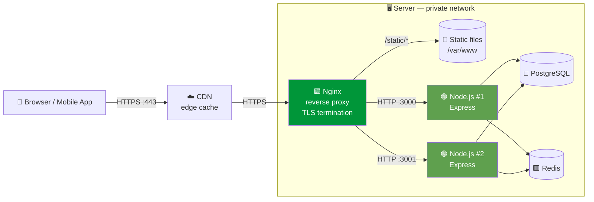
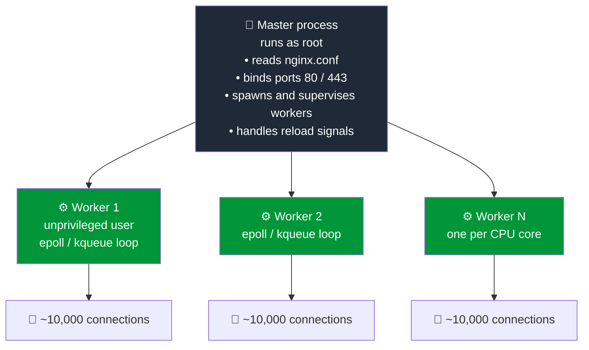

> 📍 **ITEX 320** › **Unit 2** › [**Topic 2.1: Backend Foundations**](README.md) › Part A — Web Servers vs. Reverse Proxies

# 🌐 Part A — Web Servers vs. Reverse Proxies

### A.1 Who does what?

When a browser calls `https://api.example.com/api/v1/books`, the request usually passes through **several specialized components** before it reaches your JavaScript code.

| Component | Job | Typical Tools | Knows about your business logic? |
|-----------|-----|---------------|:---:|
| **Web server** | Serves files (HTML, CSS, images) from disk over HTTP | Nginx, Apache, Caddy | ❌ |
| **Application server** | Runs *your code* and generates dynamic responses | Node.js + Express, Gunicorn, Tomcat | ✅ |
| **Reverse proxy** | Sits *in front of* app servers; receives client requests and forwards them | Nginx, HAProxy, Traefik, Envoy | ❌ |
| **Load balancer** | A reverse proxy that spreads traffic across many app instances | Nginx `upstream`, AWS ALB, HAProxy | ❌ |
| **API gateway** | Reverse proxy + API concerns (auth, quotas, API keys, routing across microservices) | Kong, AWS API Gateway, Apigee | Partially |
| **CDN** | Geographically distributed cache at the network edge | Cloudflare, CloudFront, Fastly | ❌ |

> 🎯 **Key Concept:** A **forward proxy** acts on behalf of *clients* (for example, a corporate proxy hides employees from the internet). A **reverse proxy** acts on behalf of *servers*: it hides your backend from the internet. Clients think they are talking to Nginx. They never see Node.js directly.

### A.2 Production topology



### A.3 Why put Nginx in front of Node.js?

| Concern | Without reverse proxy | With Nginx in front |
|---------|----------------------|---------------------|
| **TLS/HTTPS** | Node handles certificates and encryption on the same thread as your app logic | Nginx terminates TLS in optimized C; Node receives plain HTTP on loopback |
| **Static files** | Express `static` middleware uses JS thread time | Served from disk via `sendfile()` without touching Node |
| **Slow clients** | A client on a 2G network holds a Node socket open for its whole upload | Nginx buffers the full request, then hands Node a fast, complete request |
| **Scaling** | One process uses one CPU core | `upstream` load-balances across N processes or machines |
| **Zero-downtime deploys** | Restart equals dropped connections | Drain one upstream at a time |
| **Protection** | Every malformed or oversized request hits JS | `client_max_body_size`, `limit_req`, and timeouts stop abuse at the edge |
| **Compression** | `compression` middleware costs CPU in the event loop | `gzip` / `brotli` handled natively |

### A.4 Inside Nginx: the master–worker architecture

Nginx is fast for the **same reason Node.js is fast**: it is **event-driven and non-blocking**. It does not use one thread per connection.



| Model | Example | Connections per worker | Memory per connection | C10k-ready? |
|-------|---------|:---:|:---:|:---:|
| Process-per-connection | Apache `prefork` | 1 | High (MBs) | ❌ |
| Thread-per-connection | Apache `worker`, classic Java servlets | 1 | Medium (stack per thread) | ⚠️ |
| **Event loop** | **Nginx, Node.js** | **Thousands** | **Low (KBs)** | ✅ |

> 💡 **Pro-Tip:** `nginx -s reload` sends `SIGHUP` to the master. The master starts **new** workers with the new config, and the old workers finish their in-flight requests before exiting. That gives you config changes with **zero dropped connections**. Always run `nginx -t` (config test) first.

### A.5 Production Nginx configuration

Save as `/etc/nginx/conf.d/itex320-api.conf`:

```nginx
# Two Node.js processes behind one Nginx — Nginx load-balances between them.
upstream api_backend {
    least_conn;                     # send to the instance with fewest active connections
    server 127.0.0.1:3000;
    server 127.0.0.1:3001;
    keepalive 32;                   # reuse TCP connections to Node (saves handshakes)
}

# 10 requests/second per client IP, tracked in a 10 MB shared-memory zone.
limit_req_zone $binary_remote_addr zone=api_rl:10m rate=10r/s;

# Redirect all plain HTTP to HTTPS.
server {
    listen 80;
    server_name api.itex320.local;
    return 301 https://$host$request_uri;
}

server {
    listen 443 ssl;
    http2 on;
    server_name api.itex320.local;

    # TLS terminates here — Node only ever speaks plain HTTP on loopback.
    ssl_certificate     /etc/nginx/certs/api.crt;
    ssl_certificate_key /etc/nginx/certs/api.key;
    ssl_protocols       TLSv1.2 TLSv1.3;

    client_max_body_size 1m;        # reject huge bodies before they reach Node
    gzip on;
    gzip_types application/json application/problem+json;

    # Static assets served straight from disk — Node never sees these requests.
    location /static/ {
        root /var/www/itex320;
        expires 30d;
        add_header Cache-Control "public, immutable";
    }

    location = /health {
        proxy_pass http://api_backend;
        access_log off;
    }

    location /api/ {
        limit_req zone=api_rl burst=20 nodelay;   # absorb short bursts, then 503

        proxy_pass http://api_backend;
        proxy_http_version 1.1;
        proxy_set_header Connection "";            # required for upstream keepalive

        # Tell Express who the real client is (read via app.set('trust proxy', ...)).
        proxy_set_header Host              $host;
        proxy_set_header X-Real-IP         $remote_addr;
        proxy_set_header X-Forwarded-For   $proxy_add_x_forwarded_for;
        proxy_set_header X-Forwarded-Proto $scheme;
        proxy_set_header X-Request-Id      $request_id;   # correlation ID for logs

        proxy_connect_timeout 5s;
        proxy_read_timeout    30s;
    }
}
```

> ⚠️ **Security Warning:** Behind a proxy, `req.ip` in Express is **always `127.0.0.1`** unless you set `app.set('trust proxy', ...)`. But **never** use `app.set('trust proxy', true)` on a server that is reachable directly from the internet. An attacker can send a fake `X-Forwarded-For: 1.2.3.4` header and bypass IP-based rate limits or audit logs. Trust only the proxy hop you control (`'loopback'`, a specific IP, or a hop count).

> 💡 **Pro-Tip:** Node's `server.keepAliveTimeout` must be **longer** than the proxy's idle timeout for upstream connections (Nginx: 60 s by default, AWS ALB: 60 s). Otherwise Node closes a socket at the same moment Nginx reuses it, and you get random, hard-to-reproduce **502 Bad Gateway** errors. The reference server in [Part D](PartD-Reference-Implementation.md#backendsrcserverjs) uses 65 s.

---

| ⬅️ — | [🏠 Topic 2.1 Overview](README.md) | [🔄 Part B — The Node.js Event Loop ➡️](PartB-Nodejs-Event-Loop.md) |
|:---|:---:|---:|
