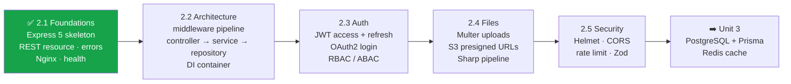

> 📍 **ITEX 320** › **Unit 2** › [**Topic 2.1: Backend Foundations**](README.md) › Part F — Student Lab Exercise

# 🧪 Part F — Student Lab Exercise

### 🗺️ Unified Backend Roadmap

Across Unit 2 you'll grow **one** codebase, `itex320-api`, which becomes the backend for your semester-long full-stack project (Project Milestone 2).

### Lab 2.1: Build the `itex320-api` skeleton

**Goal:** Build a running Express 5 API for **your own project's main resource** (e.g. `events`, `products`, `courses`, `tickets`; not `books`), served through Nginx, with correct REST semantics.

**⏱ Time:** 2 lab hours · **👥 Team:** your project group · **📦 Deliverable:** GitHub repo, tag `lab-2.1`

#### Tasks

- [ ] **T1: Scaffold.** `npm init`, `"type": "module"`, Express 5, the layered `src/` structure from the [Part D Bookstore](PartD-Reference-Implementation.md#04-final-folder-structure) (routes → controllers → services → repositories), plus unit + integration tests, and `dev` / `start` scripts. Add a `.gitignore` and a `.nvmrc` containing `22`.
- [ ] **T2: Resource design (on paper first).** In `docs/API.md`, write a table of every endpoint for your resource: method, path, request body, success code, error codes. Include at least one **nested** route (e.g. `GET /events/:id/attendees`).
- [ ] **T3: Implement CRUD.** All 6 operations (list, get, create, replace, patch, delete) with the correct status codes and a `Location` header on create.
- [ ] **T4: Query features.** Pagination (`page`, `limit` capped at 100), one filter, and whitelisted sorting with `-` for descending. Return `meta` + `links`.
- [ ] **T5: Errors.** Every error, including unknown routes, malformed JSON and oversized bodies, returns **RFC 9457** `application/problem+json` with a `requestId`.
- [ ] **T6: Event loop experiment.** Add `blocking-demo.js` from [Part B §B.5](PartB-Nodejs-Event-Loop.md#b5-blocking-the-event-loop-the-1-nodejs-production-bug). Record the `/ping` latency during blocking vs. worker requests in `docs/EVENT_LOOP.md`, and explain *why* in 3–5 sentences using the phase diagram.
- [ ] **T7: Reverse proxy.** Run **two** instances (`PORT=3000` and `PORT=3001`) behind Nginx using the config from [Part A §A.5](PartA-Web-Servers-and-Reverse-Proxies.md#a5-production-nginx-configuration). Local option: `brew install nginx` / `apt install nginx`, or the `nginx:stable` Docker image with `host.docker.internal`. Prove load balancing by adding `pid: process.pid` to `/health` and calling it repeatedly through Nginx.
- [ ] **T8: Graceful shutdown.** Send `SIGTERM` while a slow request is in flight and show it still completes.

#### ✔️ Acceptance criteria (self-grade before submitting)

| Check | Command | Expected |
|-------|---------|----------|
| Create returns 201 + Location | `curl -i -X POST .../api/v1/<resource> -d '{...}'` | `201`, `Location: /api/v1/<resource>/<uuid>` |
| Delete is 204, then 404 | `curl -i -X DELETE ...` twice | `204`, then `404` Problem Details |
| Bad JSON handled | `curl -X POST ... -d '{bad'` | `400`, `application/problem+json` |
| Unknown sort rejected | `?sort=-passwordHash` | `400` |
| `limit` capped | `?limit=100000` | `meta.limit` equals `100` |
| No framework leak | `curl -I .../health` | **no** `X-Powered-By` header |
| Load balanced | `for i in {1..6}; do curl -s https://localhost/health -k; done` | `pid` alternates between 2 values |
| Real client IP | log `req.ip` behind Nginx | not `127.0.0.1` when called from another machine |

#### 🚀 Stretch goals

- ⭐ Add `ETag` support on `GET /:id` and return **`304 Not Modified`** when `If-None-Match` matches.
- ⭐ Implement **cursor-based** pagination as an alternative to `page`.
- ⭐⭐ Support an `Idempotency-Key` header on `POST` so retried requests don't create duplicates.
- ⭐⭐ Replace per-request `new Worker()` with a `piscina` pool and benchmark both with `autocannon`.

> ⚠️ **Security Warning:** Commit **no** secrets, certificates or `.env` files. Generate a local self-signed certificate with `mkcert` or `openssl` and add `certs/` to `.gitignore`.

---

| [⬅️ ✅ Part E — Self-Check Quiz](PartE-Self-Check-Quiz.md) | [🏠 Topic 2.1 Overview](README.md) | [Topic 2.2 ➡️](../2.2%20Express%20Architecture%20%26%20Middleware/README.md) |
|:---|:---:|---:|
