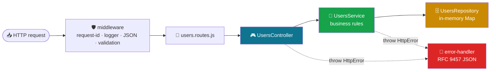

<div align="center">


# 🛠️ Topic 2.1 — Backend Foundations

### Assignment 2.1: scaffold the `users-api`, a layered REST API with Express 5


</div>

---

> 📖 **Read the theory first:** [2.1 Concepts](../2.1%20Backend%20Foundations%20-%20Concepts/README.md)
> 1. [Web Servers vs. Reverse Proxies](../2.1%20Backend%20Foundations%20-%20Concepts/1-Web-Servers-and-Reverse-Proxies.md)
> 2. [The Node.js Event Loop](../2.1%20Backend%20Foundations%20-%20Concepts/2-Nodejs-Event-Loop.md)
> 3. [RESTful API Design](../2.1%20Backend%20Foundations%20-%20Concepts/3-RESTful-API-Design.md)
> 4. [Self-Quiz](../2.1%20Backend%20Foundations%20-%20Concepts/4-Self-Quiz.md)
>
> This page contains **only what you need to build the project**, step by step. Every file is shown in full: copy each one into the exact path in its heading.

## 🎯 Goal

Build a **Users REST API** with **Node.js + Express 5**, organised in layers:



| Layer | Job | Knows HTTP? |
|-------|-----|:---:|
| **Route** | URL + method → middleware → controller method | ✅ |
| **Controller** | Read `req`, call the service, send the response | ✅ |
| **Service** | Business rules: unique email, hash the password, never return the hash | ❌ |
| **Repository** | Store and find data (a `Map` now, PostgreSQL in Unit 3) | ❌ |

In this first version there is **no DI container** and **one router** (users only). `UsersController` is a **class that creates its own service**. Assignment 2.2 refactors that into dependency injection.

The same `users-api` repository grows through every Unit 2 assignment: **2.1 scaffold → 2.2 middleware + DI → 2.3 auth → 2.4 file uploads → 2.5 security.**

### ✅ Requirements

- Node.js **22.12 or newer** (`node -v`), npm, Git, VS Code
- ES Modules (`"type": "module"`): relative imports **must** end in `.js`
- 🪟 **Windows users:** run every command in these guides in **Git Bash** (installed with [Git for Windows](https://git-scm.com/download/win); in VS Code choose *Terminal → New Terminal → ⌄ → Git Bash*). The commands are written for bash (`mkdir -p`, `cp`, `curl` with single quotes) and will **not** work as-is in PowerShell or CMD.

---

## Step 1: Create the project

```bash
mkdir users-api && cd users-api
git init
mkdir -p src/{config,controllers,routes,services,repositories,middleware,utils,validators}

npm init -y
npm pkg set type=module
npm pkg set scripts.dev="node --env-file-if-exists=.env --watch src/server.js"
npm pkg set scripts.start="node --env-file-if-exists=.env src/server.js"
npm install express@5

printf "node_modules/\n.env\n" > .gitignore
```

## Step 2: Target folder structure

```text
users-api/
├── .env.example                    ← Step 3
├── .gitignore                      ← Step 1
├── package.json                    ← Step 1
└── src/
    ├── server.js                   ← Step 12
    ├── app.js                      ← Step 11
    ├── config/
    │   └── env.js                  ← Step 3
    ├── utils/
    │   ├── http-error.js           ← Step 4
    │   ├── query.js                ← Step 4
    │   └── password.js             ← Step 4
    ├── repositories/
    │   ├── in-memory.repository.js ← Step 5
    │   └── users.repository.js     ← Step 5
    ├── validators/
    │   ├── rules.js                ← Step 6
    │   ├── validate.js             ← Step 6
    │   └── user.schema.js          ← Step 6
    ├── services/
    │   └── users.service.js        ← Step 7
    ├── middleware/
    │   ├── request-id.js           ← Step 8
    │   ├── request-logger.js       ← Step 8
    │   ├── validate-body.js        ← Step 8
    │   ├── not-found.js            ← Step 8
    │   └── error-handler.js        ← Step 8
    ├── controllers/
    │   └── users.controller.js     ← Step 9
    └── routes/
        └── users.routes.js         ← Step 10
```

We build **bottom-up**: config → utils → repository → validation → service → middleware → controller → routes → app → server. Each file only imports files you've already written.

---

## Step 3: Configuration

### `.env.example`

```bash
# Copy this file to .env and adjust. Never commit .env.
NODE_ENV=development
PORT=3000
HOST=127.0.0.1
BODY_LIMIT=100kb
```

```bash
cp .env.example .env
```

### `src/config/env.js`

```js
// Central place for configuration. Every other file imports `config` instead of reading process.env.

const toInt = (value, fallback) => {
  const n = Number.parseInt(value, 10);
  return Number.isNaN(n) ? fallback : n;
};

export const config = Object.freeze({
  env: process.env.NODE_ENV ?? 'development',
  port: toInt(process.env.PORT, 3000),
  host: process.env.HOST ?? '127.0.0.1',
  bodyLimit: process.env.BODY_LIMIT ?? '100kb',
  isTest: process.env.NODE_ENV === 'test',
});
```

---

## Step 4: Utilities

### `src/utils/http-error.js`

An `Error` that knows its HTTP status. Services `throw notFound(...)` and never touch `res`.

```js
// An Error that knows its HTTP status. The error-handler middleware turns it into
// an RFC 9457 "Problem Details" JSON response.
export class HttpError extends Error {
  constructor(status, title, detail, extras = {}) {
    super(detail ?? title);
    this.name = 'HttpError';
    this.status = status;
    this.title = title;
    this.detail = detail;
    this.extras = extras; // extra JSON fields, e.g. { errors: [...] }
  }
}

export const badRequest = (detail, errors) =>
  new HttpError(400, 'Bad Request', detail, errors ? { errors } : {});

export const notFound = (detail) => new HttpError(404, 'Not Found', detail);

export const conflict = (detail) => new HttpError(409, 'Conflict', detail);
```

### `src/utils/query.js`

Pagination (`?page=2&limit=10`), sorting (`?sort=-createdAt`) and `next`/`prev` links.

```js
import { badRequest } from './http-error.js';

export const DEFAULT_LIMIT = 20;
export const MAX_LIMIT = 100;

// ?page=2&limit=10 → { page: 2, limit: 10 }. Bad or missing values fall back to safe defaults.
export function parsePagination(query = {}) {
  const page = Math.max(1, Number.parseInt(query.page, 10) || 1);
  const limit = Math.min(MAX_LIMIT, Math.max(1, Number.parseInt(query.limit, 10) || DEFAULT_LIMIT));
  return { page, limit };
}

// ?sort=-price → sorts by price descending. Only whitelisted fields are allowed.
export function sortItems(items, sortParam, allowedFields) {
  if (sortParam === undefined) return items;
  if (typeof sortParam !== 'string') throw badRequest('sort must be a single field name');

  const desc = sortParam.startsWith('-');
  const field = desc ? sortParam.slice(1) : sortParam;
  if (!allowedFields.includes(field)) {
    throw badRequest(`Cannot sort by "${field}". Allowed: ${allowedFields.join(', ')}`);
  }

  const direction = desc ? -1 : 1;
  // Copy first: never mutate the caller's array.
  return [...items].sort((a, b) => {
    if (a[field] === b[field]) return 0;
    return a[field] > b[field] ? direction : -direction;
  });
}

// Slice one page out of an array and describe it.
export function paginate(items, { page, limit }) {
  const total = items.length;
  const totalPages = Math.max(1, Math.ceil(total / limit));
  const data = items.slice((page - 1) * limit, page * limit);
  return { data, meta: { page, limit, total, totalPages } };
}

// Build self/next/prev links from the incoming request so filters and sort are preserved.
export function pageLinks(req, { page, totalPages }) {
  const linkFor = (p) => {
    const url = new URL(req.originalUrl, 'http://placeholder'); // base is required but discarded
    url.searchParams.set('page', p);
    return url.pathname + url.search;
  };
  return {
    self: linkFor(page),
    next: page < totalPages ? linkFor(page + 1) : null,
    prev: page > 1 ? linkFor(page - 1) : null,
  };
}
```

### `src/utils/password.js`

```js
import { randomBytes, scrypt, timingSafeEqual } from 'node:crypto';
import { promisify } from 'node:util';

// scrypt is a slow, memory-hard hash built into Node — no extra package needed.
// It runs on libuv's thread pool, so it does NOT block the event loop.
const scryptAsync = promisify(scrypt);
const KEY_LENGTH = 64;

// Returns "scrypt$<salt hex>$<hash hex>" — store this, never the plain password.
export async function hashPassword(plain) {
  const salt = randomBytes(16);
  const hash = await scryptAsync(plain, salt, KEY_LENGTH);
  return `scrypt$${salt.toString('hex')}$${hash.toString('hex')}`;
}

export async function verifyPassword(plain, stored) {
  const [algorithm, saltHex, hashHex] = stored.split('$');
  if (algorithm !== 'scrypt' || !saltHex || !hashHex) return false;

  const expected = Buffer.from(hashHex, 'hex');
  const actual = await scryptAsync(plain, Buffer.from(saltHex, 'hex'), expected.length);
  // Constant-time comparison prevents timing attacks.
  return timingSafeEqual(expected, actual);
}
```

> ⚠️ **Security Warning:** Never store plain passwords, and never use fast hashes like MD5 or SHA-256 for them. `scrypt` is deliberately slow, and the random salt gives two identical passwords different hashes.

---

## Step 5: The repository layer (data access)

The repository is the only layer that touches stored data. Here the "database" is a JavaScript `Map` held in memory, so data is lost when the server restarts. In Unit 3 we replace it with PostgreSQL + Prisma, keeping the **same method names** so the service doesn't change.

### `src/repositories/in-memory.repository.js`

A generic "table" with create / read / update / delete.

```js
import { randomUUID } from 'node:crypto';

// A tiny in-memory "database table". Every method is async on purpose:
// in Unit 3 we replace this class with a Prisma/PostgreSQL repository that has the
// SAME method names, and the services above it won't need to change.
export class InMemoryRepository {
  #rows = new Map();

  async findAll() {
    return [...this.#rows.values()].map((row) => structuredClone(row));
  }

  async findById(id) {
    const row = this.#rows.get(id);
    return row ? structuredClone(row) : null;
  }

  async findOne(predicate) {
    for (const row of this.#rows.values()) {
      if (predicate(row)) return structuredClone(row);
    }
    return null;
  }

  async create(data) {
    const now = new Date().toISOString();
    const row = { id: randomUUID(), ...data, createdAt: now, updatedAt: now };
    this.#rows.set(row.id, row);
    return structuredClone(row);
  }

  async update(id, changes) {
    const existing = this.#rows.get(id);
    if (!existing) return null;
    // id and createdAt can never be overwritten.
    const row = { ...existing, ...changes, id, createdAt: existing.createdAt, updatedAt: new Date().toISOString() };
    this.#rows.set(id, row);
    return structuredClone(row);
  }

  async delete(id) {
    return this.#rows.delete(id);
  }
}
```

### `src/repositories/users.repository.js`

Extends the generic repository with a users-only query.

```js
import { InMemoryRepository } from './in-memory.repository.js';

export class UsersRepository extends InMemoryRepository {
  findByEmail(email) {
    return this.findOne((user) => user.email === email.toLowerCase());
  }
}
```

| Concept | Where | Why |
|---------|-------|-----|
| `#rows` private field | `InMemoryRepository` | Nothing outside the class can reach the data directly |
| `async` methods | every method | A real database is async, so the service already uses `await` and won't need changing later |
| `structuredClone(row)` | every read/write | Returns a **copy**, so changing a returned object can't silently change the stored data |
| `randomUUID()`, `createdAt`, `updatedAt` | `create()` | The server, not the client, sets ids and timestamps |
| `extends` + `findByEmail()` | `UsersRepository` | Reuse the generic CRUD methods and add queries specific to one table |

💡 **Quick check:** run this from the project folder. It should print the stored user with an `id` and timestamps, even though the lookup email is in capitals.

```bash
node -e "import('./src/repositories/users.repository.js').then(async ({ UsersRepository }) => { const r = new UsersRepository(); await r.create({ email: 'a@b.com' }); console.log(await r.findByEmail('A@B.com')); })"
# { id: '2d538422-...', email: 'a@b.com', createdAt: '2026-...', updatedAt: '2026-...' }
```

---

## Step 6: Validation

**Never trust the client.** Every request body is checked before it reaches the controller. (In Topic 2.5 this hand-made layer is replaced by **Zod**.)

### `src/validators/rules.js`

Small reusable checks. Each returns an error message, or `null` if the value is fine.

```js
// Small, reusable checks. Each returns an error message string, or null when the value is valid.
// In Topic 2.5 we replace this hand-made layer with Zod — the idea stays exactly the same.

export const string = ({ min = 1, max = 255 } = {}) => (value) => {
  if (typeof value !== 'string') return 'must be a string';
  const length = value.trim().length;
  if (length < min) return min === 1 ? 'must not be empty' : `must be at least ${min} characters`;
  if (length > max) return `must be at most ${max} characters`;
  return null;
};

export const integer = ({ min = Number.MIN_SAFE_INTEGER, max = Number.MAX_SAFE_INTEGER } = {}) => (value) => {
  if (!Number.isInteger(value)) return 'must be an integer';
  if (value < min || value > max) return `must be between ${min} and ${max}`;
  return null;
};

export const money = ({ min = 0, max = 100_000 } = {}) => (value) => {
  if (typeof value !== 'number' || !Number.isFinite(value)) return 'must be a number';
  if (value < min || value > max) return `must be between ${min} and ${max}`;
  // Compare with a tiny tolerance: in floating point, 0.29 * 100 === 28.999999999999996.
  if (Math.abs(Math.round(value * 100) - value * 100) > 1e-9) return 'must have at most 2 decimal places';
  return null;
};

export const oneOf = (allowed) => (value) =>
  allowed.includes(value) ? null : `must be one of: ${allowed.join(', ')}`;

// Deliberately simple: "something@something.tld". Real verification = sending an email.
const EMAIL_PATTERN = /^[^\s@]+@[^\s@]+\.[^\s@]{2,}$/;
export const email = () => (value) => {
  if (typeof value !== 'string') return 'must be a string';
  if (value.length > 254 || !EMAIL_PATTERN.test(value.trim())) return 'must be a valid email address';
  return null;
};

// At least 8 characters with at least one letter and one digit.
// Max 72 keeps us compatible with bcrypt if we switch hashing algorithms later.
export const password = () => (value) => {
  if (typeof value !== 'string') return 'must be a string';
  if (value.length < 8 || value.length > 72) return 'must be 8-72 characters long';
  if (!/[A-Za-z]/.test(value) || !/\d/.test(value)) return 'must contain at least one letter and one digit';
  return null;
};

export const phone = () => (value) => {
  if (typeof value !== 'string') return 'must be a string';
  return /^\+?[0-9][0-9\s-]{6,19}$/.test(value.trim()) ? null : 'must be a valid phone number, e.g. +977-9800000000';
};

// "YYYY-MM-DD", a real calendar date, and in the past.
export const pastDate = () => (value) => {
  if (typeof value !== 'string' || !/^\d{4}-\d{2}-\d{2}$/.test(value)) return 'must be a date in YYYY-MM-DD format';
  const date = new Date(`${value}T00:00:00Z`);
  if (Number.isNaN(date.getTime()) || date.toISOString().slice(0, 10) !== value) return 'must be a real calendar date';
  if (date >= new Date()) return 'must be in the past';
  return null;
};

// ISBN-13 with checksum: digits weighted 1,3,1,3,... must sum to a multiple of 10.
export const isbn13 = () => (value) => {
  if (typeof value !== 'string') return 'must be a string';
  const digits = value.replace(/[-\s]/g, '');
  if (!/^\d{13}$/.test(digits)) return 'must be a 13-digit ISBN';
  const sum = [...digits].reduce((acc, d, i) => acc + Number(d) * (i % 2 === 0 ? 1 : 3), 0);
  return sum % 10 === 0 ? null : 'has an invalid ISBN-13 checksum';
};

// Validates a nested object against a map of { field: { required, check } }.
export const object = (shape) => (value) => {
  if (value === null || typeof value !== 'object' || Array.isArray(value)) return 'must be an object';
  for (const [field, rule] of Object.entries(shape)) {
    if (value[field] === undefined) {
      if (rule.required) return `${field} is required`;
      continue;
    }
    const message = rule.check(value[field]);
    if (message) return `${field} ${message}`;
  }
  const unknown = Object.keys(value).find((key) => !(key in shape));
  return unknown ? `${unknown} is not allowed` : null;
};

// Common transforms applied AFTER a value passes its check.
export const trim = (value) => value.trim();
export const lowercase = (value) => value.trim().toLowerCase();
export const digitsOnly = (value) => value.replace(/[-\s]/g, '');
```

### `src/validators/validate.js`

```js
import { badRequest } from '../utils/http-error.js';

/**
 * Validate a request body against a schema.
 *
 * schema = { fieldName: { required: boolean, check: (value) => message|null, transform?: (value) => value } }
 *
 * - Unknown fields are rejected (stops "mass assignment", e.g. a client sending { "role": "admin" }).
 * - partial: true (for PATCH) makes every field optional but requires at least one.
 * - Returns a NEW object containing only the cleaned, allowed fields.
 */
export function validate(schema, body, { partial = false } = {}) {
  if (body === null || typeof body !== 'object' || Array.isArray(body)) {
    throw badRequest('Request body must be a JSON object');
  }

  const errors = [];
  const data = {};

  for (const [field, rule] of Object.entries(schema)) {
    const value = body[field];
    if (value === undefined) {
      if (rule.required && !partial) errors.push({ field, message: 'is required' });
      continue;
    }
    const message = rule.check(value);
    if (message) errors.push({ field, message });
    else data[field] = rule.transform ? rule.transform(value) : value;
  }

  for (const field of Object.keys(body)) {
    if (!(field in schema)) errors.push({ field, message: 'is not allowed' });
  }

  if (errors.length > 0) throw badRequest('Request body failed validation', errors);
  if (partial && Object.keys(data).length === 0) throw badRequest('Provide at least one field to update');

  return data;
}
```

### `src/validators/user.schema.js`

```js
import { email, lowercase, object, password, pastDate, phone, string, trim } from './rules.js';

const addressShape = {
  street:     { required: true,  check: string({ max: 120 }) },
  city:       { required: true,  check: string({ max: 80 }) },
  postalCode: { required: false, check: string({ max: 20 }) },
  country:    { required: true,  check: string({ max: 80 }) },
};

// NOTE: "role" is deliberately NOT here. Clients must never choose their own role.
// New users are always "customer"; Topic 2.3 adds an admin-only endpoint to change roles.
export const createUserSchema = {
  firstName:   { required: true,  check: string({ max: 50 }), transform: trim },
  lastName:    { required: true,  check: string({ max: 50 }), transform: trim },
  email:       { required: true,  check: email(),             transform: lowercase },
  password:    { required: true,  check: password() },
  phone:       { required: false, check: phone(),             transform: trim },
  dateOfBirth: { required: false, check: pastDate() },
  address:     { required: false, check: object(addressShape) },
};

// Profile updates: same fields minus password (password changes get their own flow in Topic 2.3).
const { password: _omitPassword, ...updatableFields } = createUserSchema;
export const updateUserSchema = updatableFields;
```

> ⚠️ **Security Warning (mass assignment):** `role` is deliberately **not** in the schema, and `validate()` rejects unknown fields. A client sending `{ "role": "admin" }` gets **400 "role is not allowed"**.

---

## Step 7: The service layer (business rules)

### `src/services/users.service.js`

```js
import { conflict, notFound } from '../utils/http-error.js';
import { hashPassword } from '../utils/password.js';
import { paginate, parsePagination, sortItems } from '../utils/query.js';

const SORTABLE_FIELDS = ['firstName', 'lastName', 'email', 'createdAt'];
export const ROLES = ['customer', 'admin'];

// Optional fields are stored as null so every user has the same shape.
const withDefaults = (profile) => ({
  ...profile,
  phone: profile.phone ?? null,
  dateOfBirth: profile.dateOfBirth ?? null,
  address: profile.address ?? null,
});

// The ONLY way a user leaves this service: without the password hash.
export const toPublicUser = ({ passwordHash, ...user }) => user;

export class UsersService {
  // `hash` is injectable so unit tests can use a fast fake instead of real scrypt.
  constructor(usersRepository, { hash = hashPassword } = {}) {
    this.users = usersRepository;
    this.hash = hash;
  }

  // query = { q, role, sort, page, limit }
  async list(query = {}) {
    let items = await this.users.findAll();

    if (typeof query.q === 'string' && query.q.trim()) {
      const needle = query.q.trim().toLowerCase();
      items = items.filter((u) =>
        `${u.firstName} ${u.lastName} ${u.email}`.toLowerCase().includes(needle),
      );
    }
    if (typeof query.role === 'string') {
      items = items.filter((u) => u.role === query.role);
    }

    items = sortItems(items, query.sort ?? 'lastName', SORTABLE_FIELDS);
    const page = paginate(items, parsePagination(query));
    return { ...page, data: page.data.map(toPublicUser) };
  }

  async getById(id) {
    const user = await this.users.findById(id);
    if (!user) throw notFound(`User ${id} does not exist`);
    return toPublicUser(user);
  }

  // `role` is a second argument, NOT part of the request body — only trusted code (seed, admin tools) sets it.
  async create(data, { role = 'customer' } = {}) {
    await this.#assertEmailAvailable(data.email);
    const { password, ...profile } = data;
    const passwordHash = await this.hash(password);
    const user = await this.users.create({ ...withDefaults(profile), role, passwordHash });
    return toPublicUser(user);
  }

  async update(id, changes) {
    await this.getById(id);
    if (changes.email) await this.#assertEmailAvailable(changes.email, id);
    return toPublicUser(await this.users.update(id, changes));
  }

  async remove(id) {
    await this.getById(id);
    await this.users.delete(id);
  }

  async #assertEmailAvailable(email, exceptId) {
    const existing = await this.users.findByEmail(email);
    if (existing && existing.id !== exceptId) throw conflict(`Email ${email} is already registered`);
  }
}
```

---

## Step 8: Middleware

### `src/middleware/request-id.js`

```js
import { randomUUID } from 'node:crypto';

// Give every request a correlation ID (reuse the one from Nginx if present).
// It is returned in the X-Request-Id header and included in logs and error responses.
export function requestId(req, res, next) {
  req.id = req.get('x-request-id') ?? randomUUID();
  res.set('X-Request-Id', req.id);
  next();
}
```

### `src/middleware/request-logger.js`

```js
// Logs one line per request AFTER the response is sent, e.g.
// GET /api/v1/books?page=2 200 3.4ms 5f2c...
export function requestLogger(req, res, next) {
  const start = process.hrtime.bigint();
  res.on('finish', () => {
    const ms = Number(process.hrtime.bigint() - start) / 1e6;
    console.log(`${req.method} ${req.originalUrl} ${res.statusCode} ${ms.toFixed(1)}ms ${req.id}`);
  });
  next();
}
```

### `src/middleware/validate-body.js`

```js
import { validate } from '../validators/validate.js';

// Route-level middleware: validate req.body against a schema, then replace it
// with the cleaned version so controllers only ever see safe, known fields.
export const validateBody = (schema, options) => (req, res, next) => {
  req.body = validate(schema, req.body, options);
  next();
};
```

### `src/middleware/not-found.js`

```js
import { HttpError } from '../utils/http-error.js';

// Reached only when no route matched.
export function notFoundHandler(req, res, next) {
  next(new HttpError(404, 'Not Found', `No route for ${req.method} ${req.path}`));
}
```

### `src/middleware/error-handler.js`

```js
import { HttpError } from '../utils/http-error.js';

// The ONE place that turns errors into HTTP responses (RFC 9457 Problem Details).
// Express recognises error handlers by their 4 parameters, so `next` must stay.
// eslint-disable-next-line no-unused-vars
export function errorHandler(err, req, res, next) {
  // HttpError → our status; body-parser errors carry err.status (400 bad JSON, 413 too large).
  const status = err instanceof HttpError ? err.status : (err.status ?? err.statusCode ?? 500);
  const isServerError = status >= 500;

  // Log full details for 5xx; never send stack traces to the client.
  if (isServerError) console.error({ requestId: req.id, err });

  res
    .status(status)
    .type('application/problem+json')
    .json({
      type: 'about:blank',
      title: err.title ?? (isServerError ? 'Internal Server Error' : 'Bad Request'),
      status,
      detail: isServerError ? 'An unexpected error occurred' : (err.detail ?? err.message),
      instance: req.originalUrl,
      requestId: req.id,
      ...(err.extras ?? {}),
    });
}
```

> 🎯 **Key Concept:** Express recognises an error handler by its **4 parameters** `(err, req, res, next)`. In **Express 5**, an `async` handler that throws (or rejects) is sent here automatically, so controllers need no `try/catch`.

---

## Step 9: The controller (a class that creates its own service)

### `src/controllers/users.controller.js`

```js
import { UsersRepository } from '../repositories/users.repository.js';
import { UsersService } from '../services/users.service.js';
import { pageLinks } from '../utils/query.js';

// The controller creates its own service (and the service's repository) — no container.
// Methods are ARROW FUNCTIONS so `this` still works when Express calls them as plain callbacks.
export class UsersController {
  constructor() {
    this.usersService = new UsersService(new UsersRepository());
  }

  list = async (req, res) => {
    const { data, meta } = await this.usersService.list(req.query);
    res.json({ data, meta, links: pageLinks(req, meta) });
  };

  getById = async (req, res) => {
    res.json({ data: await this.usersService.getById(req.params.id) });
  };

  create = async (req, res) => {
    const user = await this.usersService.create(req.body);
    res.status(201).location(`${req.baseUrl}/${user.id}`).json({ data: user });
  };

  update = async (req, res) => {
    res.json({ data: await this.usersService.update(req.params.id, req.body) });
  };

  remove = async (req, res) => {
    await this.usersService.remove(req.params.id);
    res.status(204).end();
  };
}
```

> ⚠️ **Why arrow functions?** The router receives `controller.list` as a plain function. A normal method would lose `this`, giving `TypeError: Cannot read properties of undefined (reading 'usersService')`. An arrow-function class field keeps `this` bound to the instance.

---

## Step 10: Routes

### `src/routes/users.routes.js`

```js
import { Router } from 'express';
import { UsersController } from '../controllers/users.controller.js';
import { validateBody } from '../middleware/validate-body.js';
import { createUserSchema, updateUserSchema } from '../validators/user.schema.js';

const controller = new UsersController();

export const usersRouter = Router();

usersRouter.get('/', controller.list);
usersRouter.get('/:id', controller.getById);
usersRouter.post('/', validateBody(createUserSchema), controller.create);
usersRouter.patch('/:id', validateBody(updateUserSchema, { partial: true }), controller.update);
usersRouter.delete('/:id', controller.remove);
```

---

## Step 11: The Express app

### `src/app.js`

```js
import express from 'express';
import { config } from './config/env.js';
import { errorHandler } from './middleware/error-handler.js';
import { notFoundHandler } from './middleware/not-found.js';
import { requestId } from './middleware/request-id.js';
import { requestLogger } from './middleware/request-logger.js';
import { usersRouter } from './routes/users.routes.js';

// Builds the Express app. Does NOT call listen() — server.js does that.
export function createApp() {
  const app = express();

  app.disable('x-powered-by'); // don't advertise the framework
  app.set('trust proxy', 'loopback'); // trust X-Forwarded-* only from a local proxy (Nginx)

  // ── 1. Pre-route middleware (runs top to bottom for every request) ──
  app.use(requestId);
  if (!config.isTest) app.use(requestLogger);
  app.use(express.json({ limit: config.bodyLimit }));

  // ── 2. Routes ──
  app.get('/health', (req, res) => {
    res.json({ status: 'ok', uptimeSec: Math.round(process.uptime()) });
  });
  app.use('/api/v1/users', usersRouter);

  // ── 3. Fallbacks (order matters: these must be LAST) ──
  app.use(notFoundHandler);
  app.use(errorHandler);

  return app;
}
```

> 💡 **Pro-Tip:** `app.js` **builds** the app and never calls `listen()`. `server.js` **runs** it. That split lets tests (Assignment 2.2) use the app without opening a port.

## Step 12: The server

### `src/server.js`

```js
import { createApp } from './app.js';
import { config } from './config/env.js';

const app = createApp();

const server = app.listen(config.port, config.host, () => {
  console.log(`👤 Users API on http://${config.host}:${config.port} (${config.env}, pid ${process.pid})`);
});

// Graceful shutdown: stop accepting new connections, finish in-flight requests, then exit.
function shutdown(signal) {
  console.log(`${signal} received — shutting down`);
  server.close(() => process.exit(0));
  server.closeIdleConnections();
  setTimeout(() => process.exit(1), 10_000).unref();
}
process.on('SIGTERM', shutdown);
process.on('SIGINT', shutdown);
```

---

## Step 13: Run and test with curl

```bash
npm run dev
# 👤 Users API on http://127.0.0.1:3000 (development, pid 12345)
```

In a **second terminal**, run each request and check you get the expected status code:

```bash
# 1. Create a user with full details  → 201 Created + Location header
curl -i -X POST localhost:3000/api/v1/users \
  -H 'Content-Type: application/json' \
  -d '{"firstName":"Sita","lastName":"Gurung","email":"Sita@Example.com","password":"Secret123",
       "phone":"+977-9800000002","dateOfBirth":"2002-11-03",
       "address":{"street":"Lakeside Road 5","city":"Pokhara","postalCode":"33700","country":"Nepal"}}'

# 2. List users (no password or passwordHash in the output!)  → 200
curl -s localhost:3000/api/v1/users

# 3. Get one user  → 200   (paste the id from step 1)
curl -s localhost:3000/api/v1/users/<id>

# 4. Update the phone number  → 200
curl -s -X PATCH localhost:3000/api/v1/users/<id> \
  -H 'Content-Type: application/json' -d '{"phone":"+977-9811111111"}'

# 5. Same email again (different case)  → 409 Conflict
curl -s -X POST localhost:3000/api/v1/users -H 'Content-Type: application/json' \
  -d '{"firstName":"X","lastName":"Y","email":"SITA@example.com","password":"Secret123"}'

# 6. Try to make yourself admin  → 400, "role is not allowed"
curl -s -X POST localhost:3000/api/v1/users -H 'Content-Type: application/json' \
  -d '{"firstName":"Eve","lastName":"H","email":"eve@x.com","password":"Secret123","role":"admin"}'

# 7. Delete  → 204, then GET the same id  → 404
curl -s -o /dev/null -w "%{http_code}\n" -X DELETE localhost:3000/api/v1/users/<id>
curl -s -o /dev/null -w "%{http_code}\n" localhost:3000/api/v1/users/<id>
```

💡 Run these in **Git Bash** on Windows. Prefer a GUI? Postman or the VS Code REST Client extension work too.

```bash
git add . && git commit -m "feat: layered users REST API (assignment 2.1)"
git branch -M main
git remote add origin https://github.com/<you>/users-api.git
git push -u origin main
```

---

## 📤 What to submit

1. **GitHub repository link** (public) containing your `users-api` project. Do **not** commit `node_modules/` or `.env`.
2. **Screenshots** of the terminal showing all 7 curl requests from Step 13 and their responses, plus the server log lines.
3. **Short answers** (3–5 sentences each):
   1. Explain the job of each layer (route, controller, service, repository) in *your* code.
   2. Why does `UsersController` use arrow-function class fields instead of normal methods?
   3. Here the controller creates its own service. Why might that make the code hard to **test**? (Assignment 2.2 fixes this.)

## 🧮 Marking (10 marks)

| Criteria | Marks |
|----------|:-----:|
| Project runs with `npm run dev`, correct folder structure, ES Modules | 2 |
| `UsersController` class, router and `app.js`/`server.js` work without a container | 3 |
| All 7 curl checks return the correct status codes (201, 200, 200, 200, 409, 400, 204 then 404) | 2 |
| No password or `passwordHash` in any response; `.env` and `node_modules` not committed | 1 |
| Short answers | 2 |

### ⭐ Bonus (+2)

Add a `BooksController` class and `booksRouter` the same way, and mount it at `/api/v1/books`. You can take `book.schema.js`, `books.repository.js` and `books.service.js` from the [Bookstore reference project](../Reference%20Project%20-%20Bookstore/README.md).

---

<div align="center">

⬅️ [2.1 Concepts](../2.1%20Backend%20Foundations%20-%20Concepts/README.md)  ·  **Assignment 2.1**  ·  [Topic 2.2: Middleware & Dependency Injection ➡️](../2.2%20Express%20Architecture%20%26%20Middleware/README.md)

</div>
