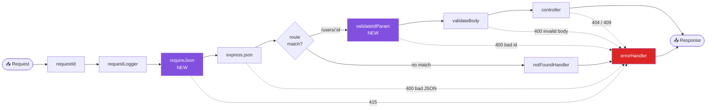
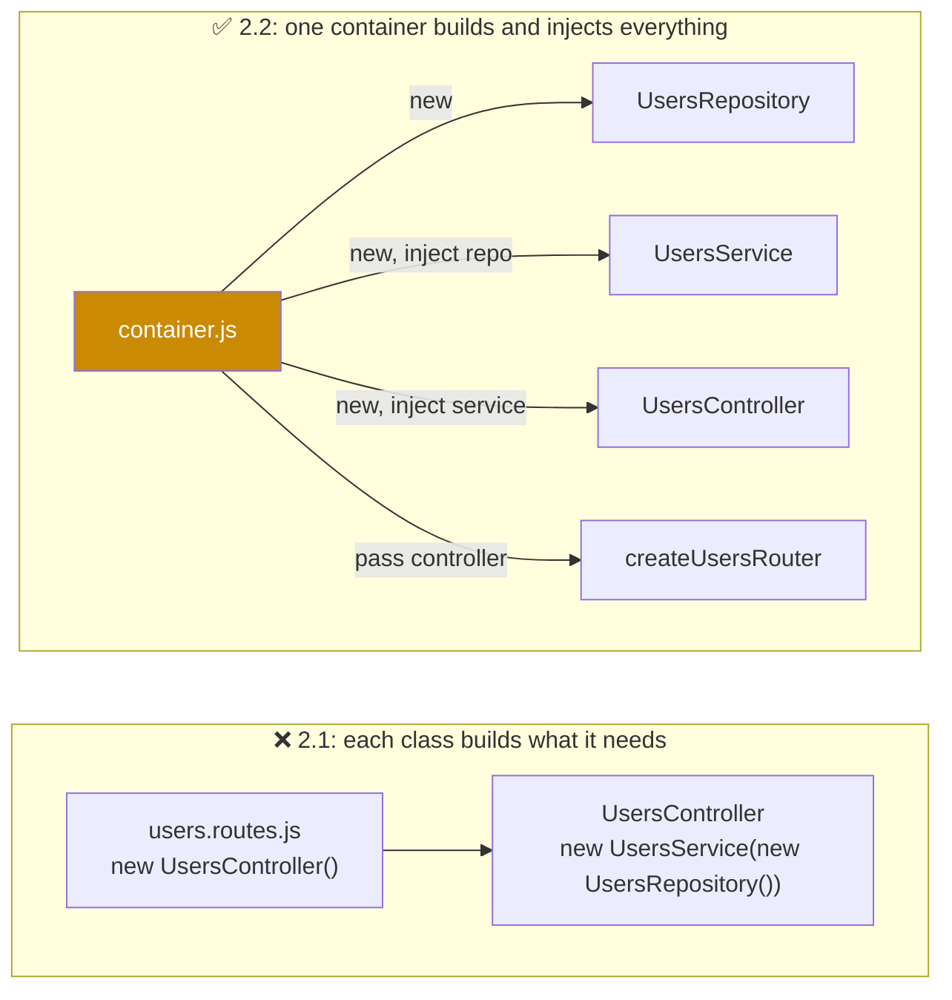

<div align="center">


# 🧩 Topic 2.2 — Express Architecture: Middleware & Dependency Injection

### Assignment 2.2: extend your `users-api` from Assignment 2.1


</div>

---

## 🎯 What you will do

You **keep working in the same GitHub repository** you created for Assignment 2.1 (`users-api`). You are **not** starting a new project.

| Part | You add | You learn |
|------|---------|-----------|
| **A: Middleware** | `requireJson` (415 for non-JSON bodies) and `validateIdParam` (400 for bad ids) | The middleware pipeline, `next()` vs `next(err)`, app-level vs param middleware, order matters |
| **B: Dependency Injection** | `container.js`; the controller now **receives** its service | Composition root, loose coupling, swapping implementations |
| **C: Tests** | Vitest + Supertest: middleware, controller and API tests | Why DI makes code testable: fake services, fake hashers, a fresh store per test |

> 📌 **Before you start:** Assignment 2.1 must be working. `npm run dev` starts the API and all 7 curl checks pass. Then create a branch:
>
> ```bash
> cd users-api
> git checkout -b assignment-2.2
> ```

### Files you will touch

```text
users-api/
├── package.json                      ← Part C (test scripts)
├── vitest.config.js                  ← Part C (new)
├── src/
│   ├── server.js                     ← Part B (changed)
│   ├── app.js                        ← Part A + B (changed)
│   ├── container.js                  ← Part B (new)
│   ├── controllers/
│   │   └── users.controller.js       ← Part B (changed)
│   ├── routes/
│   │   └── users.routes.js           ← Part A + B (changed)
│   └── middleware/
│       ├── require-json.js           ← Part A (new)
│       └── validate-id.js            ← Part A (new)
└── tests/
    ├── unit/
    │   ├── middleware.test.js        ← Part C (new)
    │   └── users.controller.test.js  ← Part C (new)
    └── integration/
        └── users.api.test.js         ← Part C (new)
```

Everything else (services, repositories, validators, utils and the other middleware) stays exactly as it was in 2.1.

---

## 🅰️ Part A: Middleware

### A.0 How the pipeline works

A **middleware** is a function `(req, res, next)` that runs **before** your route handler. Express runs them **in the order you register them**. Each one must do exactly one of these:

| Action | Code | Effect |
|--------|------|--------|
| Continue | `next()` | Go to the next middleware / route |
| Fail | `next(err)` or `throw err` | Skip everything and jump to the **error handler** |
| Answer | `res.json(...)`, `res.status(204).end()` | Stop here and send the response |

> ⚠️ **Common bug:** if a middleware does *none* of these, the request **hangs forever** and the client eventually times out.



| Middleware type | Registered with | Signature | Example in this project |
|-----------------|-----------------|-----------|-------------------------|
| Built-in | `app.use(express.json())` | provided by Express | `express.json` |
| App-level | `app.use(fn)` | `(req, res, next)` | `requestId`, `requestLogger`, **`requireJson`** |
| Route-level | `router.post('/', fn, handler)` | `(req, res, next)` | `validateBody(schema)` |
| Param | `router.param('id', fn)` | `(req, res, next, value)` | **`validateIdParam`** |
| Error-handling | `app.use(fn)` **last** | `(err, req, res, next)`, exactly 4 params | `errorHandler` |

### A.1 `src/middleware/require-json.js` (new)

Right now, if a client sends a form-encoded body, `express.json()` ignores it, `req.body` is `undefined`, and the user gets a confusing validation error. The correct answer is **415 Unsupported Media Type**.

```js
import { HttpError } from '../utils/http-error.js';

const METHODS_WITH_BODY = new Set(['POST', 'PUT', 'PATCH']);

// App-level middleware: requests that carry a body MUST be JSON.
// Without this, a form-encoded or text body is silently ignored and the user gets a confusing 400.
export function requireJson(req, res, next) {
  if (METHODS_WITH_BODY.has(req.method) && !req.is('application/json')) {
    return next(new HttpError(415, 'Unsupported Media Type', 'Content-Type must be application/json'));
  }
  next();
}
```

### A.2 `src/middleware/validate-id.js` (new)

Right now, `GET /api/v1/users/123` reaches the service and returns **404**. But `123` can never be a valid id, so it's a *client mistake* and should be **400**. A **param middleware** runs automatically for every route that contains `:id`.

```js
import { badRequest } from '../utils/http-error.js';

const UUID_PATTERN = /^[0-9a-f]{8}-[0-9a-f]{4}-[1-8][0-9a-f]{3}-[89ab][0-9a-f]{3}-[0-9a-f]{12}$/i;

// Param middleware: runs for every route that has :id, BEFORE the route handler.
// Signature has a 4th argument — the value of the parameter.
export function validateIdParam(req, res, next, id) {
  if (!UUID_PATTERN.test(id)) return next(badRequest('id must be a valid UUID'));
  next();
}
```

> 💡 **Pro-Tip:** Checking ids early also protects the database layer. In Unit 3, PostgreSQL throws an error if you query a `uuid` column with `"123"`.

### A.3 Register the middleware

- `requireJson` → **app-level** in `app.js`, **before** `express.json()` ([B.4](#b4-srcappjs-changed)).
- `validateIdParam` → `router.param('id', ...)` in `users.routes.js` ([B.2](#b2-srcroutesusersroutesjs-changed)).

Both files are shown in full in Part B, because Part B changes them too.

---

## 🅱️ Part B: Dependency Injection

### B.0 The problem with Assignment 2.1

In 2.1 the controller **creates** its own dependencies:

```js
// 2.1 — the controller is welded to one specific service and repository
constructor() {
  this.usersService = new UsersService(new UsersRepository());
}
```



| | ❌ Without DI (2.1) | ✅ With DI (2.2) |
|---|---|---|
| Who creates the service? | The controller | `container.js` (the **composition root**) |
| Swap in-memory → PostgreSQL (Unit 3) | Edit the controller | Change **one line** in `container.js` |
| Test the controller alone | Impossible: it always builds the real service | Pass a **fake service** |
| Fresh data for each test | Impossible: one shared `Map` for the whole process | `createContainer()` in `beforeEach` |
| Fast password hashing in tests | Impossible | Inject a fake hasher |

> 🎯 **Key Concept:** **Dependency Injection** means a class *receives* the objects it needs (usually through its constructor) instead of creating them. The only file that uses `new` for the app's building blocks is the **container**.

### B.1 `src/controllers/users.controller.js` (changed)

The constructor now takes the service as a parameter. The imports of `UsersService` and `UsersRepository` are **gone**.

```js
import { pageLinks } from '../utils/query.js';

// Dependency Injection: the controller RECEIVES its service instead of creating it.
// It no longer imports UsersService or UsersRepository at all.
export class UsersController {
  constructor(usersService) {
    this.usersService = usersService;
  }

  list = async (req, res) => {
    const { data, meta } = await this.usersService.list(req.query);
    res.json({ data, meta, links: pageLinks(req, meta) });
  };

  getById = async (req, res) => {
    res.json({ data: await this.usersService.getById(req.params.id) });
  };

  create = async (req, res) => {
    const user = await this.usersService.create(req.body);
    res.status(201).location(`${req.baseUrl}/${user.id}`).json({ data: user });
  };

  update = async (req, res) => {
    res.json({ data: await this.usersService.update(req.params.id, req.body) });
  };

  remove = async (req, res) => {
    await this.usersService.remove(req.params.id);
    res.status(204).end();
  };
}
```

### B.2 `src/routes/users.routes.js` (changed)

The router is now a **factory function**: it receives the controller instead of creating one. It also registers `validateIdParam` from Part A.

```js
import { Router } from 'express';
import { validateBody } from '../middleware/validate-body.js';
import { validateIdParam } from '../middleware/validate-id.js';
import { createUserSchema, updateUserSchema } from '../validators/user.schema.js';

// A factory: the router is built around whatever controller it is given.
export function createUsersRouter(controller) {
  const router = Router();

  router.param('id', validateIdParam); // every '/:id' route gets UUID validation

  router.get('/', controller.list);
  router.get('/:id', controller.getById);
  router.post('/', validateBody(createUserSchema), controller.create);
  router.patch('/:id', validateBody(updateUserSchema, { partial: true }), controller.update);
  router.delete('/:id', controller.remove);

  return router;
}
```

### B.3 `src/container.js` (new)

```js
import { UsersController } from './controllers/users.controller.js';
import { UsersRepository } from './repositories/users.repository.js';
import { UsersService } from './services/users.service.js';

// Composition root: the ONE place where objects are created and wired together.
//   repository → service → controller
// `overrides` lets tests swap any piece (e.g. a fake password hasher or a fake service).
export function createContainer(overrides = {}) {
  const usersRepository = overrides.usersRepository ?? new UsersRepository();
  const usersService = overrides.usersService ?? new UsersService(usersRepository, { hash: overrides.hashPassword });
  const usersController = new UsersController(usersService);

  return { usersRepository, usersService, usersController };
}
```

> 💡 **Pro-Tip:** `overrides` is what makes testing easy. Production code calls `createContainer()` with nothing. Tests call `createContainer({ hashPassword: fakeHasher })` or `createContainer({ usersService: fakeService })`.

### B.4 `src/app.js` (changed)

`createApp` now receives the container's objects, and `requireJson` is registered **before** `express.json()`.

```js
import express from 'express';
import { config } from './config/env.js';
import { errorHandler } from './middleware/error-handler.js';
import { notFoundHandler } from './middleware/not-found.js';
import { requestId } from './middleware/request-id.js';
import { requestLogger } from './middleware/request-logger.js';
import { requireJson } from './middleware/require-json.js';
import { createUsersRouter } from './routes/users.routes.js';

// Builds the Express app from the objects in the container. Does NOT call listen().
export function createApp({ usersController }) {
  const app = express();

  app.disable('x-powered-by');
  app.set('trust proxy', 'loopback');

  // ── 1. App-level middleware (runs top to bottom for EVERY request) ──
  app.use(requestId);
  if (!config.isTest) app.use(requestLogger);
  app.use(requireJson); // 415 unless POST/PUT/PATCH bodies are JSON
  app.use(express.json({ limit: config.bodyLimit }));

  // ── 2. Routes ──
  app.get('/health', (req, res) => {
    res.json({ status: 'ok', uptimeSec: Math.round(process.uptime()) });
  });
  app.use('/api/v1/users', createUsersRouter(usersController));

  // ── 3. Fallbacks (must be LAST) ──
  app.use(notFoundHandler);
  app.use(errorHandler);

  return app;
}
```

> ⚠️ **Order matters:** if `requireJson` were placed *after* the routes, it would never run for them. Middleware registered after a route only sees requests that route passed on.

### B.5 `src/server.js` (changed)

```js
import { createApp } from './app.js';
import { config } from './config/env.js';
import { createContainer } from './container.js';

const container = createContainer();
const app = createApp(container);

const server = app.listen(config.port, config.host, () => {
  console.log(`👤 Users API on http://${config.host}:${config.port} (${config.env}, pid ${process.pid})`);
});

function shutdown(signal) {
  console.log(`${signal} received — shutting down`);
  server.close(() => process.exit(0));
  server.closeIdleConnections();
  setTimeout(() => process.exit(1), 10_000).unref();
}
process.on('SIGTERM', shutdown);
process.on('SIGINT', shutdown);
```

### ✅ Checkpoint: run and try the new middleware

```bash
npm run dev
```

```bash
# requireJson: form-encoded body → 415
curl -s -X POST localhost:3000/api/v1/users -d 'firstName=Sita'
# {"title":"Unsupported Media Type","status":415,"detail":"Content-Type must be application/json",...}

# validateIdParam: not a UUID → 400 (was 404 in 2.1)
curl -s localhost:3000/api/v1/users/123
# {"title":"Bad Request","status":400,"detail":"id must be a valid UUID",...}

# A valid but unknown UUID still reaches the service → 404
curl -s localhost:3000/api/v1/users/15cfde80-9253-4e58-a113-a87a9e67498a
```

All 7 curl checks from Assignment 2.1 must **still pass**. Refactoring must not change behaviour.

```bash
git add . && git commit -m "feat: requireJson + validateIdParam middleware, dependency injection container"
```

---

## 🧪 Part C: Tests (this is where DI pays off)

### C.1 Install and configure

```bash
npm install -D vitest supertest
npm pkg set scripts.test="vitest run" scripts.test:watch="vitest"
mkdir -p tests/unit tests/integration
```

### `vitest.config.js` (new)

```js
import { defineConfig } from 'vitest/config';

export default defineConfig({
  test: {
    environment: 'node',
    include: ['tests/**/*.test.js'],
  },
});
```

### C.2 `tests/unit/middleware.test.js` (new)

Middleware are plain functions, so we call them with fake `req`/`next` objects. There's no server and no HTTP.

```js
import { describe, expect, it, vi } from 'vitest';
import { requireJson } from '../../src/middleware/require-json.js';
import { validateIdParam } from '../../src/middleware/validate-id.js';

// Middleware are just functions: call them with fake req/res/next and check what `next` received.

describe('requireJson', () => {
  const fakeReq = (method, isJson) => ({ method, is: () => (isJson ? 'application/json' : false) });

  it('lets GET through without a body', () => {
    const next = vi.fn();
    requireJson(fakeReq('GET', false), {}, next);
    expect(next).toHaveBeenCalledWith(); // called with NO error
  });

  it('lets a JSON POST through', () => {
    const next = vi.fn();
    requireJson(fakeReq('POST', true), {}, next);
    expect(next).toHaveBeenCalledWith();
  });

  it.each(['POST', 'PUT', 'PATCH'])('rejects a non-JSON %s with 415', (method) => {
    const next = vi.fn();
    requireJson(fakeReq(method, false), {}, next);
    expect(next.mock.calls[0][0]).toMatchObject({ status: 415 });
  });
});

describe('validateIdParam', () => {
  it('accepts a UUID', () => {
    const next = vi.fn();
    validateIdParam({}, {}, next, '15cfde80-9253-4e58-a113-a87a9e67498a');
    expect(next).toHaveBeenCalledWith();
  });

  it.each(['123', 'abc', '15cfde80-9253-4e58-a113'])('rejects %s with 400', (id) => {
    const next = vi.fn();
    validateIdParam({}, {}, next, id);
    expect(next.mock.calls[0][0]).toMatchObject({ status: 400, detail: 'id must be a valid UUID' });
  });
});
```

### C.3 `tests/unit/users.controller.test.js` (new)

A **fake service** built from `vi.fn()` is injected into the controller. This test is **impossible** with the 2.1 code.

```js
import { beforeEach, describe, expect, it, vi } from 'vitest';
import { UsersController } from '../../src/controllers/users.controller.js';

// Thanks to Dependency Injection we can give the controller a FAKE service.
// No repository, no hashing, no HTTP server — we only test what the controller does.

// A fake Express `res` whose methods record calls and return `res` so they can be chained.
function fakeRes() {
  const res = {};
  res.status = vi.fn(() => res);
  res.location = vi.fn(() => res);
  res.json = vi.fn(() => res);
  res.end = vi.fn(() => res);
  return res;
}

describe('UsersController', () => {
  let service;
  let controller;

  beforeEach(() => {
    service = {
      list: vi.fn(),
      getById: vi.fn(),
      create: vi.fn(),
      update: vi.fn(),
      remove: vi.fn(),
    };
    controller = new UsersController(service);
  });

  it('create → 201 + Location + the created user', async () => {
    service.create.mockResolvedValue({ id: 'u1', firstName: 'Sita' });
    const req = { body: { firstName: 'Sita' }, baseUrl: '/api/v1/users' };
    const res = fakeRes();

    await controller.create(req, res);

    expect(service.create).toHaveBeenCalledWith({ firstName: 'Sita' });
    expect(res.status).toHaveBeenCalledWith(201);
    expect(res.location).toHaveBeenCalledWith('/api/v1/users/u1');
    expect(res.json).toHaveBeenCalledWith({ data: { id: 'u1', firstName: 'Sita' } });
  });

  it('getById passes the route param to the service', async () => {
    service.getById.mockResolvedValue({ id: 'u1' });
    const res = fakeRes();

    await controller.getById({ params: { id: 'u1' } }, res);

    expect(service.getById).toHaveBeenCalledWith('u1');
    expect(res.json).toHaveBeenCalledWith({ data: { id: 'u1' } });
  });

  it('remove → 204 with no body', async () => {
    const res = fakeRes();
    await controller.remove({ params: { id: 'u1' } }, res);
    expect(service.remove).toHaveBeenCalledWith('u1');
    expect(res.status).toHaveBeenCalledWith(204);
    expect(res.end).toHaveBeenCalled();
  });

  it('lets service errors propagate (Express 5 sends them to the error handler)', async () => {
    service.getById.mockRejectedValue(Object.assign(new Error('nope'), { status: 404 }));
    await expect(controller.getById({ params: { id: 'x' } }, fakeRes())).rejects.toMatchObject({ status: 404 });
  });

  it('works even when a method is passed around as a plain function (arrow fields keep `this`)', async () => {
    service.list.mockResolvedValue({ data: [], meta: { page: 1, limit: 20, total: 0, totalPages: 1 } });
    const { list } = controller; // detached, exactly like router.get('/', controller.list)
    const res = fakeRes();
    await list({ query: {}, originalUrl: '/api/v1/users' }, res);
    expect(res.json).toHaveBeenCalled();
  });
});
```

### C.4 `tests/integration/users.api.test.js` (new)

The real app over HTTP with Supertest. Each test gets a **new container**, so a new empty store and a fast fake hasher.

```js
import request from 'supertest';
import { beforeEach, describe, expect, it } from 'vitest';
import { createApp } from '../../src/app.js';
import { createContainer } from '../../src/container.js';

const USERS = '/api/v1/users';
const sita = {
  firstName: 'Sita',
  lastName: 'Gurung',
  email: 'sita@example.com',
  password: 'Secret123',
  address: { street: 'Lakeside Road 5', city: 'Pokhara', country: 'Nepal' },
};

describe('Users API (integration)', () => {
  let app;
  let container;

  beforeEach(() => {
    // A brand-new container per test = a brand-new empty "database". Tests can't affect each other.
    // We also inject a fast fake hasher: possible ONLY because of Dependency Injection.
    container = createContainer({ hashPassword: async (plain) => `fake-hash:${plain}` });
    app = createApp(container);
  });

  it('POST → 201, and the injected hasher was used', async () => {
    const res = await request(app).post(USERS).send(sita);
    expect(res.status).toBe(201);
    expect(res.body.data).not.toHaveProperty('passwordHash');

    const stored = await container.usersRepository.findById(res.body.data.id);
    expect(stored.passwordHash).toBe('fake-hash:Secret123');
  });

  it('each test starts with an empty store', async () => {
    const res = await request(app).get(USERS);
    expect(res.body.meta.total).toBe(0);
  });

  it('full lifecycle: create → get → patch → delete → 404', async () => {
    const { body } = await request(app).post(USERS).send(sita);
    const url = `${USERS}/${body.data.id}`;

    expect((await request(app).get(url)).status).toBe(200);
    expect((await request(app).patch(url).send({ phone: '+977-9811111111' })).body.data.phone).toBe('+977-9811111111');
    expect((await request(app).delete(url)).status).toBe(204);
    expect((await request(app).get(url)).status).toBe(404);
  });

  describe('custom middleware', () => {
    it('requireJson: form-encoded POST → 415', async () => {
      const res = await request(app).post(USERS).type('form').send('firstName=Sita');
      expect(res.status).toBe(415);
      expect(res.headers['content-type']).toMatch(/application\/problem\+json/);
    });

    it('validateIdParam: GET /users/123 → 400 (not 404)', async () => {
      const res = await request(app).get(`${USERS}/123`);
      expect(res.status).toBe(400);
      expect(res.body.detail).toBe('id must be a valid UUID');
    });

    it('validateIdParam also guards PATCH and DELETE', async () => {
      expect((await request(app).patch(`${USERS}/abc`).send({ phone: '+977-9811111111' })).status).toBe(400);
      expect((await request(app).delete(`${USERS}/abc`)).status).toBe(400);
    });

    it('a valid but unknown UUID still reaches the service → 404', async () => {
      const res = await request(app).get(`${USERS}/15cfde80-9253-4e58-a113-a87a9e67498a`);
      expect(res.status).toBe(404);
    });
  });

  it('a fake service can replace the real one entirely', async () => {
    const fakeService = { list: async () => ({ data: [{ id: 'x', firstName: 'Fake' }], meta: { page: 1, limit: 20, total: 1, totalPages: 1 } }) };
    const fakeApp = createApp(createContainer({ usersService: fakeService }));

    const res = await request(fakeApp).get(USERS);
    expect(res.body.data).toEqual([{ id: 'x', firstName: 'Fake' }]);
  });
});
```

### C.5 Run

```bash
npm test
```

```text
 ✓ tests/unit/middleware.test.js (9 tests)
 ✓ tests/unit/users.controller.test.js (5 tests)
 ✓ tests/integration/users.api.test.js (8 tests)

 Test Files  3 passed (3)
      Tests  22 passed (22)
```

> 🎯 **Try this:** in `users.controller.js`, change `list = async (req, res) => {` to a normal method `async list(req, res) {` and run `npm test`. Three tests fail with `TypeError: Cannot read properties of undefined (reading 'usersService')`, including *"works even when a method is passed around as a plain function"*. That's exactly why we use arrow-function class fields. Change it back afterwards.

```bash
git add . && git commit -m "test: middleware, controller and API tests with Vitest + Supertest"
git push -u origin assignment-2.2
```

Then open a **Pull Request** from `assignment-2.2` into `main` on GitHub. **Don't merge it**; your instructor reviews the PR.

---

## 📤 What to submit

1. **Pull Request link** (`assignment-2.2` → `main`) in the **same** `users-api` repository from Assignment 2.1.
2. **Screenshots:**
   - the 415 and 400 curl responses from the checkpoint
   - `npm test` showing **22 passed** (or more)
3. **Short answers** (3–5 sentences each):
   1. What happens if a middleware never calls `next()` and never sends a response? What would a form-encoded `POST /api/v1/users` return if `requireJson` were registered **after** `app.use('/api/v1/users', ...)`, and why?
   2. Explain Dependency Injection in your own words, using your `container.js` as the example.
   3. Name **two tests** in Part C that could **not** be written with the Assignment 2.1 code, and explain why.

## 🧮 Marking (10 marks)

| Criteria | Marks |
|----------|:-----:|
| `requireJson` and `validateIdParam` work (415 / 400) and are registered in the right place | 3 |
| DI refactor: controller receives its service, router factory, `container.js`, `createApp(container)`; all 2.1 checks still pass | 3 |
| Tests: all three test files present and `npm test` passes | 2 |
| Short answers | 2 |

### ⭐ Bonus (+2)

Write a **third middleware**, `responseTime`, that adds an `X-Response-Time: 3.42ms` header to every response. Add a Supertest test that checks the header exists.
*Hint:* headers must be set **before** the response is sent. Look up how to hook `res.writeHead`, or search for the `on-headers` package.

---

<div align="center">

⬅️ [Topic 2.1: Backend Foundations](../2.1%20Backend%20Foundations/README.md)  ·  **Topic 2.2**  ·  [Topic 2.3: Authentication & Authorization ➡️](../2.3%20Authentication%20%26%20Authorization/README.md)

</div>
