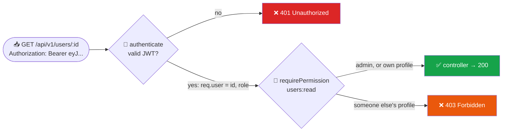
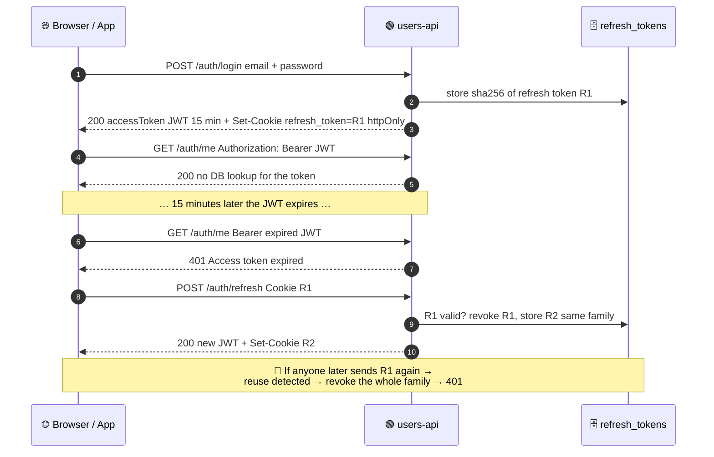
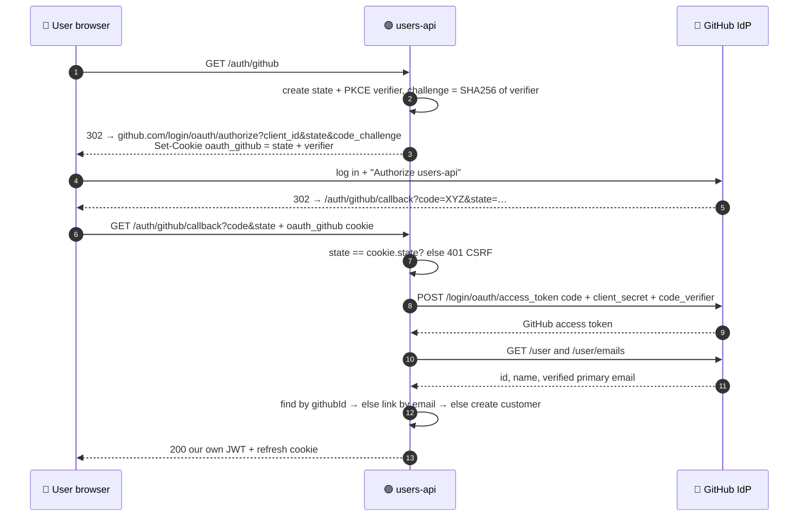

<div align="center">


# 🔐 Topic 2.3 — Authentication & Authorization

### JWT · Refresh Tokens · Sessions · OAuth 2.0 · Identity Providers · RBAC / ABAC

### Assignment 2.3: extend your `users-api` from Assignments 2.1 and 2.2


</div>

---

## 📑 Contents

| Part | Topic |
|------|-------|
| [0](#0-concepts-read-first) | **Concepts:** authentication vs authorization, JWT, sessions, OAuth 2.0, identity providers, RBAC vs ABAC |
| [A](#part-a-jwt-login-with-access--refresh-tokens) | **JWT login:** register, login, access + refresh tokens, rotation, logout, change password |
| [B](#part-b-authorization-rbac--abac) | **Authorization:** `authenticate`, `requireRole` (RBAC), `requirePermission` (ABAC) |
| [C](#part-c-login-with-github-oauth-20--pkce) | **OAuth 2.0:** "Login with GitHub" (Authorization Code + PKCE) |
| [D](#part-d-tests) | **Tests:** 79 unit + integration tests |
| [E](#part-e-try-it-end-to-end) | **Try it** end to end with curl |
| [📤](#-what-to-submit) | Submission and marking |

> 📌 **Before you start:** Assignment 2.2 must be finished (middleware + DI container, `npm test` green). Then:
>
> ```bash
> cd users-api
> # First merge your 2.2 pull request on GitHub, then:
> git checkout main && git pull            # main now contains your 2.2 work
> git checkout -b assignment-2.3
> npm install jsonwebtoken cookie-parser
> mkdir -p src/auth src/data
> ```

---

## 0. Concepts (read first)

### 0.1 Authentication vs Authorization

| | 🪪 **Authentication (AuthN)** | 🛂 **Authorization (AuthZ)** |
|---|---|---|
| Question | **Who** are you? | **What** are you allowed to do? |
| Proof | Password, GitHub login, passkey, ... | Role, ownership, attributes |
| Fails with | **401 Unauthorized** (+ `WWW-Authenticate` header) | **403 Forbidden** |
| In our code | `authenticate` middleware, `/auth/*` routes | `requireRole(...)`, `requirePermission(...)` |
| Order | Always **first** | Always **after** authentication |



### 0.2 JSON Web Tokens (JWT)

A JWT is three base64url parts joined by dots: **`header.payload.signature`**.

```text
eyJhbGciOiJIUzI1NiIsInR5cCI6IkpXVCJ9 . eyJyb2xlIjoiYWRtaW4iLCJzdWIiOiIzZDQyLi4uIiwiZXhwIjoxNzkwNzYwMDg0fQ . 8f1c...
└──────────── header ───────────┘   └──────────────────────── payload ───────────────────────┘   └ signature ┘
{"alg":"HS256","typ":"JWT"}          {"role":"admin","sub":"3d42...","iss":"users-api","exp":1790760084,...}
```

> ⚠️ **Security Warning:** The payload is **encoded, not encrypted**. Anyone can decode it: paste one into [jwt.io](https://jwt.io). **Never** put passwords, emails or personal data in a JWT. The **signature** only proves the token wasn't changed and was issued by someone who knows the secret.

### 0.3 Sessions vs JWT: and why we use both

| | 🍪 **Server session** | 🎫 **JWT access token** | 🔁 **Our refresh token** |
|---|---|---|---|
| What the client holds | Random session ID (cookie) | Signed JSON (header) | Random string (httpOnly cookie) |
| Server stores | Session data (memory / Redis) | **Nothing**: stateless | A **hash** of the token |
| Check per request | DB/Redis lookup | Verify signature (fast, no DB) | Only on `/auth/refresh` |
| Log out / revoke instantly | ✅ Delete the session | ❌ Valid until `exp` | ✅ Revoke the row |
| Scales across servers | Needs shared store | ✅ Any server can verify | Needs shared store |
| Lifetime | Hours | **15 minutes** | **7 days** |

> 🎯 **Key Concept:** We combine them. A **short-lived JWT** (15 min) makes every request fast and stateless. A **long-lived refresh token** (7 days) is stored server-side, like a session, so we *can* revoke it. If a JWT leaks, it's useless after 15 minutes. If a refresh token leaks, we detect reuse and revoke it.



| Where to keep tokens in a browser | XSS can steal it? | CSRF risk? | Our choice |
|-----------------------------------|:---:|:---:|---|
| `localStorage` | ✅ yes | no | ❌ never for refresh tokens |
| JS memory (a variable) | only while page is open | no | ✅ **access token** |
| `httpOnly` + `SameSite=Strict` cookie | ❌ no | mitigated by SameSite | ✅ **refresh token** |

### 0.4 OAuth 2.0 and Identity Providers

**OAuth 2.0** lets a user log in to *your* app with an account at an **Identity Provider** (IdP) like GitHub or Google, **without giving you their password**. We use the **Authorization Code flow with PKCE**, the flow recommended for all clients by the OAuth 2.0 Security Best Current Practice (RFC 9700) and the upcoming OAuth 2.1.



| Protection | What it stops |
|------------|---------------|
| **`state`** (random, stored in a cookie, must match) | **CSRF / login forgery:** an attacker tricking you into logging in as *them* |
| **PKCE** (`code_verifier` / `code_challenge`) | A stolen `?code=` being exchanged by someone else |
| **`client_secret` only on the server** | Anyone impersonating your app |
| **Only *verified* emails** are linked | Account takeover via an unverified email on GitHub |

| Identity provider / protocol | What it is | When to use |
|------------------------------|------------|-------------|
| **OAuth 2.0** | *Authorization* framework: "let this app access my GitHub data" | Delegated access to APIs |
| **OpenID Connect (OIDC)** | OAuth 2.0 **+ an `id_token` (a JWT about the user)**: a standard *login* layer | "Login with Google/Microsoft", enterprise SSO |
| GitHub, Google, Microsoft, Apple | Social / consumer IdPs | Public apps, developer tools |
| Auth0, Okta, AWS Cognito, Clerk | Hosted identity platforms | When you don't want to run auth yourself |
| Keycloak, Authentik | Self-hosted open-source IdPs | Universities, companies, full control |

> 💡 **Pro-Tip:** GitHub uses plain OAuth 2.0 (no `id_token`), so we call `/user` to learn who logged in. With Google (OIDC) you'd instead **verify the `id_token` JWT** you receive. The rest of the flow is identical.

### 0.5 RBAC vs ABAC

| | 🎭 **RBAC**: Role-Based | 🧬 **ABAC**: Attribute-Based |
|---|---|---|
| Decision based on | The user's **role** only | Attributes of **user + resource + action** (+ time, IP, ...) |
| Example rule | "Only `admin` can list all users" | "You can edit a profile **if it's yours** or you're an admin" |
| In our code | `requireRole('admin')` | `requirePermission('users:update')` → `policies.js` |
| Pros | Simple, easy to audit | Expressive: ownership, "not yourself", business rules |
| Cons | Role explosion (`editor-of-team-7`...) | More logic to test |

**Permission matrix you will implement:**

| Endpoint | Anonymous | Customer | Admin |
|----------|:---:|:---:|:---:|
| `POST /auth/register`, `/auth/login`, `/auth/refresh`, `/auth/logout`, `GET /auth/github` | ✅ | ✅ | ✅ |
| `GET /auth/me`, `PATCH /auth/password` | 401 | ✅ | ✅ |
| `GET /users` · `POST /users` | 401 | 403 | ✅ (RBAC) |
| `GET /users/:id` · `PATCH /users/:id` | 401 | ✅ **own only**, else 403 | ✅ (ABAC) |
| `PATCH /users/:id/role` | 401 | 403 | ✅ (RBAC) |
| `DELETE /users/:id` | 401 | 403 | ✅ **except self** (ABAC) |

---

## Part A: JWT login with access + refresh tokens

### Files for Part A

```text
src/
├── config/env.js                          ← changed: JWT secret, TTLs, admin, GitHub
├── utils/http-error.js                    ← changed: + unauthorized, forbidden
├── middleware/require-json.js             ← changed: allow POSTs with no body
├── repositories/users.repository.js       ← changed: + findByGithubId
├── repositories/refresh-tokens.repository.js  ← new
├── services/users.service.js              ← changed: + verifyCredentials, changePassword, changeRole, GitHub
├── services/token.service.js              ← new
├── services/auth.service.js               ← new
├── validators/auth.schema.js              ← new
└── data/bootstrap-admin.js                ← new
.env.example                               ← changed
```

### A.1 `.env.example` (changed), then create your `.env`

```bash
# Copy to .env and fill in. NEVER commit .env.
NODE_ENV=development
PORT=3000
HOST=127.0.0.1
BODY_LIMIT=100kb

# ── Auth ──
# Generate a strong secret with:
#   node -e "console.log(require('node:crypto').randomBytes(48).toString('base64url'))"
JWT_SECRET=
ACCESS_TOKEN_TTL_SECONDS=900
REFRESH_TOKEN_TTL_DAYS=7

# First admin (created on startup if missing)
ADMIN_EMAIL=admin@users-api.test
ADMIN_PASSWORD=ChangeMe12345

# ── GitHub OAuth app (Part C) ──
# Create at https://github.com/settings/developers → OAuth Apps → New OAuth App
GITHUB_CLIENT_ID=
GITHUB_CLIENT_SECRET=
GITHUB_CALLBACK_URL=http://localhost:3000/api/v1/auth/github/callback
```

```bash
cp .env.example .env
node -e "console.log(require('node:crypto').randomBytes(48).toString('base64url'))"
# paste the output after JWT_SECRET= in .env
```

> ⚠️ **Security Warning:** Anyone who knows `JWT_SECRET` can mint an **admin** token. Use 32+ random characters, keep it only in `.env` (git-ignored), and use a different one in production.

### A.2 `src/config/env.js` (changed)

```js
// Central place for configuration. Every other file imports `config` instead of reading process.env.

const toInt = (value, fallback) => {
  const n = Number.parseInt(value, 10);
  return Number.isNaN(n) ? fallback : n;
};

// Fail fast: never start with a missing or weak signing secret.
const jwtSecret = process.env.JWT_SECRET ?? '';
if (jwtSecret.length < 32) {
  throw new Error('JWT_SECRET must be set and at least 32 characters long (see .env.example)');
}

export const config = Object.freeze({
  env: process.env.NODE_ENV ?? 'development',
  isProduction: process.env.NODE_ENV === 'production',
  isTest: process.env.NODE_ENV === 'test',
  port: toInt(process.env.PORT, 3000),
  host: process.env.HOST ?? '127.0.0.1',
  bodyLimit: process.env.BODY_LIMIT ?? '100kb',

  auth: {
    jwtSecret,
    accessTokenTtlSeconds: toInt(process.env.ACCESS_TOKEN_TTL_SECONDS, 15 * 60), // 15 minutes
    refreshTokenTtlDays: toInt(process.env.REFRESH_TOKEN_TTL_DAYS, 7),
    issuer: 'users-api',
    audience: 'users-api',
  },

  // First admin account, created at startup if it doesn't exist yet.
  admin: {
    email: process.env.ADMIN_EMAIL,
    password: process.env.ADMIN_PASSWORD,
  },

  github: {
    clientId: process.env.GITHUB_CLIENT_ID,
    clientSecret: process.env.GITHUB_CLIENT_SECRET,
    callbackUrl: process.env.GITHUB_CALLBACK_URL ?? 'http://localhost:3000/api/v1/auth/github/callback',
  },
});
```

### A.3 `src/utils/http-error.js`: add at the bottom

```js
export const unauthorized = (detail = 'Authentication required') => new HttpError(401, 'Unauthorized', detail);

export const forbidden = (detail = 'You are not allowed to perform this action') =>
  new HttpError(403, 'Forbidden', detail);
```

### A.4 `src/middleware/require-json.js` (changed)

`POST /auth/refresh` and `POST /auth/logout` have **no body**. The 2.2 version would reject them with 415.

```js
import { HttpError } from '../utils/http-error.js';

const METHODS_WITH_BODY = new Set(['POST', 'PUT', 'PATCH']);

// A request "has a body" if it is chunked or declares a non-zero Content-Length.
// POST /auth/refresh and /auth/logout have NO body, so they must be allowed through.
const hasBody = (req) =>
  req.get('transfer-encoding') !== undefined || Number(req.get('content-length') ?? 0) > 0;

// App-level middleware: requests that carry a body MUST be JSON.
export function requireJson(req, res, next) {
  if (METHODS_WITH_BODY.has(req.method) && hasBody(req) && !req.is('application/json')) {
    return next(new HttpError(415, 'Unsupported Media Type', 'Content-Type must be application/json'));
  }
  next();
}
```

### A.5 `src/repositories/users.repository.js` (changed)

```js
import { InMemoryRepository } from './in-memory.repository.js';

export class UsersRepository extends InMemoryRepository {
  findByEmail(email) {
    return this.findOne((user) => user.email === email.toLowerCase());
  }

  findByGithubId(githubId) {
    return this.findOne((user) => user.githubId === githubId);
  }
}
```

### A.6 `src/repositories/refresh-tokens.repository.js` (new)

```js
import { InMemoryRepository } from './in-memory.repository.js';

// Stores refresh tokens (only their SHA-256 hash, never the token itself).
// Row shape: { id, userId, tokenHash, familyId, expiresAt, revokedAt, replacedBy, createdAt, updatedAt }
export class RefreshTokensRepository extends InMemoryRepository {
  findByHash(tokenHash) {
    return this.findOne((row) => row.tokenHash === tokenHash);
  }

  async revokeWhere(predicate) {
    const now = new Date().toISOString();
    for (const row of await this.findAll()) {
      if (!row.revokedAt && predicate(row)) await this.update(row.id, { revokedAt: now });
    }
  }

  revokeFamily(familyId) {
    return this.revokeWhere((row) => row.familyId === familyId);
  }

  revokeAllForUser(userId) {
    return this.revokeWhere((row) => row.userId === userId);
  }
}
```

### A.7 `src/services/users.service.js` (changed)

New methods are below the `── New in 2.3 ──` line. Also note `verify`, `githubId` and `DUMMY_HASH`.

```js
import { conflict, notFound, unauthorized } from '../utils/http-error.js';
import { hashPassword, verifyPassword } from '../utils/password.js';
import { paginate, parsePagination, sortItems } from '../utils/query.js';

const SORTABLE_FIELDS = ['firstName', 'lastName', 'email', 'createdAt'];
export const ROLES = ['customer', 'admin'];

// Optional fields are stored as null so every user has the same shape.
const withDefaults = (profile) => ({
  ...profile,
  phone: profile.phone ?? null,
  dateOfBirth: profile.dateOfBirth ?? null,
  address: profile.address ?? null,
  githubId: profile.githubId ?? null,
});

// The ONLY way a user leaves this service: without the password hash.
export const toPublicUser = ({ passwordHash, ...user }) => user;

// Verifying against a dummy hash when the email doesn't exist makes "wrong email" and
// "wrong password" take the same time, so attackers can't discover which emails are registered.
const DUMMY_HASH = await hashPassword('dummy-password-for-timing');

export class UsersService {
  // `hash` / `verify` are injectable so tests can use fast fakes instead of real scrypt.
  constructor(usersRepository, { hash = hashPassword, verify = verifyPassword } = {}) {
    this.users = usersRepository;
    this.hash = hash;
    this.verify = verify;
  }

  // query = { q, role, sort, page, limit }
  async list(query = {}) {
    let items = await this.users.findAll();

    if (typeof query.q === 'string' && query.q.trim()) {
      const needle = query.q.trim().toLowerCase();
      items = items.filter((u) =>
        `${u.firstName} ${u.lastName} ${u.email}`.toLowerCase().includes(needle),
      );
    }
    if (typeof query.role === 'string') {
      items = items.filter((u) => u.role === query.role);
    }

    items = sortItems(items, query.sort ?? 'lastName', SORTABLE_FIELDS);
    const page = paginate(items, parsePagination(query));
    return { ...page, data: page.data.map(toPublicUser) };
  }

  async getById(id) {
    const user = await this.users.findById(id);
    if (!user) throw notFound(`User ${id} does not exist`);
    return toPublicUser(user);
  }

  // `role` is a second argument, NOT part of the request body — only trusted code (seed, admin tools) sets it.
  async create(data, { role = 'customer' } = {}) {
    await this.#assertEmailAvailable(data.email);
    const { password, ...profile } = data;
    const passwordHash = await this.hash(password);
    const user = await this.users.create({ ...withDefaults(profile), role, passwordHash });
    return toPublicUser(user);
  }

  async update(id, changes) {
    await this.getById(id);
    if (changes.email) await this.#assertEmailAvailable(changes.email, id);
    return toPublicUser(await this.users.update(id, changes));
  }

  async remove(id) {
    await this.getById(id);
    await this.users.delete(id);
  }

  // ── New in 2.3 ────────────────────────────────────────────────

  // Returns the public user if email + password match, otherwise throws ONE generic 401.
  async verifyCredentials(email, password) {
    const user = await this.users.findByEmail(email);
    const ok = await this.verify(password, user?.passwordHash ?? DUMMY_HASH);
    if (!user || !user.passwordHash || !ok) throw unauthorized('Invalid email or password');
    return toPublicUser(user);
  }

  async changePassword(id, currentPassword, newPassword) {
    const user = await this.users.findById(id);
    if (!user?.passwordHash || !(await this.verify(currentPassword, user.passwordHash))) {
      throw unauthorized('Current password is incorrect');
    }
    await this.users.update(id, { passwordHash: await this.hash(newPassword) });
  }

  async changeRole(id, role) {
    await this.getById(id);
    return toPublicUser(await this.users.update(id, { role }));
  }

  // "Login with GitHub": find the user by GitHub id, else link by verified email, else create.
  async findOrCreateFromGithub({ githubId, email, name, login }) {
    const byGithub = await this.users.findByGithubId(githubId);
    if (byGithub) return toPublicUser(byGithub);

    const byEmail = await this.users.findByEmail(email);
    if (byEmail) return toPublicUser(await this.users.update(byEmail.id, { githubId }));

    const [firstName, ...rest] = (name ?? login).trim().split(/\s+/);
    const user = await this.users.create({
      ...withDefaults({ firstName, lastName: rest.join(' '), email: email.toLowerCase(), githubId }),
      role: 'customer',
      passwordHash: null, // OAuth-only account: cannot log in with a password
    });
    return toPublicUser(user);
  }

  async #assertEmailAvailable(email, exceptId) {
    const existing = await this.users.findByEmail(email);
    if (existing && existing.id !== exceptId) throw conflict(`Email ${email} is already registered`);
  }
}
```

> 🎯 **Key Concept (user enumeration):** Login returns the **same message** for "no such email" and "wrong password", and takes the **same time** (the dummy hash). Otherwise an attacker could discover which emails are registered.

### A.8 `src/services/token.service.js` (new)

```js
import { createHash, randomBytes, randomUUID } from 'node:crypto';
import jwt from 'jsonwebtoken';
import { unauthorized } from '../utils/http-error.js';

const sha256 = (value) => createHash('sha256').update(value).digest('hex');

/**
 * Two kinds of token:
 *  - ACCESS token: a short-lived signed JWT (15 min). Stateless — verified with the secret, no DB lookup.
 *  - REFRESH token: a long-lived random string (7 days). Stateful — stored (hashed) so it can be
 *    rotated on every use and revoked on logout / password change / theft.
 */
export class TokenService {
  constructor(refreshTokensRepository, { jwtSecret, accessTokenTtlSeconds, refreshTokenTtlDays, issuer, audience }) {
    this.refreshTokens = refreshTokensRepository;
    this.secret = jwtSecret;
    this.accessTokenTtlSeconds = accessTokenTtlSeconds;
    this.refreshTokenTtlMs = refreshTokenTtlDays * 24 * 60 * 60 * 1000;
    this.jwtOptions = { issuer, audience };
  }

  // Keep the payload small and non-sensitive: anyone can base64-decode a JWT.
  signAccessToken(user) {
    return jwt.sign({ role: user.role }, this.secret, {
      ...this.jwtOptions,
      subject: user.id,
      algorithm: 'HS256',
      expiresIn: this.accessTokenTtlSeconds,
    });
  }

  // Returns { id, role } or throws 401. `algorithms` is pinned to stop "alg: none" / algorithm-swap attacks.
  verifyAccessToken(token) {
    try {
      const payload = jwt.verify(token, this.secret, { ...this.jwtOptions, algorithms: ['HS256'] });
      return { id: payload.sub, role: payload.role };
    } catch (err) {
      throw unauthorized(err.name === 'TokenExpiredError' ? 'Access token expired' : 'Invalid access token');
    }
  }

  async issueRefreshToken(userId, familyId = randomUUID()) {
    const token = randomBytes(32).toString('base64url');
    const row = await this.refreshTokens.create({
      userId,
      tokenHash: sha256(token),
      familyId, // all tokens produced by rotating one login share a family
      expiresAt: new Date(Date.now() + this.refreshTokenTtlMs).toISOString(),
      revokedAt: null,
      replacedBy: null,
    });
    return { token, id: row.id, expiresAt: row.expiresAt };
  }

  // Refresh-token ROTATION with REUSE DETECTION.
  async rotateRefreshToken(token) {
    const row = token ? await this.refreshTokens.findByHash(sha256(token)) : null;
    if (!row) throw unauthorized('Invalid refresh token');

    if (row.revokedAt) {
      // A token that was already used is being used AGAIN → it was probably stolen.
      // Kill the whole family so both the thief and the victim must log in again.
      await this.refreshTokens.revokeFamily(row.familyId);
      throw unauthorized('Refresh token reuse detected — please log in again');
    }
    if (new Date(row.expiresAt) <= new Date()) throw unauthorized('Refresh token expired');

    const next = await this.issueRefreshToken(row.userId, row.familyId);
    await this.refreshTokens.update(row.id, { revokedAt: new Date().toISOString(), replacedBy: next.id });
    return { userId: row.userId, refresh: next };
  }

  async revokeRefreshToken(token) {
    const row = token ? await this.refreshTokens.findByHash(sha256(token)) : null;
    if (row) await this.refreshTokens.revokeFamily(row.familyId);
  }

  revokeAllForUser(userId) {
    return this.refreshTokens.revokeAllForUser(userId);
  }
}
```

> ⚠️ **Security Warning:** Always pass `algorithms: ['HS256']` to `jwt.verify`. Without it, some libraries historically accepted `"alg": "none"` (no signature at all). The tests in Part D prove our code rejects unsigned, forged, tampered and expired tokens.

### A.9 `src/services/auth.service.js` (new)

```js
// Orchestrates login flows. Knows nothing about HTTP or cookies (that's the controller's job).
export class AuthService {
  constructor(usersService, tokenService) {
    this.users = usersService;
    this.tokens = tokenService;
  }

  async #session(user) {
    const refresh = await this.tokens.issueRefreshToken(user.id);
    return { user, accessToken: this.tokens.signAccessToken(user), refresh };
  }

  async register(data) {
    return this.#session(await this.users.create(data)); // always role "customer"
  }

  async login(email, password) {
    return this.#session(await this.users.verifyCredentials(email, password));
  }

  async loginWithGithub(profile) {
    return this.#session(await this.users.findOrCreateFromGithub(profile));
  }

  async refresh(refreshToken) {
    const { userId, refresh } = await this.tokens.rotateRefreshToken(refreshToken);
    const user = await this.users.getById(userId); // re-read: picks up role changes
    return { user, accessToken: this.tokens.signAccessToken(user), refresh };
  }

  logout(refreshToken) {
    return this.tokens.revokeRefreshToken(refreshToken);
  }

  async changePassword(userId, currentPassword, newPassword) {
    await this.users.changePassword(userId, currentPassword, newPassword);
    await this.tokens.revokeAllForUser(userId); // log out every device
  }
}
```

### A.10 `src/validators/auth.schema.js` (new)

```js
import { ROLES } from '../services/users.service.js';
import { email, lowercase, oneOf, password, string } from './rules.js';

export const loginSchema = {
  email:    { required: true, check: email(), transform: lowercase },
  password: { required: true, check: string({ max: 72 }) }, // no strength rules on login — just "is it a string"
};

export const changePasswordSchema = {
  currentPassword: { required: true, check: string({ max: 72 }) },
  newPassword:     { required: true, check: password() },
};

export const changeRoleSchema = {
  role: { required: true, check: oneOf(ROLES) },
};
```

### A.11 `src/data/bootstrap-admin.js` (new)

```js
// Creates the first admin from ADMIN_EMAIL / ADMIN_PASSWORD if that account doesn't exist yet.
// Without this, nobody could ever call the admin-only endpoints (chicken-and-egg problem).
export async function bootstrapAdmin(usersService, { email, password }) {
  if (!email || !password) return;
  try {
    await usersService.create({ firstName: 'Admin', lastName: 'User', email, password }, { role: 'admin' });
    console.log(`👑 Admin account created: ${email}`);
  } catch (err) {
    if (err.status !== 409) throw err; // 409 = already exists, which is fine
  }
}
```

---

## Part B: Authorization (RBAC + ABAC)

### Files for Part B

```text
src/
├── auth/policies.js                ← new (ABAC rules)
├── middleware/authenticate.js      ← new (401)
├── middleware/authorize.js         ← new (403: requireRole + requirePermission)
├── controllers/users.controller.js ← changed: + changeRole
└── routes/users.routes.js          ← changed: every route protected
```

### B.1 `src/auth/policies.js` (new)

```js
// ABAC (Attribute-Based Access Control): a decision uses ATTRIBUTES of the actor (who),
// the resource (what) and the action — not just the role.
//   actor    = { id, role }  (from the access token)
//   resource = { id }        (the user being read/changed)
export const policies = {
  // Admins can read anyone; everyone else only themselves (ownership).
  'users:read': ({ actor, resource }) => actor.role === 'admin' || actor.id === resource.id,

  // Same rule for editing a profile.
  'users:update': ({ actor, resource }) => actor.role === 'admin' || actor.id === resource.id,

  // Only admins may delete, and never their own account (so the system can't lose its last admin by accident).
  'users:delete': ({ actor, resource }) => actor.role === 'admin' && actor.id !== resource.id,
};

export function can(actor, action, resource) {
  const policy = policies[action];
  if (!policy) throw new Error(`Unknown action "${action}"`); // a typo must fail loudly, never allow
  return Boolean(actor) && policy({ actor, resource });
}
```

### B.2 `src/middleware/authenticate.js` (new)

```js
import { unauthorized } from '../utils/http-error.js';

// Authentication = "WHO are you?"  Reads "Authorization: Bearer <accessToken>" and sets req.user = { id, role }.
export function createAuthenticate(tokenService) {
  return function authenticate(req, res, next) {
    const [scheme, token] = (req.get('authorization') ?? '').split(' ');
    if (!/^Bearer$/i.test(scheme) || !token) {
      res.set('WWW-Authenticate', 'Bearer');
      return next(unauthorized('Missing Bearer access token'));
    }
    try {
      req.user = tokenService.verifyAccessToken(token);
      next();
    } catch (err) {
      res.set('WWW-Authenticate', 'Bearer error="invalid_token"');
      next(err);
    }
  };
}
```

### B.3 `src/middleware/authorize.js` (new)

```js
import { can } from '../auth/policies.js';
import { forbidden } from '../utils/http-error.js';

// Authorization = "WHAT are you allowed to do?"  Always runs AFTER authenticate.

// RBAC (Role-Based Access Control): allowed if the user's role is in the list.
export const requireRole = (...roles) => (req, res, next) => {
  if (!roles.includes(req.user?.role)) return next(forbidden(`Requires role: ${roles.join(' or ')}`));
  next();
};

// ABAC: allowed if the policy for `action` says yes for this actor + resource.
export const requirePermission = (action, getResource = (req) => ({ id: req.params.id })) => (req, res, next) => {
  if (!can(req.user, action, getResource(req))) return next(forbidden());
  next();
};
```

### B.4 `src/controllers/users.controller.js` (changed: new `changeRole`)

```js
import { pageLinks } from '../utils/query.js';

// Dependency Injection: the controller RECEIVES its service instead of creating it.
// It no longer imports UsersService or UsersRepository at all.
export class UsersController {
  constructor(usersService) {
    this.usersService = usersService;
  }

  list = async (req, res) => {
    const { data, meta } = await this.usersService.list(req.query);
    res.json({ data, meta, links: pageLinks(req, meta) });
  };

  getById = async (req, res) => {
    res.json({ data: await this.usersService.getById(req.params.id) });
  };

  create = async (req, res) => {
    const user = await this.usersService.create(req.body);
    res.status(201).location(`${req.baseUrl}/${user.id}`).json({ data: user });
  };

  update = async (req, res) => {
    res.json({ data: await this.usersService.update(req.params.id, req.body) });
  };

  // Admin only (RBAC): PATCH /users/:id/role  { "role": "admin" }
  changeRole = async (req, res) => {
    res.json({ data: await this.usersService.changeRole(req.params.id, req.body.role) });
  };

  remove = async (req, res) => {
    await this.usersService.remove(req.params.id);
    res.status(204).end();
  };
}
```

### B.5 `src/routes/users.routes.js` (changed)

```js
import { Router } from 'express';
import { requirePermission, requireRole } from '../middleware/authorize.js';
import { validateBody } from '../middleware/validate-body.js';
import { validateIdParam } from '../middleware/validate-id.js';
import { changeRoleSchema } from '../validators/auth.schema.js';
import { createUserSchema, updateUserSchema } from '../validators/user.schema.js';

export function createUsersRouter({ usersController: c, authenticate }) {
  const router = Router();

  router.use(authenticate); // every /users route needs a valid access token (401 otherwise)
  router.param('id', validateIdParam);

  //                 ┌── who may do it ───────────────────┐
  router.get('/',        requireRole('admin'),                                                     c.list);
  router.post('/',       requireRole('admin'),         validateBody(createUserSchema),             c.create);
  router.get('/:id',     requirePermission('users:read'),                                          c.getById);
  router.patch('/:id',   requirePermission('users:update'), validateBody(updateUserSchema, { partial: true }), c.update);
  router.patch('/:id/role', requireRole('admin'),      validateBody(changeRoleSchema),             c.changeRole);
  router.delete('/:id',  requirePermission('users:delete'),                                        c.remove);

  return router;
}
```

> 💡 **Pro-Tip:** `router.use(authenticate)` runs **before** `router.param('id', ...)`. So `GET /users/123` without a token is **401**, not 400. Never tell anonymous users anything, not even that their id is malformed.

> 🤔 **403 or 404?** When Sita requests Ram's profile we return **403**. Some APIs return **404** instead, to hide that the user exists (see the [2.1 Self-Quiz](../2.1%20Backend%20Foundations%20-%20Concepts/4-Self-Quiz.md)). Both are acceptable; be consistent.

---

## Part C: Login with GitHub (OAuth 2.0 + PKCE)

### C.1 Register a GitHub OAuth App (5 minutes)

1. Go to **GitHub → Settings → Developer settings → OAuth Apps → New OAuth App** (<https://github.com/settings/developers>).
2. Fill in:
   | Field | Value |
   |-------|-------|
   | Application name | `users-api (your name)` |
   | Homepage URL | `http://localhost:3000` |
   | Authorization callback URL | `http://localhost:3000/api/v1/auth/github/callback` |
3. Click **Register application**, then **Generate a new client secret**.
4. Copy the **Client ID** and **Client secret** into `.env`:
   ```bash
   GITHUB_CLIENT_ID=Iv1.xxxxxxxxxxxx
   GITHUB_CLIENT_SECRET=xxxxxxxxxxxxxxxxxxxxxxxxxxxxxxxx
   ```

> ⚠️ **Security Warning:** The client secret is a password for your *app*. It goes in `.env` only. If you ever commit it, click **Generate a new client secret** on GitHub immediately.

### C.2 `src/auth/pkce.js` (new)

```js
import { createHash, randomBytes } from 'node:crypto';

// PKCE (Proof Key for Code Exchange, RFC 7636):
// we keep a random `verifier` secret and send only its SHA-256 `challenge` to GitHub.
// When exchanging the code we must prove we know the verifier, so a stolen ?code= is useless.
export function createPkcePair() {
  const verifier = randomBytes(32).toString('base64url');
  const challenge = createHash('sha256').update(verifier).digest('base64url');
  return { verifier, challenge };
}

export const createState = () => randomBytes(16).toString('base64url');
```

### C.3 `src/services/github-oauth.client.js` (new)

```js
import { unauthorized } from '../utils/http-error.js';

// Talks to GitHub's OAuth 2.0 endpoints. `fetch` is injectable so tests never call the real GitHub.
export class GithubOAuthClient {
  constructor({ clientId, clientSecret, callbackUrl }, { fetch: fetchFn = globalThis.fetch } = {}) {
    this.clientId = clientId;
    this.clientSecret = clientSecret;
    this.callbackUrl = callbackUrl;
    this.fetch = fetchFn;
  }

  get isConfigured() {
    return Boolean(this.clientId && this.clientSecret);
  }

  // Step 1: where to send the user's browser.
  buildAuthorizeUrl({ state, codeChallenge }) {
    const url = new URL('https://github.com/login/oauth/authorize');
    url.search = new URLSearchParams({
      client_id: this.clientId,
      redirect_uri: this.callbackUrl,
      scope: 'read:user user:email',
      state, // CSRF protection: must come back unchanged
      code_challenge: codeChallenge, // PKCE
      code_challenge_method: 'S256',
    });
    return url.toString();
  }

  // Step 2: exchange the one-time ?code= for a GitHub access token (server-to-server).
  async exchangeCode({ code, codeVerifier }) {
    const res = await this.fetch('https://github.com/login/oauth/access_token', {
      method: 'POST',
      headers: { Accept: 'application/json', 'Content-Type': 'application/json' },
      body: JSON.stringify({
        client_id: this.clientId,
        client_secret: this.clientSecret, // secret stays on the server — never sent to the browser
        code,
        redirect_uri: this.callbackUrl,
        code_verifier: codeVerifier,
      }),
    });
    const body = await res.json();
    if (!res.ok || !body.access_token) throw unauthorized(`GitHub login failed: ${body.error ?? res.status}`);
    return body.access_token;
  }

  // Step 3: ask GitHub who the user is. We need a VERIFIED primary email to link accounts safely.
  async getProfile(accessToken) {
    const headers = { Authorization: `Bearer ${accessToken}`, Accept: 'application/vnd.github+json', 'User-Agent': 'users-api' };
    const [userRes, emailsRes] = await Promise.all([
      this.fetch('https://api.github.com/user', { headers }),
      this.fetch('https://api.github.com/user/emails', { headers }),
    ]);
    if (!userRes.ok || !emailsRes.ok) throw unauthorized('Could not read GitHub profile');

    const user = await userRes.json();
    const emails = await emailsRes.json();
    const primary = emails.find((e) => e.primary && e.verified);
    if (!primary) throw unauthorized('Your GitHub account has no verified primary email');

    return { githubId: String(user.id), login: user.login, name: user.name, email: primary.email };
  }
}
```

### C.4 `src/controllers/auth.controller.js` (new)

```js
import { config } from '../config/env.js';
import { createPkcePair, createState } from '../auth/pkce.js';
import { badRequest, notFound, unauthorized } from '../utils/http-error.js';

const REFRESH_COOKIE = 'refresh_token';
const OAUTH_COOKIE = 'oauth_github';

// The refresh token lives in an httpOnly cookie: JavaScript in the page can NEVER read it (XSS-safe),
// and sameSite=strict stops other sites from sending it (CSRF-safe). Path limits it to /auth routes.
const refreshCookieOptions = (expiresAt) => ({
  httpOnly: true,
  secure: config.isProduction, // HTTPS-only in production
  sameSite: 'strict',
  path: '/api/v1/auth',
  expires: new Date(expiresAt),
});

export class AuthController {
  constructor(authService, usersService, githubClient) {
    this.auth = authService;
    this.users = usersService;
    this.github = githubClient;
  }

  // Common response for register / login / refresh / GitHub login.
  #sendSession(res, { user, accessToken, refresh }, status = 200) {
    res
      .status(status)
      .cookie(REFRESH_COOKIE, refresh.token, refreshCookieOptions(refresh.expiresAt))
      .json({
        data: {
          user,
          accessToken,
          tokenType: 'Bearer',
          expiresIn: config.auth.accessTokenTtlSeconds,
        },
      });
  }

  register = async (req, res) => {
    this.#sendSession(res, await this.auth.register(req.body), 201);
  };

  login = async (req, res) => {
    this.#sendSession(res, await this.auth.login(req.body.email, req.body.password));
  };

  refresh = async (req, res) => {
    this.#sendSession(res, await this.auth.refresh(req.cookies[REFRESH_COOKIE]));
  };

  logout = async (req, res) => {
    await this.auth.logout(req.cookies[REFRESH_COOKIE]);
    res.clearCookie(REFRESH_COOKIE, { path: '/api/v1/auth' }).status(204).end();
  };

  me = async (req, res) => {
    res.json({ data: await this.users.getById(req.user.id) });
  };

  changePassword = async (req, res) => {
    await this.auth.changePassword(req.user.id, req.body.currentPassword, req.body.newPassword);
    res.clearCookie(REFRESH_COOKIE, { path: '/api/v1/auth' }).status(204).end();
  };

  // ── OAuth 2.0 Authorization Code flow + PKCE with GitHub ──

  githubStart = async (req, res) => {
    if (!this.github.isConfigured) throw notFound('GitHub login is not enabled on this server');
    const state = createState();
    const { verifier, challenge } = createPkcePair();
    // Remember state + verifier for 10 minutes. sameSite=lax so the cookie IS sent when GitHub redirects back.
    res.cookie(OAUTH_COOKIE, JSON.stringify({ state, verifier }), {
      httpOnly: true,
      secure: config.isProduction,
      sameSite: 'lax',
      path: '/api/v1/auth/github',
      maxAge: 10 * 60 * 1000,
    });
    res.redirect(this.github.buildAuthorizeUrl({ state, codeChallenge: challenge }));
  };

  githubCallback = async (req, res) => {
    const saved = parseJson(req.cookies[OAUTH_COOKIE]);
    res.clearCookie(OAUTH_COOKIE, { path: '/api/v1/auth/github' }); // one-time use

    if (typeof req.query.error === 'string') throw unauthorized(`GitHub login cancelled: ${req.query.error}`);
    if (!saved || typeof req.query.state !== 'string' || req.query.state !== saved.state) {
      throw unauthorized('Invalid OAuth state'); // possible CSRF / login-forgery attempt
    }
    if (typeof req.query.code !== 'string') throw badRequest('Missing authorization code');

    const githubToken = await this.github.exchangeCode({ code: req.query.code, codeVerifier: saved.verifier });
    const profile = await this.github.getProfile(githubToken);
    this.#sendSession(res, await this.auth.loginWithGithub(profile));
  };
}

function parseJson(value) {
  try {
    return value ? JSON.parse(value) : null;
  } catch {
    return null;
  }
}
```

### C.5 `src/routes/auth.routes.js` (new)

```js
import { Router } from 'express';
import { validateBody } from '../middleware/validate-body.js';
import { changePasswordSchema, loginSchema } from '../validators/auth.schema.js';
import { createUserSchema } from '../validators/user.schema.js';

export function createAuthRouter({ authController: c, authenticate }) {
  const router = Router();

  // Public
  router.post('/register', validateBody(createUserSchema), c.register);
  router.post('/login', validateBody(loginSchema), c.login);
  router.post('/refresh', c.refresh); // reads the httpOnly refresh cookie
  router.post('/logout', c.logout);
  router.get('/github', c.githubStart);
  router.get('/github/callback', c.githubCallback);

  // Logged-in users
  router.get('/me', authenticate, c.me);
  router.patch('/password', authenticate, validateBody(changePasswordSchema), c.changePassword);

  return router;
}
```

### C.6 `src/container.js` (changed)

Adds the refresh-token repository, token/auth services, the GitHub client, `authenticate` and the auth controller.

```js
import { config } from './config/env.js';
import { AuthController } from './controllers/auth.controller.js';
import { UsersController } from './controllers/users.controller.js';
import { createAuthenticate } from './middleware/authenticate.js';
import { RefreshTokensRepository } from './repositories/refresh-tokens.repository.js';
import { UsersRepository } from './repositories/users.repository.js';
import { AuthService } from './services/auth.service.js';
import { GithubOAuthClient } from './services/github-oauth.client.js';
import { TokenService } from './services/token.service.js';
import { UsersService } from './services/users.service.js';

// Composition root. `overrides` lets tests swap pieces (fake hasher, fake GitHub fetch, ...).
export function createContainer(overrides = {}) {
  const usersRepository = overrides.usersRepository ?? new UsersRepository();
  const refreshTokensRepository = overrides.refreshTokensRepository ?? new RefreshTokensRepository();

  const usersService =
    overrides.usersService ??
    new UsersService(usersRepository, { hash: overrides.hashPassword, verify: overrides.verifyPassword });
  const tokenService = new TokenService(refreshTokensRepository, { ...config.auth, ...overrides.auth });
  const authService = new AuthService(usersService, tokenService);
  const githubClient = new GithubOAuthClient({ ...config.github, ...overrides.github }, { fetch: overrides.fetch });

  return {
    usersRepository,
    refreshTokensRepository,
    usersService,
    tokenService,
    authService,
    githubClient,
    authenticate: createAuthenticate(tokenService),
    usersController: new UsersController(usersService),
    authController: new AuthController(authService, usersService, githubClient),
  };
}
```

### C.7 `src/app.js` (changed)

Adds `cookieParser()` and mounts the new `/api/v1/auth` router. Both routers now receive the whole container.

```js
import cookieParser from 'cookie-parser';
import express from 'express';
import { config } from './config/env.js';
import { errorHandler } from './middleware/error-handler.js';
import { notFoundHandler } from './middleware/not-found.js';
import { requestId } from './middleware/request-id.js';
import { requestLogger } from './middleware/request-logger.js';
import { requireJson } from './middleware/require-json.js';
import { createAuthRouter } from './routes/auth.routes.js';
import { createUsersRouter } from './routes/users.routes.js';

export function createApp(container) {
  const app = express();

  app.disable('x-powered-by');
  app.set('trust proxy', 'loopback');

  // ── 1. App-level middleware ──
  app.use(requestId);
  if (!config.isTest) app.use(requestLogger);
  app.use(requireJson);
  app.use(express.json({ limit: config.bodyLimit }));
  app.use(cookieParser()); // fills req.cookies (needed for the refresh-token cookie)

  // ── 2. Routes ──
  app.get('/health', (req, res) => {
    res.json({ status: 'ok', uptimeSec: Math.round(process.uptime()) });
  });
  app.use('/api/v1/auth', createAuthRouter(container));
  app.use('/api/v1/users', createUsersRouter(container));

  // ── 3. Fallbacks ──
  app.use(notFoundHandler);
  app.use(errorHandler);

  return app;
}
```

### C.8 `src/server.js` (changed)

Creates the first admin at startup.

```js
import { createApp } from './app.js';
import { config } from './config/env.js';
import { createContainer } from './container.js';
import { bootstrapAdmin } from './data/bootstrap-admin.js';

const container = createContainer();
await bootstrapAdmin(container.usersService, config.admin);
const app = createApp(container);

const server = app.listen(config.port, config.host, () => {
  console.log(`👤 Users API on http://${config.host}:${config.port} (${config.env}, pid ${process.pid})`);
  if (!container.githubClient.isConfigured) console.log('ℹ️  GitHub login disabled (GITHUB_CLIENT_ID / GITHUB_CLIENT_SECRET not set)');
});

function shutdown(signal) {
  console.log(`${signal} received — shutting down`);
  server.close(() => process.exit(0));
  server.closeIdleConnections();
  setTimeout(() => process.exit(1), 10_000).unref();
}
process.on('SIGTERM', shutdown);
process.on('SIGINT', shutdown);
```

---

## Part D: Tests

### D.1 `vitest.config.js` (changed: test env vars)

```js
import { defineConfig } from 'vitest/config';

export default defineConfig({
  test: {
    environment: 'node',
    include: ['tests/**/*.test.js'],
    // Test-only values. config/env.js refuses to start without a JWT_SECRET.
    env: {
      NODE_ENV: 'test',
      JWT_SECRET: 'test-secret-that-is-at-least-32-characters-long',
    },
  },
});
```

### D.2 `tests/helpers.js` (new)

```js
import request from 'supertest';
import { createApp } from '../src/app.js';
import { createContainer } from '../src/container.js';

// Fast fake password hashing so tests don't spend ~50 ms per scrypt call.
export const fakeHash = async (plain) => `fake:${plain}`;
export const fakeVerify = async (plain, stored) => stored === `fake:${plain}`;

export const ADMIN = { firstName: 'Aarav', lastName: 'Sharma', email: 'admin@example.com', password: 'Admin12345' };
export const SITA = { firstName: 'Sita', lastName: 'Gurung', email: 'sita@example.com', password: 'Secret123' };
export const RAM = { firstName: 'Ram', lastName: 'Thapa', email: 'ram@example.com', password: 'Secret456' };

// A fresh app + empty store for every test, with one admin already created.
export async function buildTestApp(overrides = {}) {
  const container = createContainer({ hashPassword: fakeHash, verifyPassword: fakeVerify, ...overrides });
  const admin = await container.usersService.create(ADMIN, { role: 'admin' });
  return { app: createApp(container), container, admin };
}

// Register (or log in) and return { user, token, agent }. The agent keeps the refresh cookie.
export async function registerAs(app, person) {
  const agent = request.agent(app);
  const res = await agent.post('/api/v1/auth/register').send(person);
  return { user: res.body.data.user, token: res.body.data.accessToken, agent };
}

export async function loginAs(app, { email, password }) {
  const agent = request.agent(app);
  const res = await agent.post('/api/v1/auth/login').send({ email, password });
  return { user: res.body.data.user, token: res.body.data.accessToken, agent };
}

export const bearer = (token) => ({ Authorization: `Bearer ${token}` });
```

### D.3 `tests/unit/middleware.test.js` (changed: new `requireJson` cases)

```js
import { describe, expect, it, vi } from 'vitest';
import { requireJson } from '../../src/middleware/require-json.js';
import { validateIdParam } from '../../src/middleware/validate-id.js';

// Middleware are just functions: call them with fake req/res/next and check what `next` received.

describe('requireJson', () => {
  // Fake request: `headers` feeds req.get(), `isJson` feeds req.is().
  const fakeReq = (method, { headers = {}, isJson = false } = {}) => ({
    method,
    get: (name) => headers[name.toLowerCase()],
    is: () => (isJson ? 'application/json' : false),
  });

  it('lets GET through without a body', () => {
    const next = vi.fn();
    requireJson(fakeReq('GET'), {}, next);
    expect(next).toHaveBeenCalledWith(); // called with NO error
  });

  it('lets a POST with NO body through (e.g. POST /auth/refresh)', () => {
    const next = vi.fn();
    requireJson(fakeReq('POST', { headers: { 'content-length': '0' } }), {}, next);
    expect(next).toHaveBeenCalledWith();
  });

  it('lets a JSON POST through', () => {
    const next = vi.fn();
    requireJson(fakeReq('POST', { headers: { 'content-length': '20' }, isJson: true }), {}, next);
    expect(next).toHaveBeenCalledWith();
  });

  it.each(['POST', 'PUT', 'PATCH'])('rejects a non-JSON %s body with 415', (method) => {
    const next = vi.fn();
    requireJson(fakeReq(method, { headers: { 'content-length': '14' } }), {}, next);
    expect(next.mock.calls[0][0]).toMatchObject({ status: 415 });
  });

  it('also checks chunked bodies (no Content-Length)', () => {
    const next = vi.fn();
    requireJson(fakeReq('POST', { headers: { 'transfer-encoding': 'chunked' } }), {}, next);
    expect(next.mock.calls[0][0]).toMatchObject({ status: 415 });
  });
});

describe('validateIdParam', () => {
  it('accepts a UUID', () => {
    const next = vi.fn();
    validateIdParam({}, {}, next, '15cfde80-9253-4e58-a113-a87a9e67498a');
    expect(next).toHaveBeenCalledWith();
  });

  it.each(['123', 'abc', '15cfde80-9253-4e58-a113'])('rejects %s with 400', (id) => {
    const next = vi.fn();
    validateIdParam({}, {}, next, id);
    expect(next.mock.calls[0][0]).toMatchObject({ status: 400, detail: 'id must be a valid UUID' });
  });
});
```

### D.4 `tests/unit/token.service.test.js` (new)

```js
import jwt from 'jsonwebtoken';
import { beforeEach, describe, expect, it } from 'vitest';
import { RefreshTokensRepository } from '../../src/repositories/refresh-tokens.repository.js';
import { TokenService } from '../../src/services/token.service.js';

const OPTIONS = {
  jwtSecret: 'unit-test-secret-unit-test-secret-1234',
  accessTokenTtlSeconds: 900,
  refreshTokenTtlDays: 7,
  issuer: 'users-api',
  audience: 'users-api',
};
const user = { id: 'user-1', role: 'customer' };

describe('TokenService', () => {
  let repo;
  let tokens;

  beforeEach(() => {
    repo = new RefreshTokensRepository();
    tokens = new TokenService(repo, OPTIONS);
  });

  describe('access tokens (JWT)', () => {
    it('round-trips id and role', () => {
      const token = tokens.signAccessToken(user);
      expect(tokens.verifyAccessToken(token)).toEqual({ id: 'user-1', role: 'customer' });
    });

    it('contains sub, role, iss, aud, exp — and nothing secret', () => {
      const payload = jwt.decode(tokens.signAccessToken(user)); // decode WITHOUT verifying: anyone can do this!
      expect(payload).toMatchObject({ sub: 'user-1', role: 'customer', iss: 'users-api', aud: 'users-api' });
      expect(payload.exp - payload.iat).toBe(900);
      expect(Object.keys(payload).sort()).toEqual(['aud', 'exp', 'iat', 'iss', 'role', 'sub']);
    });

    it('rejects a token signed with a different secret', () => {
      const forged = jwt.sign({ role: 'admin' }, 'attacker-secret', { subject: 'user-1', issuer: 'users-api', audience: 'users-api' });
      expect(() => tokens.verifyAccessToken(forged)).toThrow('Invalid access token');
    });

    it('rejects an unsigned "alg: none" token', () => {
      const unsigned = jwt.sign({ role: 'admin' }, null, { algorithm: 'none', subject: 'user-1', issuer: 'users-api', audience: 'users-api' });
      expect(() => tokens.verifyAccessToken(unsigned)).toThrow('Invalid access token');
    });

    it('rejects an expired token with a clear message', () => {
      const expired = jwt.sign({ role: 'customer', exp: Math.floor(Date.now() / 1000) - 10 }, OPTIONS.jwtSecret, {
        subject: 'user-1', issuer: 'users-api', audience: 'users-api',
      });
      expect(() => tokens.verifyAccessToken(expired)).toThrow('Access token expired');
    });

    it('rejects a tampered payload (role changed to admin)', () => {
      const [header, , signature] = tokens.signAccessToken(user).split('.');
      const evilPayload = Buffer.from(JSON.stringify({ sub: 'user-1', role: 'admin', iss: 'users-api', aud: 'users-api', exp: 9999999999 })).toString('base64url');
      expect(() => tokens.verifyAccessToken(`${header}.${evilPayload}.${signature}`)).toThrow('Invalid access token');
    });
  });

  describe('refresh tokens', () => {
    it('stores only a SHA-256 hash, never the token itself', async () => {
      const { token } = await tokens.issueRefreshToken('user-1');
      const [row] = await repo.findAll();
      expect(row.tokenHash).toMatch(/^[0-9a-f]{64}$/);
      expect(JSON.stringify(row)).not.toContain(token);
    });

    it('rotation: returns a NEW token and revokes the old one', async () => {
      const first = await tokens.issueRefreshToken('user-1');
      const { userId, refresh: second } = await tokens.rotateRefreshToken(first.token);

      expect(userId).toBe('user-1');
      expect(second.token).not.toBe(first.token);
      const old = await repo.findById(first.id);
      expect(old.revokedAt).not.toBeNull();
      expect(old.replacedBy).toBe(second.id);
    });

    it('reuse detection: replaying an old token revokes the whole family', async () => {
      const first = await tokens.issueRefreshToken('user-1');
      const { refresh: second } = await tokens.rotateRefreshToken(first.token);

      await expect(tokens.rotateRefreshToken(first.token)).rejects.toMatchObject({ status: 401, detail: expect.stringMatching(/reuse detected/) });
      // The legitimate newer token is now dead too.
      await expect(tokens.rotateRefreshToken(second.token)).rejects.toMatchObject({ status: 401 });
    });

    it('rejects unknown and expired tokens', async () => {
      await expect(tokens.rotateRefreshToken('made-up')).rejects.toMatchObject({ status: 401 });
      await expect(tokens.rotateRefreshToken(undefined)).rejects.toMatchObject({ status: 401 });

      const shortLived = new TokenService(repo, { ...OPTIONS, refreshTokenTtlDays: -1 });
      const { token } = await shortLived.issueRefreshToken('user-1');
      await expect(shortLived.rotateRefreshToken(token)).rejects.toMatchObject({ detail: 'Refresh token expired' });
    });

    it('revokeAllForUser logs out every device', async () => {
      const a = await tokens.issueRefreshToken('user-1');
      const b = await tokens.issueRefreshToken('user-1');
      const other = await tokens.issueRefreshToken('user-2');

      await tokens.revokeAllForUser('user-1');

      await expect(tokens.rotateRefreshToken(a.token)).rejects.toMatchObject({ status: 401 });
      await expect(tokens.rotateRefreshToken(b.token)).rejects.toMatchObject({ status: 401 });
      await expect(tokens.rotateRefreshToken(other.token)).resolves.toBeDefined();
    });
  });
});
```

### D.5 `tests/unit/authorization.test.js` (new)

```js
import { describe, expect, it, vi } from 'vitest';
import { can } from '../../src/auth/policies.js';
import { createAuthenticate } from '../../src/middleware/authenticate.js';
import { requirePermission, requireRole } from '../../src/middleware/authorize.js';
import { unauthorized } from '../../src/utils/http-error.js';

const admin = { id: 'a1', role: 'admin' };
const sita = { id: 's1', role: 'customer' };
const ram = { id: 'r1', role: 'customer' };

describe('ABAC policies: can(actor, action, resource)', () => {
  it.each([
    // actor, action, resource, expected
    [sita, 'users:read', { id: 's1' }, true], // own profile
    [sita, 'users:read', { id: 'r1' }, false], // someone else
    [admin, 'users:read', { id: 'r1' }, true],
    [sita, 'users:update', { id: 's1' }, true],
    [ram, 'users:update', { id: 's1' }, false],
    [admin, 'users:delete', { id: 's1' }, true],
    [admin, 'users:delete', { id: 'a1' }, false], // admins can't delete themselves
    [sita, 'users:delete', { id: 's1' }, false], // customers can't delete, even themselves
  ])('%o %s %o → %s', (actor, action, resource, expected) => {
    expect(can(actor, action, resource)).toBe(expected);
  });

  it('denies when there is no actor', () => {
    expect(can(undefined, 'users:read', { id: 's1' })).toBe(false);
  });

  it('throws on an unknown action instead of silently allowing', () => {
    expect(() => can(admin, 'users:destroy-everything', {})).toThrow(/Unknown action/);
  });
});

describe('requireRole (RBAC middleware)', () => {
  it('allows a matching role', () => {
    const next = vi.fn();
    requireRole('admin')({ user: admin }, {}, next);
    expect(next).toHaveBeenCalledWith();
  });

  it('403s any other role', () => {
    const next = vi.fn();
    requireRole('admin')({ user: sita }, {}, next);
    expect(next.mock.calls[0][0]).toMatchObject({ status: 403 });
  });
});

describe('requirePermission (ABAC middleware)', () => {
  it('uses req.params.id as the resource by default', () => {
    const next = vi.fn();
    requirePermission('users:read')({ user: sita, params: { id: 's1' } }, {}, next);
    expect(next).toHaveBeenCalledWith();

    const next2 = vi.fn();
    requirePermission('users:read')({ user: sita, params: { id: 'r1' } }, {}, next2);
    expect(next2.mock.calls[0][0]).toMatchObject({ status: 403 });
  });
});

describe('authenticate middleware', () => {
  const tokenService = {
    verifyAccessToken: vi.fn((token) => {
      if (token === 'good') return { id: 's1', role: 'customer' };
      throw unauthorized('Invalid access token');
    }),
  };
  const authenticate = createAuthenticate(tokenService);
  const run = (authorization) => {
    const req = { get: () => authorization };
    const res = { set: vi.fn() };
    const next = vi.fn();
    authenticate(req, res, next);
    return { req, res, next };
  };

  it('sets req.user for a valid Bearer token', () => {
    const { req, next } = run('Bearer good');
    expect(req.user).toEqual({ id: 's1', role: 'customer' });
    expect(next).toHaveBeenCalledWith();
  });

  it.each([undefined, '', 'Basic abc', 'Bearer', 'good'])('401 + WWW-Authenticate for %j', (header) => {
    const { res, next } = run(header);
    expect(next.mock.calls[0][0]).toMatchObject({ status: 401 });
    expect(res.set).toHaveBeenCalledWith('WWW-Authenticate', 'Bearer');
  });

  it('401 for an invalid token', () => {
    const { res, next } = run('Bearer bad');
    expect(next.mock.calls[0][0]).toMatchObject({ status: 401, detail: 'Invalid access token' });
    expect(res.set).toHaveBeenCalledWith('WWW-Authenticate', 'Bearer error="invalid_token"');
  });
});
```

### D.6 `tests/integration/auth.api.test.js` (new)

```js
import request from 'supertest';
import { beforeEach, describe, expect, it } from 'vitest';
import { ADMIN, bearer, buildTestApp, loginAs, registerAs, SITA } from '../helpers.js';

const AUTH = '/api/v1/auth';

describe('Auth API', () => {
  let app;

  beforeEach(async () => {
    ({ app } = await buildTestApp());
  });

  describe('POST /register', () => {
    it('201: creates a customer, returns an access token and sets an httpOnly refresh cookie', async () => {
      const res = await request(app).post(`${AUTH}/register`).send(SITA);

      expect(res.status).toBe(201);
      expect(res.body.data).toMatchObject({ tokenType: 'Bearer', expiresIn: 900, user: { email: SITA.email, role: 'customer' } });
      expect(res.body.data.accessToken.split('.')).toHaveLength(3); // header.payload.signature
      expect(JSON.stringify(res.body)).not.toMatch(/password/i);

      const cookie = res.headers['set-cookie'].find((c) => c.startsWith('refresh_token='));
      expect(cookie).toMatch(/HttpOnly/);
      expect(cookie).toMatch(/SameSite=Strict/);
      expect(cookie).toMatch(/Path=\/api\/v1\/auth/);
    });

    it('400 if the client tries to register as admin', async () => {
      const res = await request(app).post(`${AUTH}/register`).send({ ...SITA, role: 'admin' });
      expect(res.status).toBe(400);
    });
  });

  describe('POST /login', () => {
    it('200 with correct credentials (email is case-insensitive)', async () => {
      const res = await request(app).post(`${AUTH}/login`).send({ email: 'ADMIN@example.com', password: ADMIN.password });
      expect(res.status).toBe(200);
      expect(res.body.data.user.role).toBe('admin');
    });

    it('401 with the SAME message for a wrong password and an unknown email', async () => {
      const wrongPassword = await request(app).post(`${AUTH}/login`).send({ email: ADMIN.email, password: 'nope-nope-1' });
      const unknownEmail = await request(app).post(`${AUTH}/login`).send({ email: 'ghost@example.com', password: 'nope-nope-1' });

      expect(wrongPassword.status).toBe(401);
      expect(unknownEmail.status).toBe(401);
      expect(wrongPassword.body.detail).toBe('Invalid email or password');
      expect(unknownEmail.body.detail).toBe(wrongPassword.body.detail); // no user enumeration
    });
  });

  describe('GET /me', () => {
    it('returns the current user for a valid token', async () => {
      const { token } = await registerAs(app, SITA);
      const res = await request(app).get(`${AUTH}/me`).set(bearer(token));
      expect(res.status).toBe(200);
      expect(res.body.data.email).toBe(SITA.email);
    });

    it('401 without a token, with a WWW-Authenticate header', async () => {
      const res = await request(app).get(`${AUTH}/me`);
      expect(res.status).toBe(401);
      expect(res.headers['www-authenticate']).toBe('Bearer');
    });

    it('401 with a garbage token', async () => {
      const res = await request(app).get(`${AUTH}/me`).set(bearer('not.a.jwt'));
      expect(res.status).toBe(401);
    });
  });

  describe('POST /refresh (rotation + reuse detection)', () => {
    it('issues a new access token AND a new refresh cookie', async () => {
      const { agent } = await registerAs(app, SITA);
      const res = await agent.post(`${AUTH}/refresh`);
      expect(res.status).toBe(200);
      expect(res.body.data.accessToken).toEqual(expect.any(String));
      expect(res.headers['set-cookie'][0]).toMatch(/^refresh_token=/);
    });

    it('401 without a refresh cookie', async () => {
      expect((await request(app).post(`${AUTH}/refresh`)).status).toBe(401);
    });

    it('replaying an old refresh token kills the whole session', async () => {
      const register = await request(app).post(`${AUTH}/register`).send(SITA);
      const oldCookie = register.headers['set-cookie'][0].split(';')[0];

      const first = await request(app).post(`${AUTH}/refresh`).set('Cookie', oldCookie);
      expect(first.status).toBe(200);
      const newCookie = first.headers['set-cookie'][0].split(';')[0];

      const replay = await request(app).post(`${AUTH}/refresh`).set('Cookie', oldCookie); // attacker
      expect(replay.status).toBe(401);
      expect(replay.body.detail).toMatch(/reuse detected/);

      const victim = await request(app).post(`${AUTH}/refresh`).set('Cookie', newCookie);
      expect(victim.status).toBe(401); // family revoked: must log in again
    });

    it('picks up role changes on refresh', async () => {
      const { user, agent } = await registerAs(app, SITA);
      const { token: adminToken } = await loginAs(app, ADMIN);
      await request(app).patch(`/api/v1/users/${user.id}/role`).set(bearer(adminToken)).send({ role: 'admin' });

      const res = await agent.post(`${AUTH}/refresh`);
      expect(res.body.data.user.role).toBe('admin');
    });
  });

  describe('POST /logout', () => {
    it('204, clears the cookie, and the refresh token stops working', async () => {
      const register = await request(app).post(`${AUTH}/register`).send(SITA);
      const cookie = register.headers['set-cookie'][0].split(';')[0];

      const res = await request(app).post(`${AUTH}/logout`).set('Cookie', cookie);
      expect(res.status).toBe(204);
      expect(res.headers['set-cookie'][0]).toMatch(/refresh_token=;/);

      expect((await request(app).post(`${AUTH}/refresh`).set('Cookie', cookie)).status).toBe(401);
    });
  });

  describe('PATCH /password', () => {
    it('changes the password and logs out every device', async () => {
      const { token, agent } = await registerAs(app, SITA);

      const res = await request(app)
        .patch(`${AUTH}/password`)
        .set(bearer(token))
        .send({ currentPassword: SITA.password, newPassword: 'BrandNew789' });
      expect(res.status).toBe(204);

      expect((await agent.post(`${AUTH}/refresh`)).status).toBe(401); // old session gone
      expect((await request(app).post(`${AUTH}/login`).send({ email: SITA.email, password: SITA.password })).status).toBe(401);
      expect((await request(app).post(`${AUTH}/login`).send({ email: SITA.email, password: 'BrandNew789' })).status).toBe(200);
    });

    it('401 if the current password is wrong', async () => {
      const { token } = await registerAs(app, SITA);
      const res = await request(app)
        .patch(`${AUTH}/password`)
        .set(bearer(token))
        .send({ currentPassword: 'wrong-pass-1', newPassword: 'BrandNew789' });
      expect(res.status).toBe(401);
    });
  });
});
```

### D.7 `tests/integration/users.api.test.js` (replaced: now with auth)

```js
import request from 'supertest';
import { beforeEach, describe, expect, it } from 'vitest';
import { ADMIN, bearer, buildTestApp, loginAs, RAM, registerAs, SITA } from '../helpers.js';

const USERS = '/api/v1/users';

describe('Users API with RBAC + ABAC', () => {
  let app;
  let admin; // { user, token }
  let sita;
  let ram;

  beforeEach(async () => {
    ({ app } = await buildTestApp());
    admin = await loginAs(app, ADMIN);
    sita = await registerAs(app, SITA);
    ram = await registerAs(app, RAM);
  });

  it('401 for every /users route without a token', async () => {
    expect((await request(app).get(USERS)).status).toBe(401);
    expect((await request(app).get(`${USERS}/${sita.user.id}`)).status).toBe(401);
  });

  describe('RBAC: admin-only routes', () => {
    it('GET /users: admin 200, customer 403', async () => {
      const asAdmin = await request(app).get(USERS).set(bearer(admin.token));
      expect(asAdmin.status).toBe(200);
      expect(asAdmin.body.meta.total).toBe(3);

      const asCustomer = await request(app).get(USERS).set(bearer(sita.token));
      expect(asCustomer.status).toBe(403);
      expect(asCustomer.body.detail).toBe('Requires role: admin');
    });

    it('PATCH /users/:id/role: only admins can promote', async () => {
      const bySita = await request(app).patch(`${USERS}/${sita.user.id}/role`).set(bearer(sita.token)).send({ role: 'admin' });
      expect(bySita.status).toBe(403); // can't promote yourself

      const byAdmin = await request(app).patch(`${USERS}/${sita.user.id}/role`).set(bearer(admin.token)).send({ role: 'admin' });
      expect(byAdmin.status).toBe(200);
      expect(byAdmin.body.data.role).toBe('admin');
    });

    it('400 for an invalid role', async () => {
      const res = await request(app).patch(`${USERS}/${sita.user.id}/role`).set(bearer(admin.token)).send({ role: 'superuser' });
      expect(res.status).toBe(400);
    });
  });

  describe('ABAC: ownership rules', () => {
    it('a customer can read and update THEIR OWN profile', async () => {
      const url = `${USERS}/${sita.user.id}`;
      expect((await request(app).get(url).set(bearer(sita.token))).status).toBe(200);

      const res = await request(app).patch(url).set(bearer(sita.token)).send({ phone: '+977-9811111111' });
      expect(res.status).toBe(200);
      expect(res.body.data.phone).toBe('+977-9811111111');
    });

    it("a customer can NOT read or update someone else's profile", async () => {
      const url = `${USERS}/${ram.user.id}`;
      expect((await request(app).get(url).set(bearer(sita.token))).status).toBe(403);
      expect((await request(app).patch(url).set(bearer(sita.token)).send({ phone: '+977-9811111111' })).status).toBe(403);
    });

    it('an admin can read and update anyone', async () => {
      const url = `${USERS}/${ram.user.id}`;
      expect((await request(app).get(url).set(bearer(admin.token))).status).toBe(200);
      expect((await request(app).patch(url).set(bearer(admin.token)).send({ lastName: 'Thapa Magar' })).status).toBe(200);
    });

    it('DELETE: customers never; admins yes, but not themselves', async () => {
      expect((await request(app).delete(`${USERS}/${sita.user.id}`).set(bearer(sita.token))).status).toBe(403);
      expect((await request(app).delete(`${USERS}/${admin.user.id}`).set(bearer(admin.token))).status).toBe(403);
      expect((await request(app).delete(`${USERS}/${sita.user.id}`).set(bearer(admin.token))).status).toBe(204);
    });
  });

  it('middleware order: 401 (no token) is checked before 400 (bad id)', async () => {
    expect((await request(app).get(`${USERS}/123`)).status).toBe(401);
    expect((await request(app).get(`${USERS}/123`).set(bearer(admin.token))).status).toBe(400);
  });
});
```

### D.8 `tests/integration/github-oauth.test.js` (new)

The real GitHub is replaced by a **fake `fetch`** injected through the container. This is DI from Topic 2.2 paying off again.

```js
import request from 'supertest';
import { beforeEach, describe, expect, it, vi } from 'vitest';
import { buildTestApp } from '../helpers.js';

// A fake `fetch` that pretends to be GitHub. Injected through the container (DI), so no real network calls.
function fakeGithubFetch({ id = 4242, login = 'sita-dev', name = 'Sita Gurung', email = 'sita@example.com', verified = true } = {}) {
  return vi.fn(async (url, options) => {
    const json = (body, status = 200) => ({ ok: status < 400, status, json: async () => body });
    if (url === 'https://github.com/login/oauth/access_token') {
      const body = JSON.parse(options.body);
      if (body.code !== 'good-code' || !body.code_verifier) return json({ error: 'bad_verification_code' });
      return json({ access_token: 'gho_fake', token_type: 'bearer' });
    }
    if (url === 'https://api.github.com/user') return json({ id, login, name });
    if (url === 'https://api.github.com/user/emails') return json([{ email, primary: true, verified }]);
    throw new Error(`Unexpected URL ${url}`);
  });
}

const GITHUB = { clientId: 'test-client-id', clientSecret: 'test-client-secret', callbackUrl: 'http://localhost:3000/api/v1/auth/github/callback' };

// Step 1 of the flow: returns the redirect URL and the state cookie.
async function startLogin(agent) {
  const res = await agent.get('/api/v1/auth/github');
  return { res, url: new URL(res.headers.location) };
}

describe('Login with GitHub (OAuth 2.0 Authorization Code + PKCE)', () => {
  let app;
  let container;
  let fetch;

  beforeEach(async () => {
    fetch = fakeGithubFetch();
    ({ app, container } = await buildTestApp({ github: GITHUB, fetch }));
  });

  it('step 1: redirects to GitHub with client_id, state and a PKCE challenge', async () => {
    const { res, url } = await startLogin(request.agent(app));

    expect(res.status).toBe(302);
    expect(url.origin + url.pathname).toBe('https://github.com/login/oauth/authorize');
    expect(url.searchParams.get('client_id')).toBe('test-client-id');
    expect(url.searchParams.get('state')).toMatch(/^[\w-]{20,}$/);
    expect(url.searchParams.get('code_challenge_method')).toBe('S256');
    expect(url.searchParams.get('code_challenge')).toMatch(/^[\w-]{43}$/);
    expect(res.headers.location).not.toContain('test-client-secret'); // the secret never goes to the browser

    const cookie = res.headers['set-cookie'][0];
    expect(cookie).toMatch(/^oauth_github=/);
    expect(cookie).toMatch(/HttpOnly/);
    expect(cookie).toMatch(/SameSite=Lax/);
  });

  it('step 2: callback with the right state creates the user and logs them in', async () => {
    const agent = request.agent(app);
    const { url } = await startLogin(agent);

    const res = await agent.get(`/api/v1/auth/github/callback?code=good-code&state=${url.searchParams.get('state')}`);

    expect(res.status).toBe(200);
    expect(res.body.data.user).toMatchObject({ email: 'sita@example.com', firstName: 'Sita', lastName: 'Gurung', githubId: '4242', role: 'customer' });
    expect(res.body.data.accessToken).toEqual(expect.any(String));
    expect(res.headers['set-cookie'].some((c) => c.startsWith('refresh_token='))).toBe(true);

    // The code_verifier we sent to GitHub must match the challenge from step 1 (PKCE).
    const tokenCall = fetch.mock.calls.find(([u]) => u.includes('access_token'));
    expect(JSON.parse(tokenCall[1].body).code_verifier).toEqual(expect.any(String));
  });

  it('401 when state does not match (CSRF / login forgery)', async () => {
    const agent = request.agent(app);
    await startLogin(agent);
    const res = await agent.get('/api/v1/auth/github/callback?code=good-code&state=attacker-state');
    expect(res.status).toBe(401);
    expect(res.body.detail).toBe('Invalid OAuth state');
  });

  it('401 when there is no state cookie at all', async () => {
    const res = await request(app).get('/api/v1/auth/github/callback?code=good-code&state=anything');
    expect(res.status).toBe(401);
  });

  it('401 when GitHub rejects the code', async () => {
    const agent = request.agent(app);
    const { url } = await startLogin(agent);
    const res = await agent.get(`/api/v1/auth/github/callback?code=bad-code&state=${url.searchParams.get('state')}`);
    expect(res.status).toBe(401);
    expect(res.body.detail).toMatch(/GitHub login failed/);
  });

  it('links to an EXISTING account with the same verified email instead of creating a duplicate', async () => {
    const existing = await container.usersService.create({ firstName: 'Sita', lastName: 'G', email: 'sita@example.com', password: 'Secret123' });

    const agent = request.agent(app);
    const { url } = await startLogin(agent);
    const res = await agent.get(`/api/v1/auth/github/callback?code=good-code&state=${url.searchParams.get('state')}`);

    expect(res.body.data.user.id).toBe(existing.id);
    expect(res.body.data.user.githubId).toBe('4242');
  });

  it('refuses GitHub accounts without a verified email', async () => {
    ({ app } = await buildTestApp({ github: GITHUB, fetch: fakeGithubFetch({ verified: false }) }));
    const agent = request.agent(app);
    const { url } = await startLogin(agent);
    const res = await agent.get(`/api/v1/auth/github/callback?code=good-code&state=${url.searchParams.get('state')}`);
    expect(res.status).toBe(401);
  });

  it('OAuth-only users cannot log in with a password', async () => {
    const agent = request.agent(app);
    const { url } = await startLogin(agent);
    await agent.get(`/api/v1/auth/github/callback?code=good-code&state=${url.searchParams.get('state')}`);

    const res = await request(app).post('/api/v1/auth/login').send({ email: 'sita@example.com', password: 'anything1' });
    expect(res.status).toBe(401);
  });

  it('404 when GitHub login is not configured', async () => {
    ({ app } = await buildTestApp({ github: { clientId: '', clientSecret: '' } }));
    expect((await request(app).get('/api/v1/auth/github')).status).toBe(404);
  });
});
```

`tests/unit/users.controller.test.js` from 2.2 stays **unchanged**.

### D.9 Run

```bash
npm test
```

```text
 ✓ tests/unit/middleware.test.js (11 tests)
 ✓ tests/unit/users.controller.test.js (5 tests)
 ✓ tests/unit/token.service.test.js (11 tests)
 ✓ tests/unit/authorization.test.js (20 tests)
 ✓ tests/integration/auth.api.test.js (14 tests)
 ✓ tests/integration/users.api.test.js (9 tests)
 ✓ tests/integration/github-oauth.test.js (9 tests)

 Test Files  7 passed (7)
      Tests  79 passed (79)
```

---

## Part E: Try it end to end

```bash
npm run dev
# 👑 Admin account created: admin@users-api.test
# 👤 Users API on http://127.0.0.1:3000 (development, pid 12345)
```

```bash
API=localhost:3000/api/v1

# 1. Anonymous → 401
curl -s $API/users

# 2. Register Sita (customer). -c saves the refresh cookie to a file.
curl -s -c sita.txt -X POST $API/auth/register -H 'Content-Type: application/json' \
  -d '{"firstName":"Sita","lastName":"Gurung","email":"sita@example.com","password":"Secret123"}'
# → copy data.accessToken:
SITA=eyJhbGciOi...

# 3. Decode the JWT payload: readable by ANYONE (that's why it has no secrets)
node -e "console.log(Buffer.from(process.argv[1].split('.')[1],'base64url').toString())" $SITA
# {"role":"customer","iat":...,"exp":...,"aud":"users-api","iss":"users-api","sub":"<sita-id>"}

# 4. Who am I?
curl -s $API/auth/me -H "Authorization: Bearer $SITA"

# 5. RBAC: customer lists users → 403
curl -s $API/users -H "Authorization: Bearer $SITA"

# 6. Log in as admin
curl -s -c admin.txt -X POST $API/auth/login -H 'Content-Type: application/json' \
  -d '{"email":"admin@users-api.test","password":"ChangeMe12345"}'
ADMIN=eyJhbGciOi...
curl -s $API/users -H "Authorization: Bearer $ADMIN"          # 200

# 7. ABAC: Sita reads her own profile (200) but not the admin's (403)
curl -s $API/users/<sita-id>  -H "Authorization: Bearer $SITA"
curl -s $API/users/<admin-id> -H "Authorization: Bearer $SITA"

# 8. Refresh (rotation): the cookie file is updated with the new refresh token
curl -s -b sita.txt -c sita.txt -X POST $API/auth/refresh

# 9. Logout → refresh no longer works
curl -s -b sita.txt -X POST $API/auth/logout -o /dev/null -w "%{http_code}\n"   # 204
curl -s -b sita.txt -X POST $API/auth/refresh                                    # 401

# 10. GitHub: open this in your BROWSER (not curl)
#     http://localhost:3000/api/v1/auth/github
#     → GitHub asks you to authorize → you land on the callback and see your user + accessToken as JSON
```

> 💡 **Pro-Tip:** Add `sita.txt` and `admin.txt` to `.gitignore`. They contain live refresh tokens.

---

## 📤 What to submit

1. **Pull Request link** (`assignment-2.3` → `main`) in your **same** `users-api` repository. Merge it after submitting.
2. **Screenshots:**
   - Part E steps 1, 5 and 7: the 401, 403 and 200/403 responses
   - step 3: your decoded JWT payload
   - step 10: the JSON after logging in **with your real GitHub account** (blur the tokens)
   - `npm test` showing **79 passed** (or more)
3. **Short answers** (3–5 sentences each):
   1. Why is the access token short-lived (15 min) while the refresh token lives 7 days? What does **refresh-token rotation with reuse detection** protect against?
   2. Why is the refresh token in an `httpOnly` `SameSite=Strict` cookie, and not in `localStorage`?
   3. Explain the purpose of `state` and PKCE in your GitHub login.
   4. Give one rule in your API that is **RBAC** and one that is **ABAC**, and explain why the second could not be expressed with roles alone.

## 🧮 Marking (10 marks)

| Criteria | Marks |
|----------|:-----:|
| **Part A:** register / login / me / refresh (rotation + reuse detection) / logout / change password work | 3 |
| **Part B:** `authenticate`, `requireRole`, `requirePermission` + policies; permission matrix enforced | 2 |
| **Part C:** GitHub login works with a real OAuth app; `state` + PKCE implemented | 2 |
| **Part D:** all tests present and passing | 1 |
| Short answers | 2 |

### ⭐ Bonus (+2, choose one)

- **Sessions:** add `express-session` with a `connect-redis` store as an alternative login mode, and write a short comparison with your JWT version.
- **OIDC:** add "Login with Google" using OpenID Connect. Verify Google's `id_token` with Google's public keys (JWKS) instead of calling a `/user` endpoint.
- **Rate limiting preview:** limit `POST /auth/login` to 5 attempts per 15 minutes per IP (Topic 2.5 covers this properly).

---

<div align="center">

⬅️ [Topic 2.2: Middleware & Dependency Injection](../2.2%20Express%20Architecture%20%26%20Middleware/README.md)  ·  **Topic 2.3**  ·  [Topic 2.4: File Handling & Media Pipelines ➡️](../2.4%20File%20Handling%20%26%20Media%20Pipelines/README.md)

</div>
