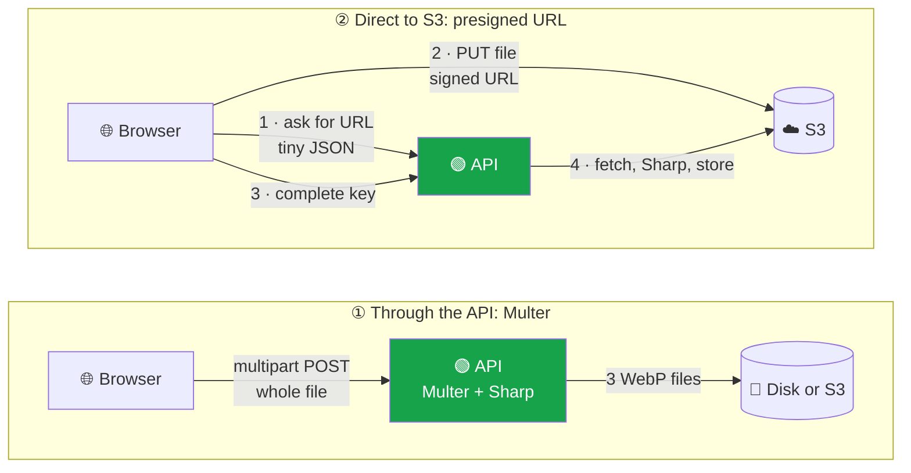
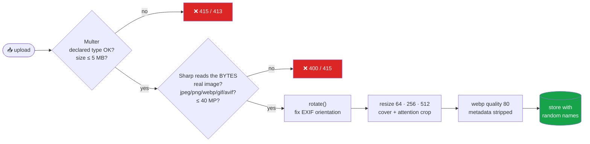
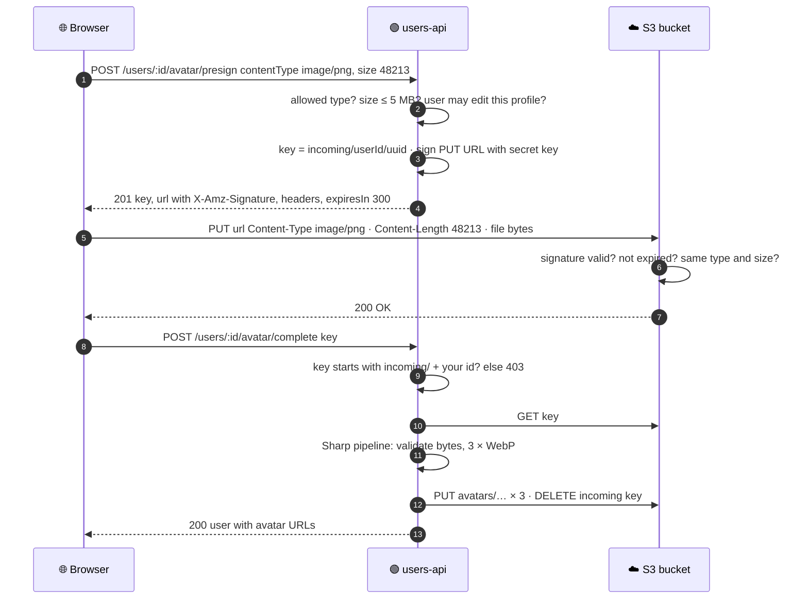

<div align="center">


# 🖼️ Topic 2.4 — File Handling & Media Pipelines

### Multipart Uploads with Multer · Presigned S3 URLs · Image Processing with Sharp

### Assignment 2.4: add avatars to your `users-api` from Assignments 2.1 – 2.3


</div>

---

## 📑 Contents

| Part | Topic |
|------|-------|
| [0](#0-concepts-read-first) | **Concepts:** multipart/form-data, two upload architectures, the image pipeline, upload security |
| [A](#part-a-storage-layer-local-disk-and-s3) | **Storage layer:** one interface, two implementations (local disk and S3) |
| [B](#part-b-image-pipeline-with-sharp) | **Image pipeline** with Sharp: validate → rotate → resize → WebP → strip metadata |
| [C](#part-c-multipart-uploads-with-multer) | **Multer:** `POST /users/:id/avatar` |
| [D](#part-d-presigned-urls-direct-to-s3) | **Presigned URLs:** direct browser → S3 uploads |
| [E](#part-e-tests) | **Tests:** 28 new, 107 total |
| [F](#part-f-try-it) | **Try it** with curl (and optionally a real S3 bucket) |
| [📤](#-what-to-submit) | Submission and marking |

> 📌 **Before you start:** Assignment 2.3 is finished and `npm test` is green.
>
> ```bash
> cd users-api
> git checkout main && git pull
> git checkout -b assignment-2.4
> npm install multer@2 sharp @aws-sdk/client-s3 @aws-sdk/s3-request-presigner
> mkdir -p src/storage tests/fakes
> echo "uploads/" >> .gitignore
> ```

---

## 0. Concepts (read first)

### 0.1 What a file upload looks like on the wire

JSON can't carry binary files efficiently, so browsers use **`multipart/form-data`**: the body is split into *parts* separated by a random **boundary** string.

```http
POST /api/v1/users/4f05.../avatar HTTP/1.1
Authorization: Bearer eyJhbGciOi...
Content-Type: multipart/form-data; boundary=----X9f2

------X9f2
Content-Disposition: form-data; name="avatar"; filename="me.jpg"
Content-Type: image/jpeg

<binary JPEG bytes ...>
------X9f2--
```

**Multer** is Express middleware that parses this body and gives you `req.file = { fieldname, originalname, mimetype, size, buffer }`.

| Multer storage engine | Where the file goes | Use it when |
|-----------------------|---------------------|-------------|
| `memoryStorage()` | A `Buffer` in RAM (`req.file.buffer`) | Small files you process immediately (**our avatars**) |
| `diskStorage()` | A temp file (`req.file.path`) | Large files (videos). Remember to delete temp files |

### 0.2 Two upload architectures



| | ① Through the API (Multer) | ② Presigned URL (direct to S3) |
|---|---|---|
| Upload bandwidth through your server | **All** of it | **None** (only small JSON) |
| Server memory / event loop | Holds the file in RAM | Untouched during the upload |
| Works with local disk | ✅ | ❌ needs a bucket |
| Max practical size | A few MB | GBs (with multipart S3 uploads) |
| Complexity | Low | Medium (3 steps, bucket CORS) |
| Validation | Before storing | **After** upload, so you must re-check everything in step 4 |

> 🎯 **Key Concept:** A **presigned URL** is a normal S3 URL plus a **signature** created with your secret key, e.g. `?X-Amz-Expires=300&X-Amz-Signature=…`. Anyone holding it can do **exactly one thing** (PUT this key, with this Content-Type and Content-Length) for **5 minutes**. The secret key never leaves your server.

### 0.3 The image pipeline



| Format | Typical use | Transparency | File size vs JPEG (rough) |
|--------|-------------|:---:|:---:|
| JPEG | Photos | ❌ | 100 % |
| PNG | Screenshots, logos | ✅ | 200–500 % for photos |
| **WebP** | Everything on the web today | ✅ | **~70 %** |
| AVIF | Newest, best compression | ✅ | ~50 %, but slower to encode |

### 0.4 Upload security checklist (OWASP File Upload Cheat Sheet)

| # | Rule | Where in our code |
|---|------|-------------------|
| 1 | **Limit size** before reading everything | Multer `limits.fileSize` → **413** |
| 2 | **Allow-list** types, never block-list | `fileFilter` + `ALLOWED_FORMATS` |
| 3 | **Don't trust** `Content-Type` or the file extension; check the **bytes** | `sharp().metadata()` → **400** for a fake "PNG" |
| 4 | **No SVG**: it's XML and can contain `<script>` | not in `ALLOWED_FORMATS` → **415** |
| 5 | **Re-encode** the image instead of storing the original | every variant is freshly encoded WebP |
| 6 | **Strip metadata** (EXIF GPS location!) | Sharp's default |
| 7 | **Random, server-generated names**; never use the user's filename in a path | `avatars/<userId>/<uuid>-thumb.webp` |
| 8 | **Block path traversal** | `SAFE_KEY` regex + root check in `LocalDiskStorage` |
| 9 | Serve with **`X-Content-Type-Options: nosniff`** | `express.static` `setHeaders` |
| 10 | **Decompression bombs**: limit pixel count | `limitInputPixels: 40_000_000` |
| 11 | **Authorize** uploads like any other write | `requirePermission('users:update')` + key prefix check |

---

## Part A: Storage layer (local disk and S3)

Both classes have the **same methods**: `put`, `get`, `delete`, `urlFor` and `createPresignedUpload`. The rest of the app never knows which one it's using. That's the **Strategy pattern**, wired with DI in `container.js`.

### A.1 `.env.example` (changed: new upload + S3 section at the bottom)

```bash
# Copy to .env and fill in. NEVER commit .env.
NODE_ENV=development
PORT=3000
HOST=127.0.0.1
BODY_LIMIT=100kb

# ── Auth ──
# Generate a strong secret with:
#   node -e "console.log(require('node:crypto').randomBytes(48).toString('base64url'))"
JWT_SECRET=
ACCESS_TOKEN_TTL_SECONDS=900
REFRESH_TOKEN_TTL_DAYS=7

# First admin (created on startup if missing)
ADMIN_EMAIL=admin@users-api.test
ADMIN_PASSWORD=ChangeMe12345

# ── GitHub OAuth app (Part C) ──
# Create at https://github.com/settings/developers → OAuth Apps → New OAuth App
GITHUB_CLIENT_ID=
GITHUB_CLIENT_SECRET=
GITHUB_CALLBACK_URL=http://localhost:3000/api/v1/auth/github/callback

# ── File uploads (Topic 2.4) ──
STORAGE_DRIVER=local            # local | s3
UPLOADS_DIR=uploads
PUBLIC_BASE_URL=http://localhost:3000
UPLOAD_MAX_BYTES=5242880        # 5 MB

# Only when STORAGE_DRIVER=s3 (AWS S3, MinIO or Cloudflare R2)
S3_REGION=us-east-1
S3_BUCKET=
S3_ENDPOINT=                    # e.g. http://localhost:9000 for MinIO; empty for AWS
S3_PUBLIC_URL=                  # e.g. https://<bucket>.s3.<region>.amazonaws.com
S3_ACCESS_KEY_ID=
S3_SECRET_ACCESS_KEY=
```

### A.2 `src/config/env.js` (changed: `uploads` and `s3` sections)

```js
// Central place for configuration. Every other file imports `config` instead of reading process.env.

const toInt = (value, fallback) => {
  const n = Number.parseInt(value, 10);
  return Number.isNaN(n) ? fallback : n;
};

// Fail fast: never start with a missing or weak signing secret.
const jwtSecret = process.env.JWT_SECRET ?? '';
if (jwtSecret.length < 32) {
  throw new Error('JWT_SECRET must be set and at least 32 characters long (see .env.example)');
}

export const config = Object.freeze({
  env: process.env.NODE_ENV ?? 'development',
  isProduction: process.env.NODE_ENV === 'production',
  isTest: process.env.NODE_ENV === 'test',
  port: toInt(process.env.PORT, 3000),
  host: process.env.HOST ?? '127.0.0.1',
  bodyLimit: process.env.BODY_LIMIT ?? '100kb',

  auth: {
    jwtSecret,
    accessTokenTtlSeconds: toInt(process.env.ACCESS_TOKEN_TTL_SECONDS, 15 * 60), // 15 minutes
    refreshTokenTtlDays: toInt(process.env.REFRESH_TOKEN_TTL_DAYS, 7),
    issuer: 'users-api',
    audience: 'users-api',
  },

  // First admin account, created at startup if it doesn't exist yet.
  admin: {
    email: process.env.ADMIN_EMAIL,
    password: process.env.ADMIN_PASSWORD,
  },

  // ── New in 2.4: file uploads ──
  uploads: {
    driver: process.env.STORAGE_DRIVER ?? 'local', // 'local' (disk) or 's3'
    localDir: process.env.UPLOADS_DIR ?? 'uploads',
    publicBaseUrl: process.env.PUBLIC_BASE_URL ?? 'http://localhost:3000',
    maxBytes: toInt(process.env.UPLOAD_MAX_BYTES, 5 * 1024 * 1024), // 5 MB
  },

  s3: {
    region: process.env.S3_REGION ?? 'us-east-1',
    bucket: process.env.S3_BUCKET,
    endpoint: process.env.S3_ENDPOINT, // set for MinIO / Cloudflare R2; leave empty for AWS
    publicUrl: process.env.S3_PUBLIC_URL, // e.g. https://my-bucket.s3.us-east-1.amazonaws.com
    accessKeyId: process.env.S3_ACCESS_KEY_ID,
    secretAccessKey: process.env.S3_SECRET_ACCESS_KEY,
  },

  github: {
    clientId: process.env.GITHUB_CLIENT_ID,
    clientSecret: process.env.GITHUB_CLIENT_SECRET,
    callbackUrl: process.env.GITHUB_CALLBACK_URL ?? 'http://localhost:3000/api/v1/auth/github/callback',
  },
});
```

### A.3 `src/storage/local-disk.storage.js` (new)

```js
import { mkdir, readFile, rm, writeFile } from 'node:fs/promises';
import path from 'node:path';
import { badRequest, notFound } from '../utils/http-error.js';

// Keys are generated by OUR code (e.g. "avatars/<userId>/<uuid>-thumb.webp"),
// but we still refuse anything that could escape the uploads folder ("../../etc/passwd").
const SAFE_KEY = /^[\w-]+(\/[\w.-]+)*$/;

export class LocalDiskStorage {
  constructor({ dir, publicBaseUrl }) {
    this.root = path.resolve(dir);
    this.publicBaseUrl = publicBaseUrl;
  }

  #pathFor(key) {
    const full = path.resolve(this.root, key);
    if (!SAFE_KEY.test(key) || key.includes('..') || !full.startsWith(this.root + path.sep)) {
      throw badRequest('Invalid storage key');
    }
    return full;
  }

  async put(key, buffer) {
    const file = this.#pathFor(key);
    await mkdir(path.dirname(file), { recursive: true });
    await writeFile(file, buffer);
    return this.urlFor(key);
  }

  async get(key) {
    try {
      return await readFile(this.#pathFor(key));
    } catch (err) {
      if (err.code === 'ENOENT') throw notFound('Uploaded file not found');
      throw err;
    }
  }

  async delete(key) {
    await rm(this.#pathFor(key), { force: true });
  }

  urlFor(key) {
    return `${this.publicBaseUrl}/uploads/${key}`;
  }

  // Direct browser uploads need a cloud bucket.
  async createPresignedUpload() {
    throw notFound('Direct uploads require STORAGE_DRIVER=s3');
  }
}
```

### A.4 `src/storage/s3.storage.js` (new)

```js
import { DeleteObjectCommand, GetObjectCommand, PutObjectCommand, S3Client } from '@aws-sdk/client-s3';
import { getSignedUrl } from '@aws-sdk/s3-request-presigner';
import { notFound } from '../utils/http-error.js';

// Works with AWS S3 and S3-compatible services (MinIO, Cloudflare R2, DigitalOcean Spaces).
export class S3Storage {
  constructor({ region, bucket, endpoint, publicUrl, accessKeyId, secretAccessKey }, { client } = {}) {
    this.bucket = bucket;
    this.publicUrl = publicUrl ?? `https://${bucket}.s3.${region}.amazonaws.com`;
    this.client =
      client ??
      new S3Client({
        region,
        endpoint: endpoint || undefined,
        forcePathStyle: Boolean(endpoint), // MinIO uses http://host:9000/<bucket>/<key>
        credentials: accessKeyId ? { accessKeyId, secretAccessKey } : undefined,
      });
  }

  async put(key, buffer, contentType) {
    await this.client.send(
      new PutObjectCommand({
        Bucket: this.bucket,
        Key: key,
        Body: buffer,
        ContentType: contentType,
        CacheControl: 'public, max-age=31536000, immutable', // keys are unique per upload, so cache forever
      }),
    );
    return this.urlFor(key);
  }

  async get(key) {
    try {
      const res = await this.client.send(new GetObjectCommand({ Bucket: this.bucket, Key: key }));
      return Buffer.from(await res.Body.transformToByteArray());
    } catch (err) {
      if (err.name === 'NoSuchKey') throw notFound('Uploaded file not found');
      throw err;
    }
  }

  async delete(key) {
    await this.client.send(new DeleteObjectCommand({ Bucket: this.bucket, Key: key }));
  }

  urlFor(key) {
    return `${this.publicUrl}/${key}`;
  }

  /**
   * A presigned PUT URL lets the BROWSER upload straight to S3 — the file never passes through
   * our server. Content-Type and Content-Length are part of the signature, so the client must
   * upload exactly the type and size it declared (S3 rejects anything else with 403).
   */
  async createPresignedUpload({ key, contentType, size, expiresIn = 300 }) {
    const command = new PutObjectCommand({ Bucket: this.bucket, Key: key, ContentType: contentType, ContentLength: size });
    const url = await getSignedUrl(this.client, command, {
      expiresIn, // seconds
      signableHeaders: new Set(['content-type', 'content-length']),
    });
    return { url, method: 'PUT', headers: { 'Content-Type': contentType, 'Content-Length': String(size) }, expiresIn };
  }
}
```

---

## Part B: Image pipeline with Sharp

### B.1 `src/services/image.service.js` (new)

```js
import sharp from 'sharp';
import { badRequest, HttpError } from '../utils/http-error.js';

// Formats we accept as INPUT. Notice: no SVG — SVG is XML and can contain <script>.
const ALLOWED_FORMATS = new Set(['jpeg', 'png', 'webp', 'gif', 'avif']);

// Refuse "decompression bombs": a tiny file that decodes to a gigantic image and eats all RAM.
const MAX_PIXELS = 40_000_000; // e.g. 8000 x 5000

export const AVATAR_VARIANTS = [
  { name: 'thumb', size: 64 },
  { name: 'small', size: 256 },
  { name: 'medium', size: 512 },
];

export class ImageService {
  // Never trust the file name or the Content-Type header — look at the actual bytes.
  async inspect(buffer) {
    let meta;
    try {
      meta = await sharp(buffer, { limitInputPixels: MAX_PIXELS }).metadata();
    } catch {
      throw badRequest('The uploaded file is not a valid image');
    }
    if (!ALLOWED_FORMATS.has(meta.format)) {
      throw new HttpError(415, 'Unsupported Media Type', `Image format "${meta.format}" is not allowed`);
    }
    if (meta.width * meta.height > MAX_PIXELS) throw badRequest('Image dimensions are too large');
    return meta;
  }

  /**
   * The pipeline, for each variant:
   *   rotate()  → apply the EXIF orientation (phone photos are often stored sideways)
   *   resize()  → square crop, "attention" keeps the most interesting part (usually the face)
   *   webp()    → modern format, ~30% smaller than JPEG at the same quality
   * Sharp drops ALL metadata by default, so GPS location and camera info never leak.
   * Sharp runs on libuv's thread pool, so this does NOT block the event loop.
   */
  async createAvatarVariants(buffer) {
    await this.inspect(buffer);
    return Promise.all(
      AVATAR_VARIANTS.map(async ({ name, size }) => ({
        name,
        size,
        contentType: 'image/webp',
        buffer: await sharp(buffer, { limitInputPixels: MAX_PIXELS })
          .rotate()
          .resize(size, size, { fit: 'cover', position: 'attention' })
          .webp({ quality: 80 })
          .toBuffer(),
      })),
    );
  }
}
```

> 💡 **Pro-Tip:** Sharp is built on **libvips**, written in C, and runs on libuv's **thread pool**. Resizing even a large phone photo typically takes tens of milliseconds and does **not** block the event loop (remember the [Event Loop](../2.1%20Backend%20Foundations%20-%20Concepts/2-Nodejs-Event-Loop.md) page). A pure-JavaScript image library would freeze every other request.

### B.2 `src/services/avatar.service.js` (new)

```js
import { randomUUID } from 'node:crypto';
import { AVATAR_VARIANTS } from './image.service.js';
import { badRequest, forbidden, HttpError } from '../utils/http-error.js';

export const DIRECT_UPLOAD_TYPES = ['image/jpeg', 'image/png', 'image/webp'];

const keyFor = (userId, version, name) => `avatars/${userId}/${version}-${name}.webp`;

export class AvatarService {
  constructor(usersService, imageService, storage, { maxBytes }) {
    this.users = usersService;
    this.images = imageService;
    this.storage = storage;
    this.maxBytes = maxBytes;
  }

  // Process an image buffer, store 3 WebP sizes, point the user at them, delete the old ones.
  async setAvatar(userId, buffer) {
    const before = await this.users.getById(userId); // 404 if the user doesn't exist
    const variants = await this.images.createAvatarVariants(buffer);

    // A new random "version" per upload gives new URLs, so browsers/CDNs never show a stale image.
    const version = randomUUID();
    const avatar = { version };
    for (const variant of variants) {
      avatar[variant.name] = await this.storage.put(keyFor(userId, version, variant.name), variant.buffer, variant.contentType);
    }

    const user = await this.users.setAvatar(userId, avatar);
    if (before.avatar) await this.#deleteFiles(userId, before.avatar.version);
    return user;
  }

  async removeAvatar(userId) {
    const user = await this.users.getById(userId);
    if (user.avatar) await this.#deleteFiles(userId, user.avatar.version);
    return this.users.setAvatar(userId, null);
  }

  // ── Direct-to-S3 uploads with presigned URLs ──

  // Step 1: the client says what it wants to upload; we answer with a short-lived signed URL.
  async createDirectUpload(userId, { contentType, size }) {
    if (!DIRECT_UPLOAD_TYPES.includes(contentType)) {
      throw new HttpError(415, 'Unsupported Media Type', `contentType must be one of: ${DIRECT_UPLOAD_TYPES.join(', ')}`);
    }
    if (size > this.maxBytes) throw new HttpError(413, 'Content Too Large', `Maximum size is ${this.maxBytes} bytes`);

    const key = `incoming/${userId}/${randomUUID()}`;
    const upload = await this.storage.createPresignedUpload({ key, contentType, size });
    return { key, ...upload };
  }

  // Step 3: after the browser uploaded to S3, the client tells us the key; we fetch, process, clean up.
  async completeDirectUpload(userId, key) {
    // ABAC again: you may only finish uploads that were issued for YOUR user id.
    if (!key.startsWith(`incoming/${userId}/`)) throw forbidden('This upload does not belong to you');
    const buffer = await this.storage.get(key);
    if (buffer.length > this.maxBytes) throw badRequest('Uploaded file is too large');
    try {
      return await this.setAvatar(userId, buffer);
    } finally {
      await this.storage.delete(key); // the raw original is never kept
    }
  }

  async #deleteFiles(userId, version) {
    await Promise.all(AVATAR_VARIANTS.map(({ name }) => this.storage.delete(keyFor(userId, version, name))));
  }
}
```

### B.3 `src/services/users.service.js` (changed: two small additions)

```js
// 1) in withDefaults(), add one line:
  avatar: profile.avatar ?? null,

// 2) new method, just above #assertEmailAvailable:
  // ── New in 2.4 ──
  async setAvatar(id, avatar) {
    await this.getById(id);
    return toPublicUser(await this.users.update(id, { avatar }));
  }
```

---

## Part C: Multipart uploads with Multer

### C.1 `src/middleware/upload.js` (new)

```js
import multer from 'multer';
import { badRequest, HttpError } from '../utils/http-error.js';

const ALLOWED_MIME_TYPES = new Set(['image/jpeg', 'image/png', 'image/webp', 'image/gif', 'image/avif']);

/**
 * Multer parses multipart/form-data. We keep the file in MEMORY (a Buffer) because Sharp
 * processes it straight away; nothing unprocessed is ever written to disk.
 * The limits stop abuse before the whole body is read.
 */
export function createImageUpload({ fieldName, maxBytes }) {
  const upload = multer({
    storage: multer.memoryStorage(),
    limits: { fileSize: maxBytes, files: 1, fields: 5, parts: 6 },
    fileFilter(req, file, cb) {
      // A first, cheap check on the declared type. The REAL check (magic bytes) happens in ImageService.
      if (!ALLOWED_MIME_TYPES.has(file.mimetype)) {
        return cb(new HttpError(415, 'Unsupported Media Type', `File type ${file.mimetype} is not allowed`));
      }
      cb(null, true);
    },
  }).single(fieldName);

  return function imageUpload(req, res, next) {
    upload(req, res, (err) => {
      if (err instanceof multer.MulterError) {
        if (err.code === 'LIMIT_FILE_SIZE') {
          return next(new HttpError(413, 'Content Too Large', `File is larger than ${maxBytes} bytes`));
        }
        return next(badRequest(`Upload error: ${err.message}`)); // e.g. unexpected field name
      }
      if (err) return next(err);
      if (!req.file) return next(badRequest(`Send the image as multipart/form-data in a field named "${fieldName}"`));
      next();
    });
  };
}
```

### C.2 `src/middleware/require-json.js` (changed: also allow `multipart/form-data`)

```js
import { HttpError } from '../utils/http-error.js';

const METHODS_WITH_BODY = new Set(['POST', 'PUT', 'PATCH']);
// JSON for normal requests, multipart/form-data for file uploads (Topic 2.4).
const ALLOWED_BODY_TYPES = ['application/json', 'multipart/form-data'];

// A request "has a body" if it is chunked or declares a non-zero Content-Length.
const hasBody = (req) =>
  req.get('transfer-encoding') !== undefined || Number(req.get('content-length') ?? 0) > 0;

export function requireJson(req, res, next) {
  if (METHODS_WITH_BODY.has(req.method) && hasBody(req) && !req.is(ALLOWED_BODY_TYPES)) {
    return next(new HttpError(415, 'Unsupported Media Type', 'Content-Type must be application/json (or multipart/form-data for uploads)'));
  }
  next();
}
```

### C.3 `src/controllers/avatar.controller.js` (new)

```js
export class AvatarController {
  constructor(avatarService) {
    this.avatars = avatarService;
  }

  // POST /users/:id/avatar   (multipart/form-data, field "avatar")
  upload = async (req, res) => {
    res.json({ data: await this.avatars.setAvatar(req.params.id, req.file.buffer) });
  };

  // DELETE /users/:id/avatar
  remove = async (req, res) => {
    res.json({ data: await this.avatars.removeAvatar(req.params.id) });
  };

  // POST /users/:id/avatar/presign   { contentType, size }
  presign = async (req, res) => {
    res.status(201).json({ data: await this.avatars.createDirectUpload(req.params.id, req.body) });
  };

  // POST /users/:id/avatar/complete  { key }
  complete = async (req, res) => {
    res.json({ data: await this.avatars.completeDirectUpload(req.params.id, req.body.key) });
  };
}
```

### C.4 `src/validators/upload.schema.js` (new)

```js
import { integer, string } from './rules.js';

export const presignSchema = {
  contentType: { required: true, check: string({ max: 50 }) },
  size: { required: true, check: integer({ min: 1, max: 50 * 1024 * 1024 }) },
};

export const completeUploadSchema = {
  key: { required: true, check: string({ max: 200 }) },
};
```

### C.5 `src/routes/users.routes.js` (changed: 4 avatar routes)

```js
import { Router } from 'express';
import { requirePermission, requireRole } from '../middleware/authorize.js';
import { validateBody } from '../middleware/validate-body.js';
import { validateIdParam } from '../middleware/validate-id.js';
import { changeRoleSchema } from '../validators/auth.schema.js';
import { completeUploadSchema, presignSchema } from '../validators/upload.schema.js';
import { createUserSchema, updateUserSchema } from '../validators/user.schema.js';

export function createUsersRouter({ usersController: c, avatarController: a, authenticate, avatarUpload }) {
  const router = Router();

  router.use(authenticate);
  router.param('id', validateIdParam);

  router.get('/',           requireRole('admin'),                                    c.list);
  router.post('/',          requireRole('admin'), validateBody(createUserSchema),    c.create);
  router.get('/:id',        requirePermission('users:read'),                         c.getById);
  router.patch('/:id',      requirePermission('users:update'), validateBody(updateUserSchema, { partial: true }), c.update);
  router.patch('/:id/role', requireRole('admin'), validateBody(changeRoleSchema),    c.changeRole);
  router.delete('/:id',     requirePermission('users:delete'),                       c.remove);

  // ── New in 2.4: avatars (same ABAC rule as editing the profile) ──
  router.post('/:id/avatar',          requirePermission('users:update'), avatarUpload,                       a.upload);
  router.delete('/:id/avatar',        requirePermission('users:update'),                                     a.remove);
  router.post('/:id/avatar/presign',  requirePermission('users:update'), validateBody(presignSchema),        a.presign);
  router.post('/:id/avatar/complete', requirePermission('users:update'), validateBody(completeUploadSchema), a.complete);

  return router;
}
```

### C.6 `src/container.js` (changed: storage, image and avatar services)

```js
import { config } from './config/env.js';
import { AuthController } from './controllers/auth.controller.js';
import { AvatarController } from './controllers/avatar.controller.js';
import { UsersController } from './controllers/users.controller.js';
import { createAuthenticate } from './middleware/authenticate.js';
import { createImageUpload } from './middleware/upload.js';
import { RefreshTokensRepository } from './repositories/refresh-tokens.repository.js';
import { UsersRepository } from './repositories/users.repository.js';
import { AuthService } from './services/auth.service.js';
import { AvatarService } from './services/avatar.service.js';
import { GithubOAuthClient } from './services/github-oauth.client.js';
import { ImageService } from './services/image.service.js';
import { TokenService } from './services/token.service.js';
import { UsersService } from './services/users.service.js';
import { LocalDiskStorage } from './storage/local-disk.storage.js';
import { S3Storage } from './storage/s3.storage.js';

// Pick the storage implementation from config. Both have the same methods (put/get/delete/...).
function createStorage(uploads) {
  if (uploads.driver === 's3') return new S3Storage(config.s3);
  return new LocalDiskStorage({ dir: uploads.localDir, publicBaseUrl: uploads.publicBaseUrl });
}

// Composition root. `overrides` lets tests swap pieces (fake hasher, fake GitHub fetch, ...).
export function createContainer(overrides = {}) {
  const usersRepository = overrides.usersRepository ?? new UsersRepository();
  const refreshTokensRepository = overrides.refreshTokensRepository ?? new RefreshTokensRepository();

  const usersService =
    overrides.usersService ??
    new UsersService(usersRepository, { hash: overrides.hashPassword, verify: overrides.verifyPassword });
  const tokenService = new TokenService(refreshTokensRepository, { ...config.auth, ...overrides.auth });
  const authService = new AuthService(usersService, tokenService);
  const githubClient = new GithubOAuthClient({ ...config.github, ...overrides.github }, { fetch: overrides.fetch });

  const uploads = { ...config.uploads, ...overrides.uploads };
  const storage = overrides.storage ?? createStorage(uploads);
  const avatarService = new AvatarService(usersService, new ImageService(), storage, { maxBytes: uploads.maxBytes });

  return {
    usersRepository,
    refreshTokensRepository,
    usersService,
    tokenService,
    authService,
    githubClient,
    authenticate: createAuthenticate(tokenService),
    usersController: new UsersController(usersService),
    authController: new AuthController(authService, usersService, githubClient),
    storage,
    uploads,
    avatarService,
    avatarController: new AvatarController(avatarService),
    avatarUpload: createImageUpload({ fieldName: 'avatar', maxBytes: uploads.maxBytes }),
  };
}
```

### C.7 `src/app.js` (changed: serve `/uploads`)

```js
import cookieParser from 'cookie-parser';
import express from 'express';
import { config } from './config/env.js';
import { errorHandler } from './middleware/error-handler.js';
import { notFoundHandler } from './middleware/not-found.js';
import { requestId } from './middleware/request-id.js';
import { requestLogger } from './middleware/request-logger.js';
import { requireJson } from './middleware/require-json.js';
import { createAuthRouter } from './routes/auth.routes.js';
import { createUsersRouter } from './routes/users.routes.js';

export function createApp(container) {
  const app = express();

  app.disable('x-powered-by');
  app.set('trust proxy', 'loopback');

  // ── 1. App-level middleware ──
  app.use(requestId);
  if (!config.isTest) app.use(requestLogger);
  app.use(requireJson);
  app.use(express.json({ limit: config.bodyLimit }));
  app.use(cookieParser()); // fills req.cookies (needed for the refresh-token cookie)

  // ── 2. Routes ──
  app.get('/health', (req, res) => {
    res.json({ status: 'ok', uptimeSec: Math.round(process.uptime()) });
  });
  // Uploaded files on local disk are served as static files (public, cache forever: names never repeat).
  if (container.uploads.driver === 'local') {
    app.use(
      '/uploads',
      express.static(container.uploads.localDir, {
        index: false,
        dotfiles: 'deny',
        immutable: true,
        maxAge: '365d',
        setHeaders: (res) => res.set('X-Content-Type-Options', 'nosniff'), // never let the browser guess the type
      }),
    );
  }
  app.use('/api/v1/auth', createAuthRouter(container));
  app.use('/api/v1/users', createUsersRouter(container));

  // ── 3. Fallbacks ──
  app.use(notFoundHandler);
  app.use(errorHandler);

  return app;
}
```

> ⚠️ **Security Warning:** In production, serve user uploads from a **different domain** (e.g. `cdn.example.com` or the S3 bucket), never from your API's domain. If a malicious file ever slipped through, it then can't read your API's cookies.

---

## Part D: Presigned URLs (direct to S3)



The code is already in place: `S3Storage.createPresignedUpload` (A.4), `AvatarService.createDirectUpload` / `completeDirectUpload` (B.2), and the `/presign` and `/complete` routes (C.5).

**Frontend side (for your React app from Unit 1):**

```js
async function uploadAvatarDirect(userId, file, accessToken) {
  const auth = { Authorization: `Bearer ${accessToken}`, 'Content-Type': 'application/json' };

  // 1. Ask our API for a presigned URL
  const presign = await fetch(`/api/v1/users/${userId}/avatar/presign`, {
    method: 'POST',
    headers: auth,
    body: JSON.stringify({ contentType: file.type, size: file.size }),
  }).then((r) => r.json());

  // 2. Upload the file straight to S3. The browser sets Content-Length itself.
  const put = await fetch(presign.data.url, { method: 'PUT', headers: { 'Content-Type': file.type }, body: file });
  if (!put.ok) throw new Error(`S3 upload failed: ${put.status}`);

  // 3. Tell our API to process it
  return fetch(`/api/v1/users/${userId}/avatar/complete`, {
    method: 'POST',
    headers: auth,
    body: JSON.stringify({ key: presign.data.key }),
  }).then((r) => r.json());
}

// Classic multipart alternative (Part C):
async function uploadAvatarMultipart(userId, file, accessToken) {
  const form = new FormData();
  form.append('avatar', file); // field name must match createImageUpload({ fieldName: 'avatar' })
  return fetch(`/api/v1/users/${userId}/avatar`, {
    method: 'POST',
    headers: { Authorization: `Bearer ${accessToken}` }, // do NOT set Content-Type: the browser adds the boundary
    body: form,
  }).then((r) => r.json());
}
```

### D.1 (Optional) A real S3 bucket

The tests don't need AWS. To try Part D for real, use an AWS free-tier account or any S3-compatible service (MinIO, Cloudflare R2):

1. **Create a bucket**, e.g. `itex320-<yourname>-avatars`, in `us-east-1`.
2. **Create an IAM user** with **only** this policy (least privilege), then create an access key for it:
   ```json
   {
     "Version": "2012-10-17",
     "Statement": [{
       "Effect": "Allow",
       "Action": ["s3:PutObject", "s3:GetObject", "s3:DeleteObject"],
       "Resource": "arn:aws:s3:::itex320-<yourname>-avatars/*"
     }]
   }
   ```
3. **Bucket CORS** (Permissions → CORS), so the *browser* may PUT directly:
   ```json
   [{
     "AllowedOrigins": ["http://localhost:5173"],
     "AllowedMethods": ["PUT"],
     "AllowedHeaders": ["Content-Type"],
     "MaxAgeSeconds": 3000
   }]
   ```
4. To make avatars viewable, allow public `s3:GetObject` on **`avatars/*` only** (bucket policy). Keep `incoming/*` private.
5. In `.env`, set `STORAGE_DRIVER=s3`, `S3_BUCKET`, `S3_REGION`, `S3_ACCESS_KEY_ID` and `S3_SECRET_ACCESS_KEY`.

> ⚠️ **Security Warning:** Never commit AWS keys. Bots scan GitHub for them within **minutes** and start crypto-mining on your account. If a key leaks, **deactivate it in IAM immediately**.

---

## Part E: Tests

### E.1 `tests/fakes/images.js` (new)

Real test images, generated in memory, so there are no binary files to commit.

```js
import sharp from 'sharp';

// Generate real test images in memory — no binary fixture files needed in the repo.
export const makeImage = ({ width = 800, height = 600, format = 'png', exif } = {}) => {
  let img = sharp({ create: { width, height, channels: 3, background: { r: 200, g: 60, b: 40 } } });
  if (exif) img = img.withExif(exif);
  return img.toFormat(format).toBuffer();
};

export const SVG_WITH_SCRIPT = Buffer.from(
  '<svg xmlns="http://www.w3.org/2000/svg" width="10" height="10"><script>alert(document.cookie)</script><rect width="10" height="10"/></svg>',
);
```

### E.2 `tests/fakes/memory.storage.js` (new)

```js
// An in-memory stand-in for S3Storage with the SAME methods. Injected via the container in tests.
export class MemoryStorage {
  files = new Map();

  async put(key, buffer, contentType) {
    this.files.set(key, { buffer, contentType });
    return this.urlFor(key);
  }

  async get(key) {
    const file = this.files.get(key);
    if (!file) throw Object.assign(new Error('Uploaded file not found'), { status: 404 });
    return file.buffer;
  }

  async delete(key) {
    this.files.delete(key);
  }

  urlFor(key) {
    return `https://bucket.example.com/${key}`;
  }

  async createPresignedUpload({ key, contentType, size }) {
    return {
      url: `https://bucket.example.com/${key}?X-Amz-Signature=fake`,
      method: 'PUT',
      headers: { 'Content-Type': contentType, 'Content-Length': String(size) },
      expiresIn: 300,
    };
  }
}
```

### E.3 `tests/unit/image.service.test.js` (new)

```js
import sharp from 'sharp';
import { describe, expect, it } from 'vitest';
import { ImageService } from '../../src/services/image.service.js';
import { makeImage, SVG_WITH_SCRIPT } from '../fakes/images.js';

const images = new ImageService();

describe('ImageService', () => {
  it('creates 3 square WebP variants: 64, 256 and 512 px', async () => {
    const variants = await images.createAvatarVariants(await makeImage({ width: 1200, height: 800, format: 'jpeg' }));

    expect(variants.map((v) => v.name)).toEqual(['thumb', 'small', 'medium']);
    for (const v of variants) {
      const meta = await sharp(v.buffer).metadata();
      expect(meta.format).toBe('webp');
      expect([meta.width, meta.height]).toEqual([v.size, v.size]);
      expect(v.contentType).toBe('image/webp');
    }
  });

  it('strips EXIF metadata (camera, GPS, ...) from the output', async () => {
    const input = await makeImage({ format: 'jpeg', exif: { IFD0: { Copyright: 'secret-camera-owner' } } });
    expect((await sharp(input).metadata()).exif).toBeDefined(); // input HAS exif

    const [thumb] = await images.createAvatarVariants(input);
    expect((await sharp(thumb.buffer).metadata()).exif).toBeUndefined();
  });

  it('compresses: the 512 px WebP is much smaller than a big PNG input', async () => {
    const input = await makeImage({ width: 2000, height: 2000, format: 'png' });
    const medium = (await images.createAvatarVariants(input)).find((v) => v.name === 'medium');
    expect(medium.buffer.length).toBeLessThan(input.length / 5);
  });

  it('rejects bytes that are not an image, whatever the file claims to be', async () => {
    await expect(images.createAvatarVariants(Buffer.from('I am a PDF pretending to be a PNG'))).rejects.toMatchObject({
      status: 400,
      detail: 'The uploaded file is not a valid image',
    });
  });

  it('rejects SVG (it can contain scripts) with 415', async () => {
    await expect(images.createAvatarVariants(SVG_WITH_SCRIPT)).rejects.toMatchObject({ status: 415 });
  });

  it('rejects decompression bombs (huge pixel dimensions)', async () => {
    const bomb = await sharp({ create: { width: 9000, height: 9000, channels: 3, background: '#000' } }).png().toBuffer();
    await expect(images.createAvatarVariants(bomb)).rejects.toMatchObject({ status: 400 });
  });
});
```

### E.4 `tests/unit/storage.test.js` (new)

The S3 test signs a URL **locally with fake credentials**: signing is pure cryptography and needs no network.

```js
import { mkdtemp, rm } from 'node:fs/promises';
import os from 'node:os';
import path from 'node:path';
import { afterEach, beforeEach, describe, expect, it } from 'vitest';
import { LocalDiskStorage } from '../../src/storage/local-disk.storage.js';
import { S3Storage } from '../../src/storage/s3.storage.js';

describe('LocalDiskStorage', () => {
  let dir;
  let storage;

  beforeEach(async () => {
    dir = await mkdtemp(path.join(os.tmpdir(), 'uploads-'));
    storage = new LocalDiskStorage({ dir, publicBaseUrl: 'http://localhost:3000' });
  });
  afterEach(() => rm(dir, { recursive: true, force: true }));

  it('put → get → delete', async () => {
    const url = await storage.put('avatars/u1/v1-thumb.webp', Buffer.from('hello'));
    expect(url).toBe('http://localhost:3000/uploads/avatars/u1/v1-thumb.webp');
    expect((await storage.get('avatars/u1/v1-thumb.webp')).toString()).toBe('hello');

    await storage.delete('avatars/u1/v1-thumb.webp');
    await expect(storage.get('avatars/u1/v1-thumb.webp')).rejects.toMatchObject({ status: 404 });
  });

  it.each(['../../etc/passwd', 'avatars/../../secret', '/etc/passwd', 'a\\..\\b'])('refuses path traversal: %s', async (key) => {
    await expect(storage.put(key, Buffer.from('x'))).rejects.toMatchObject({ status: 400 });
  });

  it('has no presigned uploads (404 explains why)', async () => {
    await expect(storage.createPresignedUpload({})).rejects.toMatchObject({ status: 404 });
  });
});

describe('S3Storage presigned upload (signed locally — no network, no real AWS account)', () => {
  const s3 = new S3Storage({
    region: 'us-east-1',
    bucket: 'itex320-avatars',
    accessKeyId: 'AKIAEXAMPLEEXAMPLE00',
    secretAccessKey: 'example-secret-key-example-secret-key-00',
  });

  it('returns a signed PUT URL that expires and locks Content-Type and Content-Length', async () => {
    const upload = await s3.createPresignedUpload({ key: 'incoming/u1/abc', contentType: 'image/png', size: 12345 });
    const url = new URL(upload.url);

    expect(url.hostname).toBe('itex320-avatars.s3.us-east-1.amazonaws.com');
    expect(url.pathname).toBe('/incoming/u1/abc');
    expect(url.searchParams.get('X-Amz-Algorithm')).toBe('AWS4-HMAC-SHA256');
    expect(url.searchParams.get('X-Amz-Expires')).toBe('300');
    expect(url.searchParams.get('X-Amz-Signature')).toMatch(/^[0-9a-f]{64}$/);
    expect(url.searchParams.get('X-Amz-SignedHeaders').split(';')).toEqual(
      expect.arrayContaining(['content-length', 'content-type', 'host']),
    );
    expect(upload).toMatchObject({ method: 'PUT', headers: { 'Content-Type': 'image/png', 'Content-Length': '12345' } });
    expect(upload.url).not.toContain('example-secret-key'); // the secret itself is never in the URL
  });

  it('builds public URLs for stored objects', () => {
    expect(s3.urlFor('avatars/u1/v-thumb.webp')).toBe('https://itex320-avatars.s3.us-east-1.amazonaws.com/avatars/u1/v-thumb.webp');
  });
});
```

### E.5 `tests/integration/avatar.api.test.js` (new)

```js
import { randomBytes } from 'node:crypto';
import { mkdtemp, readdir, rm } from 'node:fs/promises';
import os from 'node:os';
import path from 'node:path';
import sharp from 'sharp';
import request from 'supertest';
import { afterEach, beforeEach, describe, expect, it } from 'vitest';
import { makeImage, SVG_WITH_SCRIPT } from '../fakes/images.js';
import { MemoryStorage } from '../fakes/memory.storage.js';
import { bearer, buildTestApp, RAM, registerAs, SITA } from '../helpers.js';

const avatarUrl = (id) => `/api/v1/users/${id}/avatar`;

describe('Avatar upload with Multer + Sharp (local disk storage)', () => {
  let app;
  let dir;
  let sita;

  beforeEach(async () => {
    dir = await mkdtemp(path.join(os.tmpdir(), 'uploads-'));
    ({ app } = await buildTestApp({ uploads: { driver: 'local', localDir: dir, publicBaseUrl: '', maxBytes: 1024 * 1024 } }));
    sita = await registerAs(app, SITA);
  });
  afterEach(() => rm(dir, { recursive: true, force: true }));

  const upload = (buffer, { filename = 'me.png', contentType = 'image/png', field = 'avatar', token = sita.token, id = sita.user.id } = {}) =>
    request(app).post(avatarUrl(id)).set(bearer(token)).attach(field, buffer, { filename, contentType });

  it('200: stores 3 WebP sizes and returns their URLs on the user', async () => {
    const res = await upload(await makeImage({ format: 'png' }));

    expect(res.status).toBe(200);
    const { avatar } = res.body.data;
    expect(avatar).toMatchObject({
      version: expect.any(String),
      thumb: expect.stringMatching(/^\/uploads\/avatars\/.+-thumb\.webp$/),
      small: expect.stringMatching(/-small\.webp$/),
      medium: expect.stringMatching(/-medium\.webp$/),
    });

    // The files are really served as static WebP images
    const file = await request(app).get(avatar.thumb);
    expect(file.status).toBe(200);
    expect(file.headers['content-type']).toBe('image/webp');
    expect(file.headers['x-content-type-options']).toBe('nosniff');
    expect((await sharp(file.body).metadata()).width).toBe(64);
  });

  it('uploading again replaces the old files (no orphans on disk)', async () => {
    await upload(await makeImage());
    await upload(await makeImage({ format: 'jpeg' }));
    const files = await readdir(path.join(dir, 'avatars', sita.user.id));
    expect(files).toHaveLength(3);
  });

  it('DELETE removes the avatar and its files', async () => {
    await upload(await makeImage());
    const res = await request(app).delete(avatarUrl(sita.user.id)).set(bearer(sita.token));
    expect(res.status).toBe(200);
    expect(res.body.data.avatar).toBeNull();
    expect(await readdir(path.join(dir, 'avatars', sita.user.id))).toHaveLength(0);
  });

  describe('rejections', () => {
    it('401 without a token, 403 for someone else’s avatar', async () => {
      const ram = await registerAs(app, RAM);
      expect((await request(app).post(avatarUrl(sita.user.id)).attach('avatar', await makeImage(), 'a.png')).status).toBe(401);
      expect((await upload(await makeImage(), { token: ram.token })).status).toBe(403);
    });

    it('413 when the file is larger than the limit', async () => {
      const big = randomBytes(1024 * 1024 + 1); // 1 byte over the 1 MB test limit
      const res = await upload(big); // Multer stops reading at the limit — Sharp never sees it
      expect(res.status).toBe(413);
    });

    it('415 for a declared type that is not an image', async () => {
      const res = await upload(Buffer.from('%PDF-1.7'), { filename: 'cv.pdf', contentType: 'application/pdf' });
      expect(res.status).toBe(415);
    });

    it('400 for a fake "PNG" (right Content-Type, wrong bytes)', async () => {
      const res = await upload(Buffer.from('<?php system($_GET["cmd"]); ?>'), { filename: 'shell.png', contentType: 'image/png' });
      expect(res.status).toBe(400);
      expect(res.body.detail).toBe('The uploaded file is not a valid image');
    });

    it('415 for SVG disguised as PNG', async () => {
      expect((await upload(SVG_WITH_SCRIPT, { filename: 'x.png' })).status).toBe(415);
    });

    it('400 when the field name is wrong or no file is sent', async () => {
      expect((await upload(await makeImage(), { field: 'photo' })).status).toBe(400);
      const noFile = await request(app).post(avatarUrl(sita.user.id)).set(bearer(sita.token)).field('note', 'hi');
      expect(noFile.status).toBe(400);
    });

    it('presign returns 404 on local storage (needs S3)', async () => {
      const res = await request(app).post(`${avatarUrl(sita.user.id)}/presign`).set(bearer(sita.token)).send({ contentType: 'image/png', size: 1000 });
      expect(res.status).toBe(404);
    });
  });
});

describe('Direct-to-S3 upload with presigned URLs (S3 replaced by MemoryStorage)', () => {
  let app;
  let storage;
  let sita;

  beforeEach(async () => {
    storage = new MemoryStorage();
    ({ app } = await buildTestApp({ storage, uploads: { driver: 's3', maxBytes: 1024 * 1024 } }));
    sita = await registerAs(app, SITA);
  });

  it('presign → (browser uploads to S3) → complete → avatar processed, original deleted', async () => {
    // Step 1: ask for a signed URL
    const presign = await request(app)
      .post(`${avatarUrl(sita.user.id)}/presign`)
      .set(bearer(sita.token))
      .send({ contentType: 'image/png', size: 5000 });
    expect(presign.status).toBe(201);
    const { key, url, method, headers } = presign.body.data;
    expect(key).toMatch(new RegExp(`^incoming/${sita.user.id}/`));
    expect(url).toContain('X-Amz-Signature');
    expect(method).toBe('PUT');
    expect(headers['Content-Type']).toBe('image/png');

    // Step 2: the browser PUTs the file to `url` — simulated here
    await storage.put(key, await makeImage(), 'image/png');

    // Step 3: tell the API the upload is done
    const complete = await request(app).post(`${avatarUrl(sita.user.id)}/complete`).set(bearer(sita.token)).send({ key });
    expect(complete.status).toBe(200);
    expect(complete.body.data.avatar.medium).toMatch(/^https:\/\/bucket\.example\.com\/avatars\/.+-medium\.webp$/);
    expect(storage.files.has(key)).toBe(false); // raw original removed
  });

  it('415 / 413 for bad presign requests', async () => {
    const url = `${avatarUrl(sita.user.id)}/presign`;
    expect((await request(app).post(url).set(bearer(sita.token)).send({ contentType: 'image/svg+xml', size: 100 })).status).toBe(415);
    expect((await request(app).post(url).set(bearer(sita.token)).send({ contentType: 'image/png', size: 5 * 1024 * 1024 })).status).toBe(413);
  });

  it('403 when completing an upload key that belongs to another user', async () => {
    const res = await request(app)
      .post(`${avatarUrl(sita.user.id)}/complete`)
      .set(bearer(sita.token))
      .send({ key: 'incoming/some-other-user/abc' });
    expect(res.status).toBe(403);
  });

  it('400 and cleanup when the uploaded object is not an image', async () => {
    const { body } = await request(app).post(`${avatarUrl(sita.user.id)}/presign`).set(bearer(sita.token)).send({ contentType: 'image/png', size: 20 });
    await storage.put(body.data.key, Buffer.from('not really an image'), 'image/png');

    const res = await request(app).post(`${avatarUrl(sita.user.id)}/complete`).set(bearer(sita.token)).send({ key: body.data.key });
    expect(res.status).toBe(400);
    expect(storage.files.has(body.data.key)).toBe(false);
  });
});
```

### E.6 Run

```bash
npm test
```

```text
 ✓ tests/unit/image.service.test.js (6 tests)
 ✓ tests/unit/storage.test.js (8 tests)
 ✓ tests/integration/avatar.api.test.js (14 tests)
 … all 2.3 test files still pass …

 Test Files  10 passed (10)
      Tests  107 passed (107)
```

---

## Part F: Try it

```bash
npm run dev
API=localhost:3000/api/v1

# Register and keep the token + id
curl -s -X POST $API/auth/register -H 'Content-Type: application/json' \
  -d '{"firstName":"Sita","lastName":"Gurung","email":"sita@example.com","password":"Secret123"}'
TOKEN=eyJ...      # data.accessToken
ID=4f05...        # data.user.id

# Upload any photo from your computer (-F sends multipart/form-data)
curl -s -X POST $API/users/$ID/avatar -H "Authorization: Bearer $TOKEN" -F "avatar=@photo.jpg"
# → "avatar": { "version": "…", "thumb": "http://localhost:3000/uploads/avatars/<id>/<v>-thumb.webp", "small": …, "medium": … }

# Open the "medium" URL in your browser → your photo, square, 512×512, WebP
ls -la uploads/avatars/$ID      # compare the 3 sizes with your original photo

# Try to break it
echo "not an image" > fake.png
curl -s -X POST $API/users/$ID/avatar -H "Authorization: Bearer $TOKEN" -F "avatar=@fake.png;type=image/png"   # 400
curl -s -X POST $API/users/$ID/avatar -H "Authorization: Bearer $TOKEN" -F "photo=@photo.jpg"                  # 400 wrong field
```

> 💡 **Pro-Tip:** Take a photo with your phone (location enabled), upload it, and download the `medium` WebP. Run `exiftool` on both, or use an online EXIF viewer. The original has GPS coordinates; the processed avatar has **none**.

---

## 📤 What to submit

1. **Pull Request link** (`assignment-2.4` → `main`) in your **same** `users-api` repository.
2. **Screenshots:**
   - a real photo uploaded with curl, and the `medium` avatar opened in the browser
   - `ls -la uploads/avatars/<id>` next to the size of your original photo
   - the 400 response for `fake.png`
   - `npm test` showing **107 passed** (or more)
3. **Short answers** (3–5 sentences each):
   1. Why do we check the image **bytes** with Sharp when Multer already checked the `Content-Type`? Give an attack that the second check stops.
   2. Compare uploading **through the API** with **presigned URLs**: when would you choose each?
   3. Name three things our pipeline does to the image and why each matters (performance, privacy, security).
   4. Why does every upload get a **new random `version`** in its filename?

## 🧮 Marking (10 marks)

| Criteria | Marks |
|----------|:-----:|
| Storage layer: `LocalDiskStorage` + `S3Storage` with the same interface, chosen in the container | 2 |
| Sharp pipeline: 3 WebP sizes, EXIF stripped, bad files rejected (400/413/415) | 3 |
| Multer route + presign/complete routes with correct authorization | 2 |
| Tests present and passing | 1 |
| Short answers | 2 |

### ⭐ Bonus (+2, choose one)

- **Real S3:** complete Part D.1 and show a browser upload going **directly** to your bucket (DevTools → Network tab: the PUT goes to `*.amazonaws.com`, not to `localhost:3000`).
- **Blur placeholder:** also generate a tiny 16×16 image and return it as a base64 `data:` URL (`placeholder`), so the frontend can show it while the real avatar loads.
- **Background processing:** respond `202 Accepted` right after `/complete` and process the image in the background. How would the client know when it's done?

---

<div align="center">

⬅️ [Topic 2.3: Authentication & Authorization](../2.3%20Authentication%20%26%20Authorization/README.md)  ·  **Topic 2.4**  ·  [Topic 2.5: Web Security & Hardening ➡️](../2.5%20Web%20Security%20%26%20Hardening/README.md)

</div>
