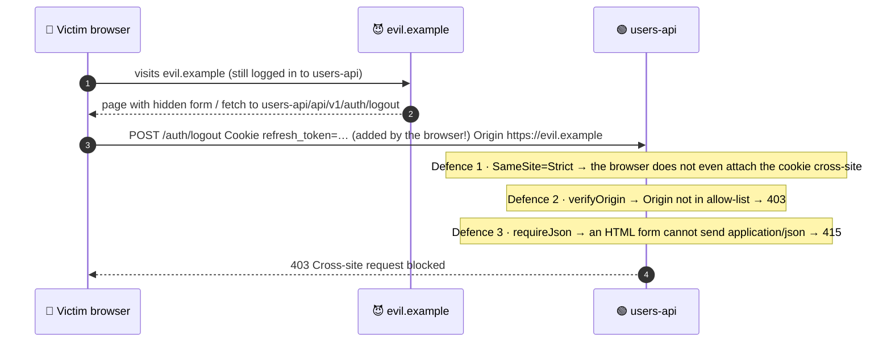
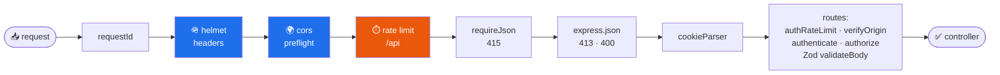

<div align="center">


# 🛡️ Topic 2.5 — Web Security & Hardening

### OWASP Top 10 · XSS · CSRF · SQL/NoSQL Injection · Helmet · CORS · Rate Limiting · Zod

### Assignment 2.5: harden your `users-api` from Assignments 2.1 – 2.4


</div>

---

## 📑 Contents

| Part | Topic |
|------|-------|
| [0](#0-concepts-read-first) | **Concepts:** OWASP Top 10, XSS, CSRF, SQL/NoSQL injection, CORS, security headers, rate limiting |
| [A](#part-a-input-validation-with-zod) | **Zod:** replace the hand-made validators |
| [B](#part-b-helmet-cors-csrf-and-rate-limiting) | **Helmet, CORS, CSRF check, rate limiting** |
| [C](#part-c-tests) | **Tests:** 24 new, 131 total, including real attack payloads |
| [D](#part-d-attack-your-own-api) | **Attack your own API** with curl |
| [📤](#-what-to-submit) | Submission and marking |

> 📌 **Before you start:** Assignment 2.4 is finished and `npm test` is green.
>
> ```bash
> cd users-api
> # First merge your 2.4 pull request on GitHub, then:
> git checkout main && git pull            # main now contains your 2.4 work
> git checkout -b assignment-2.5
> npm install zod helmet cors express-rate-limit
> ```

---

## 0. Concepts (read first)

### 0.1 OWASP Top 10: where each risk is handled in `users-api`

The [OWASP Top 10](https://owasp.org/www-project-top-ten/) is the industry's list of the most critical web application risks. The table uses the 2021 categories; check owasp.org for the latest edition.

| # | Risk | Example attack | Our defence | Topic |
|---|------|----------------|-------------|:---:|
| A01 | **Broken Access Control** | Sita edits Ram's profile | `authenticate` + RBAC/ABAC policies | 2.3 |
| A02 | **Cryptographic Failures** | Plain-text passwords in a DB dump | scrypt + salt, signed JWTs, HTTPS/HSTS | 2.1, 2.3, **2.5** |
| A03 | **Injection** (SQL, NoSQL, XSS) | `{"email":{"$ne":null}}`, `<script>` | **Zod** allow-list validation, parameterised queries, output encoding | **2.5** |
| A04 | **Insecure Design** | No limit on login attempts | Threat modelling, **rate limits**, refresh-token reuse detection | 2.3, **2.5** |
| A05 | **Security Misconfiguration** | Stack traces in errors, missing headers, `CORS: *` | Problem Details errors, **Helmet**, **CORS allow-list** | 2.1, **2.5** |
| A06 | **Vulnerable Components** | An old library with a known CVE | `npm audit`, lock file, Dependabot | **2.5** |
| A07 | **Identification & Authentication Failures** | Credential stuffing, brute force | Password rules, **login rate limit**, generic login errors | 2.3, **2.5** |
| A08 | **Software & Data Integrity Failures** | Tampered JWT, malicious package | JWT signature + pinned `alg`, `npm ci` | 2.3 |
| A09 | **Logging & Monitoring Failures** | Attack goes unnoticed | Request IDs + logs (monitoring in Unit 4) | 2.1 |
| A10 | **Server-Side Request Forgery (SSRF)** | "Fetch this URL for me" → `http://169.254.169.254` | We never fetch user-supplied URLs (GitHub URLs are hard-coded; S3 keys are ours) | 2.3, 2.4 |

### 0.2 Cross-Site Scripting (XSS)

An attacker gets **their JavaScript to run in another user's browser** on your site, where it can steal tokens, act as the user, and so on.

| Type | How | Example |
|------|-----|---------|
| **Stored** | Payload saved in the DB, shown to others | `firstName: ""` |
| **Reflected** | Payload in a URL, echoed in the response | `/search?q=<script>…</script>` |
| **DOM-based** | Frontend JS puts untrusted data into the page | `el.innerHTML = location.hash` |

| Defence (use **all** of them) | In this project |
|-------------------------------|-----------------|
| **Output encoding:** let the framework escape | React escapes `{user.firstName}`. **Never** use `dangerouslySetInnerHTML` with user data |
| **Input allow-listing** | Zod: names may only contain letters, spaces, `'`, `.`, `-` |
| **Content-Security-Policy** header | Helmet: `default-src 'self'` blocks injected inline scripts |
| **Keep tokens out of JS reach** | Refresh token in an `httpOnly` cookie (2.3) |
| **Correct `Content-Type` + `nosniff`** | JSON is always `application/json`; uploads are re-encoded (2.4) |

### 0.3 Cross-Site Request Forgery (CSRF)

The browser **automatically attaches cookies**. An evil site can make *your* browser send a request to *our* API with *your* cookie.



> 🎯 **Key Concept:** Routes that use `Authorization: Bearer …` are **not** CSRF-able: the browser never adds that header by itself. Only **cookie**-authenticated routes need CSRF defences. In our API that's `/auth/refresh` and `/auth/logout`.

### 0.4 SQL and NoSQL injection

We use an in-memory store until Unit 3, but here is what injection looks like. **Learn it now; you'll need it in Unit 3.**

```js
// ❌ SQL injection: user input is glued into the SQL text
const sql = `SELECT * FROM users WHERE email = '${req.body.email}'`;
//   email = "' OR '1'='1"  →  SELECT * FROM users WHERE email = '' OR '1'='1'   → every user!

// ✅ Parameterised query (node-postgres): the driver sends the value SEPARATELY from the SQL
await pool.query('SELECT * FROM users WHERE email = $1', [req.body.email]);

// ✅ ORM (Prisma, Unit 3): parameterised for you
await prisma.user.findUnique({ where: { email: req.body.email } });

// ❌ NoSQL injection (MongoDB): the attacker sends an OBJECT instead of a string
//    body = { "email": { "$ne": null }, "password": { "$ne": null } }
await db.collection('users').findOne({ email: req.body.email, password: req.body.password }); // → first user!

// ✅ Validate types first: Zod rejects anything that isn't a string → 400
```

### 0.5 CORS: who may call the API from a browser

Browsers follow the **Same-Origin Policy**: JavaScript on `http://localhost:5173` may *send* a request to `http://localhost:3000`, but may **not read the response** unless the API allows that origin with **CORS** headers. For non-simple requests (JSON body, `Authorization` header) the browser first sends an **`OPTIONS` preflight**.

| ❌ Common mistake | Why it's dangerous |
|-------------------|--------------------|
| `cors()` with no options (`*`) on an API that uses cookies | Any website can call it from your users' browsers |
| Reflecting any `Origin` back with `credentials: true` | The same, but worse: cookies are included |
| Thinking CORS protects the server | CORS only controls what **browsers** let JS read. curl ignores it. **Authentication is still required** |

### 0.6 Security headers (Helmet)

| Header | What it does |
|--------|--------------|
| `Content-Security-Policy` | Which scripts, styles and images may load. Stops most injected scripts |
| `Strict-Transport-Security` | "Only ever talk to me over HTTPS" (HSTS) |
| `X-Content-Type-Options: nosniff` | Browser must not guess content types (e.g. run an "image" as HTML) |
| `X-Frame-Options: SAMEORIGIN` | Stops **clickjacking** (your site in an invisible iframe) |
| `Referrer-Policy: no-referrer` | Don't leak URLs (with tokens/ids) to other sites |
| `Cross-Origin-Resource-Policy` | Which sites may embed our files (we use `same-site` so the frontend can show avatars) |
| *(removed)* `X-Powered-By` | Don't advertise "Express" to attackers |

### 0.7 Rate limiting

| Limiter | Limit | Key | Stops |
|---------|-------|-----|-------|
| Whole API (`/api/*`) | 300 requests / 15 min | client IP | Scraping, simple DoS, runaway scripts |
| `/auth/login`, `/auth/register` | 5 **failed** attempts / 15 min | IP **+ email** | Brute force, credential stuffing |

> 💡 **Pro-Tip:** The default store keeps counters **in memory**, so each Node process counts separately and restarts reset them. With several instances behind Nginx (Topic 2.1), use a shared store like `rate-limit-redis` (Unit 3).

### 0.8 Zod vs Joi vs hand-made validation

| | Hand-made (2.1–2.4) | **Zod** | Joi |
|---|---|---|---|
| Lines of code for our schemas | ~150 | ~60 | ~60 |
| Unknown keys rejected | manually | `z.strictObject` | `.unknown(false)` (default) |
| Transforms (trim, lower-case) | manually | ✅ built in | ✅ built in |
| TypeScript types from schema | ❌ | ✅ `z.infer<typeof schema>` | ❌ (needs extra tools) |
| Runs in the browser too | ✅ | ✅ small, tree-shakable | heavier |

---

## Part A: Input validation with Zod

### A.1 Delete the hand-made validation files

```bash
git rm src/validators/rules.js src/validators/validate.js
```

### A.2 `src/validators/user.schema.js` (replaced)

```js
import { z } from 'zod';

// Names: letters (any language), spaces, apostrophes, dots and hyphens — so "<script>" can't get in.
// This is ALLOW-listing: describe what is valid instead of trying to list every bad character.
const name = z
  .string()
  .trim()
  .min(1, 'must not be empty')
  .max(50)
  .regex(/^[\p{L}\p{M}' .-]+$/u, 'may only contain letters, spaces, apostrophes, dots and hyphens');

const email = z.string().trim().toLowerCase().max(254).pipe(z.email('must be a valid email address'));

const password = z
  .string()
  .min(8, 'must be 8-72 characters long')
  .max(72, 'must be 8-72 characters long')
  .regex(/[A-Za-z]/, 'must contain at least one letter')
  .regex(/\d/, 'must contain at least one digit');

const phone = z.string().trim().regex(/^\+?[0-9][0-9\s-]{6,19}$/, 'must be a valid phone number, e.g. +977-9800000000');

const pastDate = z.iso
  .date('must be a real date in YYYY-MM-DD format')
  .refine((value) => new Date(value) < new Date(), 'must be in the past');

const text = (max) => z.string().trim().min(1, 'must not be empty').max(max);

// strictObject = unknown keys are an ERROR (stops mass assignment like { "role": "admin" }).
const address = z.strictObject({
  street: text(120),
  city: text(80),
  postalCode: text(20).optional(),
  country: text(80),
});

export const createUserSchema = z.strictObject({
  firstName: name,
  lastName: name,
  email,
  password,
  phone: phone.optional(),
  dateOfBirth: pastDate.optional(),
  address: address.optional(),
});

// PATCH: every field optional, password not allowed here, and at least one field required.
export const updateUserSchema = createUserSchema
  .omit({ password: true })
  .partial()
  .refine((body) => Object.keys(body).length > 0, 'Provide at least one field to update');

export { email, password };
```

### A.3 `src/validators/auth.schema.js` (replaced)

```js
import { z } from 'zod';
import { ROLES } from '../services/users.service.js';
import { email, password } from './user.schema.js';

export const loginSchema = z.strictObject({
  email,
  password: z.string().min(1).max(72), // no strength rules on login — just "is it a string"
});

export const changePasswordSchema = z.strictObject({
  currentPassword: z.string().min(1).max(72),
  newPassword: password,
});

export const changeRoleSchema = z.strictObject({
  role: z.enum(ROLES),
});
```

### A.4 `src/validators/upload.schema.js` (replaced)

```js
import { z } from 'zod';

export const presignSchema = z.strictObject({
  contentType: z.string().max(50),
  size: z.int().min(1).max(50 * 1024 * 1024),
});

export const completeUploadSchema = z.strictObject({
  key: z.string().max(200),
});
```

### A.5 `src/middleware/validate-body.js` (replaced)

The error format stays **exactly the same** (`{ field, message }`), so API clients don't notice the change.

```js
import { badRequest } from '../utils/http-error.js';

// Turn Zod issues into our { field, message } error list (same shape as before 2.5).
function toFieldErrors(issues) {
  return issues.flatMap((issue) =>
    issue.code === 'unrecognized_keys'
      ? issue.keys.map((key) => ({ field: [...issue.path, key].join('.'), message: 'is not allowed' }))
      : [{ field: issue.path.join('.') || '(body)', message: issue.message }],
  );
}

// Route-level middleware: parse req.body with a Zod schema. On success req.body is REPLACED by the
// parsed data — trimmed, lower-cased, and containing only the fields the schema knows about.
export const validateBody = (schema) => (req, res, next) => {
  const result = schema.safeParse(req.body);
  if (!result.success) return next(badRequest('Request body failed validation', toFieldErrors(result.error.issues)));
  req.body = result.data;
  next();
};
```

### A.6 `src/routes/users.routes.js` (changed: one line)

The "partial" rule now lives inside `updateUserSchema`, so `validateBody(updateUserSchema, { partial: true })` becomes just `validateBody(updateUserSchema)` on the `PATCH /:id` route:

```js
import { Router } from 'express';
import { requirePermission, requireRole } from '../middleware/authorize.js';
import { validateBody } from '../middleware/validate-body.js';
import { validateIdParam } from '../middleware/validate-id.js';
import { changeRoleSchema } from '../validators/auth.schema.js';
import { completeUploadSchema, presignSchema } from '../validators/upload.schema.js';
import { createUserSchema, updateUserSchema } from '../validators/user.schema.js';

export function createUsersRouter({ usersController: c, avatarController: a, authenticate, avatarUpload }) {
  const router = Router();

  router.use(authenticate);
  router.param('id', validateIdParam);

  router.get('/',           requireRole('admin'),                                    c.list);
  router.post('/',          requireRole('admin'), validateBody(createUserSchema),    c.create);
  router.get('/:id',        requirePermission('users:read'),                         c.getById);
  router.patch('/:id',      requirePermission('users:update'), validateBody(updateUserSchema), c.update);
  router.patch('/:id/role', requireRole('admin'), validateBody(changeRoleSchema),    c.changeRole);
  router.delete('/:id',     requirePermission('users:delete'),                       c.remove);

  // ── New in 2.4: avatars (same ABAC rule as editing the profile) ──
  router.post('/:id/avatar',          requirePermission('users:update'), avatarUpload,                       a.upload);
  router.delete('/:id/avatar',        requirePermission('users:update'),                                     a.remove);
  router.post('/:id/avatar/presign',  requirePermission('users:update'), validateBody(presignSchema),        a.presign);
  router.post('/:id/avatar/complete', requirePermission('users:update'), validateBody(completeUploadSchema), a.complete);

  return router;
}
```

---

## Part B: Helmet, CORS, CSRF and rate limiting

### B.1 `.env.example`: add at the bottom

```bash
# ── Security (Topic 2.5) ──
CORS_ORIGINS=http://localhost:5173     # comma-separated list of frontend origins
RATE_LIMIT_MAX=300                     # requests per 15 min per IP (whole API)
AUTH_RATE_LIMIT_MAX=5                  # failed logins per 15 min per IP + email
```

### B.2 `src/config/env.js` (changed: new `security` section)

```js
// Central place for configuration. Every other file imports `config` instead of reading process.env.

const toInt = (value, fallback) => {
  const n = Number.parseInt(value, 10);
  return Number.isNaN(n) ? fallback : n;
};

// Fail fast: never start with a missing or weak signing secret.
const jwtSecret = process.env.JWT_SECRET ?? '';
if (jwtSecret.length < 32) {
  throw new Error('JWT_SECRET must be set and at least 32 characters long (see .env.example)');
}

export const config = Object.freeze({
  env: process.env.NODE_ENV ?? 'development',
  isProduction: process.env.NODE_ENV === 'production',
  isTest: process.env.NODE_ENV === 'test',
  port: toInt(process.env.PORT, 3000),
  host: process.env.HOST ?? '127.0.0.1',
  bodyLimit: process.env.BODY_LIMIT ?? '100kb',

  auth: {
    jwtSecret,
    accessTokenTtlSeconds: toInt(process.env.ACCESS_TOKEN_TTL_SECONDS, 15 * 60), // 15 minutes
    refreshTokenTtlDays: toInt(process.env.REFRESH_TOKEN_TTL_DAYS, 7),
    issuer: 'users-api',
    audience: 'users-api',
  },

  // First admin account, created at startup if it doesn't exist yet.
  admin: {
    email: process.env.ADMIN_EMAIL,
    password: process.env.ADMIN_PASSWORD,
  },

  // ── New in 2.4: file uploads ──
  uploads: {
    driver: process.env.STORAGE_DRIVER ?? 'local', // 'local' (disk) or 's3'
    localDir: process.env.UPLOADS_DIR ?? 'uploads',
    publicBaseUrl: process.env.PUBLIC_BASE_URL ?? 'http://localhost:3000',
    maxBytes: toInt(process.env.UPLOAD_MAX_BYTES, 5 * 1024 * 1024), // 5 MB
  },

  s3: {
    region: process.env.S3_REGION ?? 'us-east-1',
    bucket: process.env.S3_BUCKET,
    endpoint: process.env.S3_ENDPOINT, // set for MinIO / Cloudflare R2; leave empty for AWS
    publicUrl: process.env.S3_PUBLIC_URL, // e.g. https://my-bucket.s3.us-east-1.amazonaws.com
    accessKeyId: process.env.S3_ACCESS_KEY_ID,
    secretAccessKey: process.env.S3_SECRET_ACCESS_KEY,
  },

  // ── New in 2.5: security ──
  security: {
    // Browser origins allowed to call the API (CORS) and to use the refresh cookie (CSRF check).
    corsOrigins: (process.env.CORS_ORIGINS ?? 'http://localhost:5173')
      .split(',')
      .map((origin) => origin.trim())
      .filter(Boolean),
    // Whole API: 300 requests / 15 min per IP.
    apiRateLimit: { windowMs: 15 * 60 * 1000, limit: toInt(process.env.RATE_LIMIT_MAX, 300) },
    // Login/register: 5 FAILED attempts / 15 min per IP + email (brute-force protection).
    authRateLimit: { windowMs: 15 * 60 * 1000, limit: toInt(process.env.AUTH_RATE_LIMIT_MAX, 5) },
  },

  github: {
    clientId: process.env.GITHUB_CLIENT_ID,
    clientSecret: process.env.GITHUB_CLIENT_SECRET,
    callbackUrl: process.env.GITHUB_CALLBACK_URL ?? 'http://localhost:3000/api/v1/auth/github/callback',
  },
});
```

### B.3 `src/middleware/security.js` (new)

```js
import cors from 'cors';
import { ipKeyGenerator, rateLimit } from 'express-rate-limit';
import helmet from 'helmet';
import { forbidden, HttpError } from '../utils/http-error.js';

// ── Security headers (OWASP A05 Security Misconfiguration) ──
// Helmet sets ~13 headers: Content-Security-Policy, Strict-Transport-Security, X-Content-Type-Options,
// X-Frame-Options, Referrer-Policy, Cross-Origin-*-Policy, and removes X-Powered-By.
export const securityHeaders = () =>
  helmet({
    // Avatars under /uploads must be loadable by the frontend on another PORT of the same site
    // (localhost:5173 → localhost:3000). "same-site" allows that; "same-origin" (default) would block it.
    crossOriginResourcePolicy: { policy: 'same-site' },
  });

// ── CORS: which OTHER websites may call this API from a browser ──
export const corsPolicy = (allowedOrigins) =>
  cors({
    origin(origin, callback) {
      // No Origin header = not a cross-site browser request (curl, server-to-server, same-origin GET).
      callback(null, !origin || allowedOrigins.includes(origin));
    },
    credentials: true, // allow the refresh-token cookie
    methods: ['GET', 'POST', 'PATCH', 'PUT', 'DELETE'],
    allowedHeaders: ['Content-Type', 'Authorization'],
    exposedHeaders: ['X-Request-Id', 'Location'],
    maxAge: 600, // browsers may cache the preflight answer for 10 minutes
  });

// ── CSRF defence for COOKIE-authenticated routes (/auth/refresh, /auth/logout) ──
// Browsers always send an Origin header on cross-site POSTs. If it's there and not ours → reject.
// (Layered with SameSite=Strict cookies and requireJson: an HTML <form> can't send application/json.)
export const verifyOrigin = (allowedOrigins) => (req, res, next) => {
  const origin = req.get('origin');
  if (origin && !allowedOrigins.includes(origin)) return next(forbidden('Cross-site request blocked'));
  next();
};

// ── Rate limiting (OWASP A07: brute force, credential stuffing; also basic DoS protection) ──
const tooManyRequests = (message) => (req, res, next) =>
  next(new HttpError(429, 'Too Many Requests', message));

export const apiRateLimit = ({ windowMs, limit }) =>
  rateLimit({
    windowMs,
    limit,
    standardHeaders: 'draft-8', // RateLimit + RateLimit-Policy headers
    legacyHeaders: false,
    handler: tooManyRequests('Too many requests, please try again later'),
  });

export const authRateLimit = ({ windowMs, limit }) =>
  rateLimit({
    windowMs,
    limit,
    standardHeaders: 'draft-8',
    legacyHeaders: false,
    skipSuccessfulRequests: true, // only FAILED logins count against the limit
    // Key = IP + email, so one attacker can't lock out every user, and one user can't be brute-forced.
    keyGenerator: (req) => `${ipKeyGenerator(req.ip)}:${String(req.body?.email ?? '').toLowerCase()}`,
    handler: tooManyRequests('Too many attempts, please try again in 15 minutes'),
  });
```

### B.4 `src/container.js` (changed: create the security middleware)

```js
import { config } from './config/env.js';
import { AuthController } from './controllers/auth.controller.js';
import { AvatarController } from './controllers/avatar.controller.js';
import { UsersController } from './controllers/users.controller.js';
import { createAuthenticate } from './middleware/authenticate.js';
import { apiRateLimit, authRateLimit, corsPolicy, securityHeaders, verifyOrigin } from './middleware/security.js';
import { createImageUpload } from './middleware/upload.js';
import { RefreshTokensRepository } from './repositories/refresh-tokens.repository.js';
import { UsersRepository } from './repositories/users.repository.js';
import { AuthService } from './services/auth.service.js';
import { AvatarService } from './services/avatar.service.js';
import { GithubOAuthClient } from './services/github-oauth.client.js';
import { ImageService } from './services/image.service.js';
import { TokenService } from './services/token.service.js';
import { UsersService } from './services/users.service.js';
import { LocalDiskStorage } from './storage/local-disk.storage.js';
import { S3Storage } from './storage/s3.storage.js';

// Pick the storage implementation from config. Both have the same methods (put/get/delete/...).
function createStorage(uploads) {
  if (uploads.driver === 's3') return new S3Storage(config.s3);
  return new LocalDiskStorage({ dir: uploads.localDir, publicBaseUrl: uploads.publicBaseUrl });
}

// Composition root. `overrides` lets tests swap pieces (fake hasher, fake GitHub fetch, ...).
export function createContainer(overrides = {}) {
  const usersRepository = overrides.usersRepository ?? new UsersRepository();
  const refreshTokensRepository = overrides.refreshTokensRepository ?? new RefreshTokensRepository();

  const usersService =
    overrides.usersService ??
    new UsersService(usersRepository, { hash: overrides.hashPassword, verify: overrides.verifyPassword });
  const tokenService = new TokenService(refreshTokensRepository, { ...config.auth, ...overrides.auth });
  const authService = new AuthService(usersService, tokenService);
  const githubClient = new GithubOAuthClient({ ...config.github, ...overrides.github }, { fetch: overrides.fetch });

  const uploads = { ...config.uploads, ...overrides.uploads };
  const storage = overrides.storage ?? createStorage(uploads);
  const avatarService = new AvatarService(usersService, new ImageService(), storage, { maxBytes: uploads.maxBytes });

  const security = { ...config.security, ...overrides.security };

  return {
    usersRepository,
    refreshTokensRepository,
    usersService,
    tokenService,
    authService,
    githubClient,
    authenticate: createAuthenticate(tokenService),
    usersController: new UsersController(usersService),
    authController: new AuthController(authService, usersService, githubClient),
    storage,
    uploads,
    avatarService,
    avatarController: new AvatarController(avatarService),
    avatarUpload: createImageUpload({ fieldName: 'avatar', maxBytes: uploads.maxBytes }),
    // ── 2.5 security middleware (created here so tests can use tiny limits) ──
    security,
    securityHeaders: securityHeaders(),
    corsPolicy: corsPolicy(security.corsOrigins),
    verifyOrigin: verifyOrigin(security.corsOrigins),
    apiRateLimit: apiRateLimit(security.apiRateLimit),
    authRateLimit: authRateLimit(security.authRateLimit),
  };
}
```

### B.5 `src/app.js` (changed: order matters!)

```js
import cookieParser from 'cookie-parser';
import express from 'express';
import { config } from './config/env.js';
import { errorHandler } from './middleware/error-handler.js';
import { notFoundHandler } from './middleware/not-found.js';
import { requestId } from './middleware/request-id.js';
import { requestLogger } from './middleware/request-logger.js';
import { requireJson } from './middleware/require-json.js';
import { createAuthRouter } from './routes/auth.routes.js';
import { createUsersRouter } from './routes/users.routes.js';

export function createApp(container) {
  const app = express();

  app.disable('x-powered-by');
  app.set('trust proxy', 'loopback');

  // ── 1. App-level middleware ──
  app.use(requestId);
  if (!config.isTest) app.use(requestLogger);
  app.use(container.securityHeaders); // Helmet: security headers on EVERY response
  app.use(container.corsPolicy); // CORS: answer preflights, allow only our frontend origins
  app.use('/api', container.apiRateLimit); // rate limit the API (not static files)
  app.use(requireJson);
  app.use(express.json({ limit: config.bodyLimit }));
  app.use(cookieParser()); // fills req.cookies (needed for the refresh-token cookie)

  // ── 2. Routes ──
  app.get('/health', (req, res) => {
    res.json({ status: 'ok', uptimeSec: Math.round(process.uptime()) });
  });
  // Uploaded files on local disk are served as static files (public, cache forever: names never repeat).
  if (container.uploads.driver === 'local') {
    app.use(
      '/uploads',
      express.static(container.uploads.localDir, {
        index: false,
        dotfiles: 'deny',
        immutable: true,
        maxAge: '365d',
      }),
    );
  }
  app.use('/api/v1/auth', createAuthRouter(container));
  app.use('/api/v1/users', createUsersRouter(container));

  // ── 3. Fallbacks ──
  app.use(notFoundHandler);
  app.use(errorHandler);

  return app;
}
```



> 🎯 **Key Concept (defence in depth):** Each layer stops a different attack, and if one layer has a bug the next one still protects you. Cheap checks (headers, rate limits) run **first**; expensive work (parsing, hashing, database) runs **last**.

### B.6 `src/routes/auth.routes.js` (changed: rate limit + CSRF check)

```js
import { Router } from 'express';
import { validateBody } from '../middleware/validate-body.js';
import { changePasswordSchema, loginSchema } from '../validators/auth.schema.js';
import { createUserSchema } from '../validators/user.schema.js';

export function createAuthRouter({ authController: c, authenticate, authRateLimit, verifyOrigin }) {
  const router = Router();

  // Public
  router.post('/register', authRateLimit, validateBody(createUserSchema), c.register);
  router.post('/login', authRateLimit, validateBody(loginSchema), c.login);
  router.post('/refresh', verifyOrigin, c.refresh); // cookie-authenticated → CSRF check
  router.post('/logout', verifyOrigin, c.logout);
  router.get('/github', c.githubStart);
  router.get('/github/callback', c.githubCallback);

  // Logged-in users
  router.get('/me', authenticate, c.me);
  router.patch('/password', authenticate, validateBody(changePasswordSchema), c.changePassword);

  return router;
}
```

---

## Part C: Tests

### C.1 `tests/unit/validators.test.js` (new)

```js
import { describe, expect, it } from 'vitest';
import { loginSchema } from '../../src/validators/auth.schema.js';
import { createUserSchema, updateUserSchema } from '../../src/validators/user.schema.js';

const valid = {
  firstName: 'Sita',
  lastName: "O'Brien-Gurung",
  email: '  Sita@Example.COM ',
  password: 'Secret123',
  address: { street: 'Lakeside Road 5', city: 'Pokhara', country: 'Nepal' },
};

// Helper: the list of field paths Zod complained about.
const errorPaths = (schema, body) => schema.safeParse(body).error?.issues.map((i) => i.path.join('.') || i.code) ?? [];

describe('createUserSchema (Zod)', () => {
  it('accepts valid input and normalises it (trim + lower-case email)', () => {
    const result = createUserSchema.parse(valid);
    expect(result.email).toBe('sita@example.com');
    expect(result.lastName).toBe("O'Brien-Gurung");
  });

  it('accepts names in any language', () => {
    expect(createUserSchema.safeParse({ ...valid, firstName: 'सीता', lastName: 'Łukasz' }).success).toBe(true);
  });

  it.each([
    '<script>alert(1)</script>',
    '',
    'Robert"); DROP TABLE users;--',
    '{{7*7}}',
  ])('rejects XSS / injection payloads in names: %s', (payload) => {
    expect(errorPaths(createUserSchema, { ...valid, firstName: payload })).toEqual(['firstName']);
  });

  it('rejects NoSQL operator objects instead of strings', () => {
    expect(errorPaths(createUserSchema, { ...valid, email: { $ne: null } })).toEqual(['email']);
  });

  it('rejects unknown keys, including __proto__ (prototype pollution) and role (mass assignment)', () => {
    const body = JSON.parse('{"firstName":"Sita","lastName":"G","email":"s@x.co","password":"Secret123","__proto__":{"isAdmin":true},"role":"admin"}');
    const issue = createUserSchema.safeParse(body).error.issues[0];
    expect(issue.code).toBe('unrecognized_keys');
    expect(issue.keys).toEqual(['__proto__', 'role']);
  });

  it('checks nested address fields and impossible dates', () => {
    expect(errorPaths(createUserSchema, { ...valid, address: { street: 'x', country: 'Nepal' } })).toEqual(['address.city']);
    expect(errorPaths(createUserSchema, { ...valid, dateOfBirth: '2001-02-29' })).toEqual(['dateOfBirth']);
    expect(errorPaths(createUserSchema, { ...valid, dateOfBirth: '2999-01-01' })).toEqual(['dateOfBirth']);
  });

  it('enforces password strength', () => {
    expect(errorPaths(createUserSchema, { ...valid, password: 'short1' })).toEqual(['password']);
    expect(errorPaths(createUserSchema, { ...valid, password: 'onlyletters' })).toEqual(['password']);
  });
});

describe('updateUserSchema', () => {
  it('allows partial updates but not an empty body or a password', () => {
    expect(updateUserSchema.safeParse({ phone: '+977-9811111111' }).success).toBe(true);
    expect(updateUserSchema.safeParse({}).success).toBe(false);
    expect(updateUserSchema.safeParse({ password: 'NewPass123' }).success).toBe(false);
  });
});

describe('loginSchema', () => {
  it('rejects the classic NoSQL login bypass { "$ne": null }', () => {
    const result = loginSchema.safeParse({ email: { $ne: null }, password: { $ne: null } });
    expect(result.success).toBe(false);
    expect(result.error.issues.map((i) => i.path[0])).toEqual(['email', 'password']);
  });
});
```

### C.2 `tests/integration/security.api.test.js` (new)

```js
import request from 'supertest';
import { describe, expect, it } from 'vitest';
import { ADMIN, buildTestApp, SITA } from '../helpers.js';

const FRONTEND = 'http://localhost:5173';
const EVIL = 'https://evil.example';

describe('Security headers (Helmet)', () => {
  it('sets the important headers on every response', async () => {
    const { app } = await buildTestApp();
    const res = await request(app).get('/health');

    expect(res.headers['content-security-policy']).toContain("default-src 'self'");
    expect(res.headers['strict-transport-security']).toMatch(/max-age=\d+/);
    expect(res.headers['x-content-type-options']).toBe('nosniff');
    expect(res.headers['x-frame-options']).toBe('SAMEORIGIN');
    expect(res.headers['referrer-policy']).toBe('no-referrer');
    expect(res.headers['cross-origin-resource-policy']).toBe('same-site');
    expect(res.headers['x-powered-by']).toBeUndefined();
  });
});

describe('CORS', () => {
  it('allows the configured frontend origin, with credentials', async () => {
    const { app } = await buildTestApp({ security: { corsOrigins: [FRONTEND] } });
    const res = await request(app).get('/health').set('Origin', FRONTEND);
    expect(res.headers['access-control-allow-origin']).toBe(FRONTEND);
    expect(res.headers['access-control-allow-credentials']).toBe('true');
  });

  it('gives NO CORS headers to other origins (the browser then blocks the response)', async () => {
    const { app } = await buildTestApp({ security: { corsOrigins: [FRONTEND] } });
    const res = await request(app).get('/health').set('Origin', EVIL);
    expect(res.headers['access-control-allow-origin']).toBeUndefined();
  });

  it('answers preflight requests', async () => {
    const { app } = await buildTestApp({ security: { corsOrigins: [FRONTEND] } });
    const res = await request(app)
      .options('/api/v1/users')
      .set('Origin', FRONTEND)
      .set('Access-Control-Request-Method', 'PATCH')
      .set('Access-Control-Request-Headers', 'authorization,content-type');
    expect(res.status).toBe(204);
    expect(res.headers['access-control-allow-methods']).toContain('PATCH');
    expect(res.headers['access-control-allow-headers']).toMatch(/Authorization/i);
    expect(res.headers['access-control-max-age']).toBe('600');
  });
});

describe('CSRF protection on cookie-authenticated routes', () => {
  it('403 for /auth/refresh from a foreign Origin, 200 from our frontend', async () => {
    const { app } = await buildTestApp({ security: { corsOrigins: [FRONTEND] } });
    const reg = await request(app).post('/api/v1/auth/register').send(SITA);
    const cookie = reg.headers['set-cookie'][0].split(';')[0];

    const evil = await request(app).post('/api/v1/auth/refresh').set('Cookie', cookie).set('Origin', EVIL);
    expect(evil.status).toBe(403);
    expect(evil.body.detail).toBe('Cross-site request blocked');

    const ours = await request(app).post('/api/v1/auth/refresh').set('Cookie', cookie).set('Origin', FRONTEND);
    expect(ours.status).toBe(200);
  });

  it('415 for an HTML-form style POST (forms cannot send application/json)', async () => {
    const { app } = await buildTestApp();
    const res = await request(app).post('/api/v1/auth/login').type('form').send('email=a@b.co&password=x');
    expect(res.status).toBe(415);
  });
});

describe('Rate limiting', () => {
  it('429 with RateLimit headers after too many API requests', async () => {
    const { app } = await buildTestApp({ security: { apiRateLimit: { windowMs: 60_000, limit: 3 } } });

    const first = await request(app).get('/api/v1/auth/me');
    expect(first.headers['ratelimit-policy']).toMatch(/^"3-in-1min"; q=3; w=60/); // 3 requests per 60 s
    expect(first.headers.ratelimit).toMatch(/r=2/); // 2 remaining
    for (let i = 0; i < 2; i++) await request(app).get('/api/v1/auth/me');

    const blocked = await request(app).get('/api/v1/auth/me');
    expect(blocked.status).toBe(429);
    expect(blocked.headers['content-type']).toMatch(/application\/problem\+json/);
    expect(blocked.headers['retry-after']).toBeDefined();
  });

  it('login: blocks after 5 FAILED attempts for the same email, but successful logins do not count', async () => {
    const { app } = await buildTestApp();
    const login = (password) => request(app).post('/api/v1/auth/login').send({ email: ADMIN.email, password });

    for (let i = 0; i < 3; i++) expect((await login(ADMIN.password)).status).toBe(200); // not counted
    for (let i = 0; i < 5; i++) expect((await login('wrong-password-1')).status).toBe(401);

    const blocked = await login(ADMIN.password); // even the RIGHT password is blocked now
    expect(blocked.status).toBe(429);
    expect(blocked.body.detail).toBe('Too many attempts, please try again in 15 minutes');

    // A different account from the same IP is not affected
    expect((await request(app).post('/api/v1/auth/login').send({ email: 'ghost@example.com', password: 'x' })).status).toBe(401);
  });
});

describe('Injection & input attacks over HTTP', () => {
  it('NoSQL-style login bypass → 400, not 200', async () => {
    const { app } = await buildTestApp();
    const res = await request(app).post('/api/v1/auth/login').send({ email: { $ne: null }, password: { $ne: null } });
    expect(res.status).toBe(400);
    expect(res.body.errors.map((e) => e.field)).toEqual(['email', 'password']);
  });

  it('stored-XSS payload in a name → 400', async () => {
    const { app } = await buildTestApp();
    const res = await request(app).post('/api/v1/auth/register').send({ ...SITA, firstName: '<script>alert(1)</script>' });
    expect(res.status).toBe(400);
    expect(res.body.errors).toEqual([{ field: 'firstName', message: 'may only contain letters, spaces, apostrophes, dots and hyphens' }]);
  });

  it('prototype pollution attempt → 400, and Object.prototype stays clean', async () => {
    const { app } = await buildTestApp();
    const res = await request(app)
      .post('/api/v1/auth/register')
      .set('Content-Type', 'application/json')
      .send('{"firstName":"Sita","lastName":"G","email":"s@x.co","password":"Secret123","__proto__":{"isAdmin":true}}');
    expect(res.status).toBe(400);
    expect(res.body.errors).toEqual([{ field: '__proto__', message: 'is not allowed' }]);
    expect({}.isAdmin).toBeUndefined();
  });

  it('errors never leak stack traces or internals', async () => {
    const { app } = await buildTestApp();
    const res = await request(app).post('/api/v1/auth/login').set('Content-Type', 'application/json').send('{"broken');
    expect(res.status).toBe(400);
    expect(JSON.stringify(res.body)).not.toMatch(/at \w+ \(|node_modules|\.js:\d+/);
  });
});
```

### C.3 Run everything, then audit dependencies

```bash
npm test
```

```text
 ✓ tests/unit/validators.test.js (12 tests)
 ✓ tests/integration/security.api.test.js (12 tests)
 … all 2.4 test files still pass …

 Test Files  12 passed (12)
      Tests  131 passed (131)
```

```bash
npm audit
# found 0 vulnerabilities
```

> 💡 **Pro-Tip:** Turn on **Dependabot** in your GitHub repo (Settings → Code security → Dependabot alerts + security updates). GitHub will then open PRs when a dependency gets a CVE. In Unit 4 you'll run `npm audit --audit-level=high` in CI so a vulnerable build can't be deployed.

---

## Part D: Attack your own API

Run `npm run dev`, then try each attack. **Every one of them must fail.**

```bash
API=localhost:3000/api/v1

# 1. Security headers
curl -sI localhost:3000/health
# content-security-policy: default-src 'self';…   strict-transport-security: max-age=31536000; includeSubDomains
# x-content-type-options: nosniff   x-frame-options: SAMEORIGIN   (no x-powered-by)

# 2. NoSQL injection login bypass → 400
curl -s -X POST $API/auth/login -H 'Content-Type: application/json' \
  -d '{"email":{"$ne":null},"password":{"$ne":null}}'

# 3. Stored XSS in a name → 400
curl -s -X POST $API/auth/register -H 'Content-Type: application/json' \
  -d '{"firstName":"<script>alert(1)</script>","lastName":"X","email":"x@x.co","password":"Secret123"}'

# 4. Mass assignment / prototype pollution → 400 "role is not allowed", "__proto__ is not allowed"
curl -s -X POST $API/auth/register -H 'Content-Type: application/json' \
  -d '{"firstName":"Eve","lastName":"X","email":"eve@x.co","password":"Secret123","role":"admin","__proto__":{"isAdmin":true}}'

# 5. CSRF: refresh from a foreign Origin → 403
curl -s -X POST $API/auth/refresh -H 'Origin: https://evil.example' -H 'Cookie: refresh_token=anything'

# 6. CORS: allowed origin gets the header, evil origin gets nothing
curl -sI $API/auth/me -H 'Origin: http://localhost:5173' | grep -i access-control-allow-origin
curl -sI $API/auth/me -H 'Origin: https://evil.example' | grep -i access-control-allow-origin   # (no output)

# 7. Brute force: the 6th wrong password within 15 minutes → 429
for i in 1 2 3 4 5 6; do
  curl -s -o /dev/null -w "%{http_code} " -X POST $API/auth/login -H 'Content-Type: application/json' \
    -d '{"email":"admin@users-api.test","password":"guess'$i'"}'
done; echo
# 401 401 401 401 401 429
```

---

## 📤 What to submit

1. **Pull Request link** (`assignment-2.5` → `main`) in your **same** `users-api` repository. Merge it after submitting.
2. **Screenshots:**
   - all 7 attacks from Part D with their responses
   - `npm test` showing **131 passed** (or more) and `npm audit` showing 0 vulnerabilities
   - GitHub → Settings → Code security with **Dependabot alerts enabled**
3. **Security report** (1–2 pages, Markdown file `SECURITY.md` in your repo):
   - A table with **each OWASP Top 10 category**: one sentence on how *your* `users-api` defends against it, or why it doesn't apply yet.
   - **One weakness that is still left** in your API, and how you would fix it.
4. **Short answers** (3–5 sentences each):
   1. Why does CORS **not** protect your API from curl or a server-side attacker? What *does*?
   2. Our `/users` routes use Bearer tokens, `/auth/refresh` uses a cookie. Why does only the second need CSRF protection?
   3. Why is **allow-listing** (the name regex) safer than **block-listing** (`if (name.includes('<script>'))`)?

## 🧮 Marking (10 marks)

| Criteria | Marks |
|----------|:-----:|
| Zod replaces the hand-made validators; same error format; all old tests still pass | 2 |
| Helmet + CORS allow-list + CSRF Origin check correctly placed | 2 |
| Rate limiting: API-wide and login (failed attempts, IP + email) | 1 |
| Tests (validators + security) present and passing; `npm audit` clean | 2 |
| `SECURITY.md` report | 2 |
| Short answers | 1 |

### ⭐ Bonus (+2, choose one)

- **Redis rate limiting:** use `rate-limit-redis` with a Redis container so limits are shared between two instances behind Nginx (Topic 2.1).
- **CSP for the React app:** serve your Unit 1 React build with a strict CSP (no `'unsafe-inline'`) and show that an injected `<script>` is blocked (DevTools console).
- **Account lockout email:** after the login limit triggers, log a security event with the request ID and explain how you would alert the user.

---

<div align="center">

⬅️ [Topic 2.4: File Handling & Media Pipelines](../2.4%20File%20Handling%20%26%20Media%20Pipelines/README.md)  ·  **Topic 2.5**  ·  🎓 End of Unit 2 · Next: Unit 3 (Data Persistence & API Integration) ➡️

</div>
