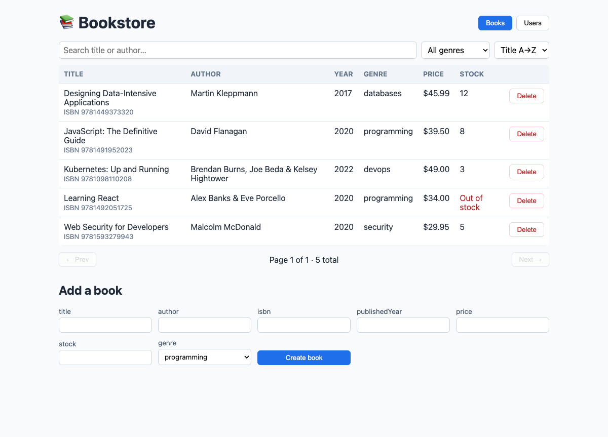
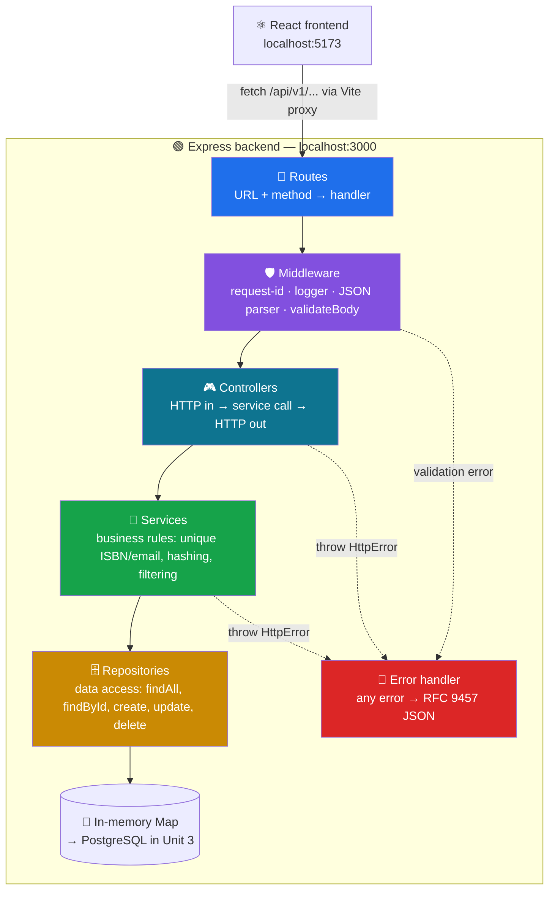
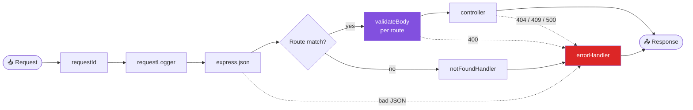
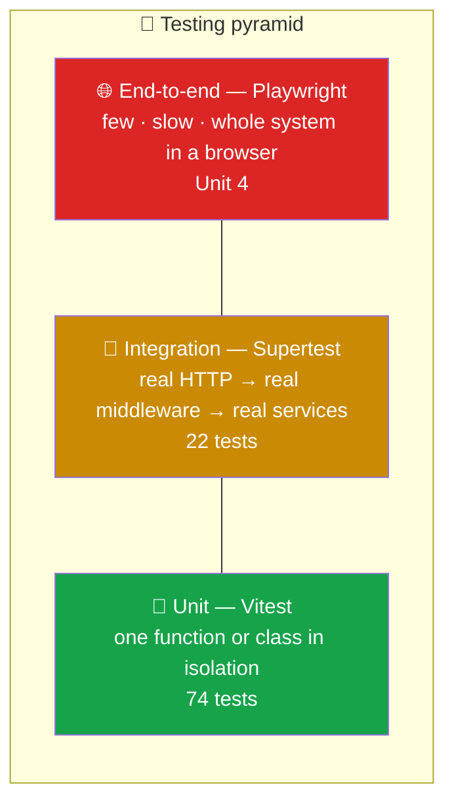
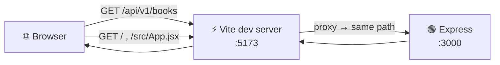
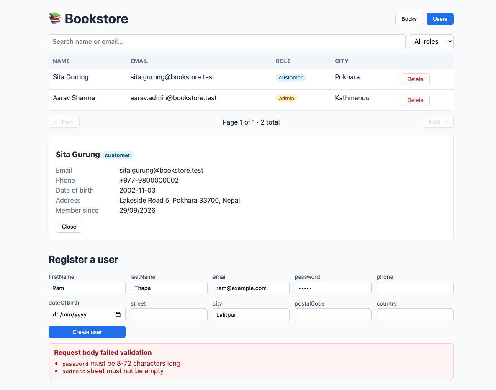

> 📍 **ITEX 320** › **Unit 2** › **Reference Project: Bookstore**
>
> 💡 This is an **optional, larger** full-stack reference (users + books + tests + React). For the graded scaffold, start with **[Assignment 2.1](../2.1%20Backend%20Foundations/README.md)**. The finished code is in [`bookstore/`](bookstore/).

# 🛠️ Reference Project: Build the Bookstore (Step by Step)


In this part you build a **complete full-stack Bookstore**, one file at a time:

- 🟢 **Backend:** an Express 5 REST API with two resources, **Users** (full profile, hashed passwords) and **Books** (ISBN, price, stock, genre). It is built in clean layers: routes → middleware → controllers → services → repositories.
- 🧪 **Tests:** **74 unit tests** + **22 integration tests** with Vitest and Supertest, plus a coverage report.
- ⚛️ **Frontend:** a React + Vite app that lists, searches, creates and deletes books and users, and shows the API's validation errors.

> 🎯 **Key Concept:** Every code block below was run and tested exactly as written. **Copy each file completely**, into the exact path shown in its heading. If something doesn't work, compare your file against the block. Nine times out of ten it's a missing line or a wrong path.

<div align="center">



</div>

---

## 📑 Steps

| Phase | Steps |
|-------|-------|
| 🧭 **Plan** | [0. What we're building](#step-0--what-were-building) · [1. Prerequisites](#step-1--prerequisites) · [2. Create the folders](#step-2--create-the-folder-structure) |
| 🟢 **Backend** | [3. Initialise](#step-3--initialise-the-backend) · [4. Config](#step-4--configuration) · [5. Utils](#step-5--utilities) · [6. Repositories](#step-6--repositories-data-access) · [7. Validators](#step-7--validators) · [8. Services](#step-8--services-business-rules) · [9. Controllers](#step-9--controllers) · [10. Middleware](#step-10--middleware) · [11. Routes](#step-11--routes) · [12. Container & seed](#step-12--wiring-dependency-injection-container--seed-data) · [13. App & server](#step-13--the-express-app-and-the-server) · [14. Try it](#step-14--run-it-and-try-every-endpoint) |
| 🧪 **Tests** | [15. Test setup](#step-15--testing-setup) · [16. Unit tests](#step-16--unit-tests) · [17. Integration tests](#step-17--integration-tests) · [18. Run & coverage](#step-18--run-the-tests-and-check-coverage) |
| ⚛️ **Frontend** | [19. React app](#step-19--the-react-frontend) · [20. Run the full stack](#step-20--run-the-full-stack) |
| 🩺 **Help** | [Troubleshooting](#-troubleshooting) · [Final checklist](#-final-checklist) |

---

## Step 0 — What we're building

### 0.1 Layered architecture

Each layer has **one job** and only talks to the layer directly below it.



| Layer | Folder | Knows about HTTP? | Knows about storage? | Example job |
|-------|--------|:---:|:---:|-------------|
| Routes | `src/routes/` | ✅ | ❌ | `POST /books` → `validateBody(bookSchema)` → `controller.create` |
| Middleware | `src/middleware/` | ✅ | ❌ | Add a request ID, parse JSON, validate the body, format errors |
| Controllers | `src/controllers/` | ✅ | ❌ | Read `req`, call a service, send `201 + Location` |
| Services | `src/services/` | ❌ | ❌ | "ISBN must be unique", "hash the password", "never return the hash" |
| Repositories | `src/repositories/` | ❌ | ✅ | `findByEmail()`, `create()`, `update()` |
| Validators | `src/validators/` | ❌ | ❌ | "price has at most 2 decimals", "ISBN checksum is valid" |

> 💡 **Pro-Tip:** Because services know nothing about HTTP, we can **unit test** them without starting a server. Because repositories hide the storage, in Unit 3 we swap the in-memory Map for **PostgreSQL + Prisma** by changing *one* folder. The services, controllers and tests stay the same.

### 0.2 Lifecycle of one request


### 0.3 The API you will build

**Books** (`/api/v1/books`)

| Method | Path | Body | Success | Errors |
|--------|------|------|---------|--------|
| `GET` | `/books?q=&author=&genre=&minPrice=&maxPrice=&inStock=true&sort=-price&page=1&limit=20` | — | `200` list + `meta` + `links` | `400` bad sort/price |
| `GET` | `/books/:id` | — | `200` | `404` |
| `POST` | `/books` | full book | `201` + `Location` | `400`, `409` duplicate ISBN |
| `PUT` | `/books/:id` | full book | `200` | `400`, `404`, `409` |
| `PATCH` | `/books/:id` | any book fields | `200` | `400`, `404`, `409` |
| `DELETE` | `/books/:id` | — | `204` | `404` |

**Users** (`/api/v1/users`)

| Method | Path | Body | Success | Errors |
|--------|------|------|---------|--------|
| `GET` | `/users?q=&role=admin&sort=lastName&page=1&limit=20` | — | `200` list (no password hashes!) | `400` |
| `GET` | `/users/:id` | — | `200` | `404` |
| `POST` | `/users` | profile + password | `201` + `Location` | `400`, `409` duplicate email |
| `PATCH` | `/users/:id` | profile fields (no password, no role) | `200` | `400`, `404`, `409` |
| `DELETE` | `/users/:id` | — | `204` | `404` |

**Data models**

| Book field | Type | Rules |
|------------|------|-------|
| `id` | UUID | set by server |
| `title` | string | required, 1–200 chars, trimmed |
| `author` | string | required, 1–120 chars |
| `isbn` | string | required, valid **ISBN-13 checksum**, hyphens removed, **unique** |
| `publishedYear` | integer | required, 1450 – current year |
| `price` | number | required, 0–10 000, **max 2 decimals** |
| `stock` | integer | required, ≥ 0 |
| `genre` | enum | optional: `programming`, `databases`, `security`, `devops`, `design`, `other` (default `other`) |
| `description` | string | optional, ≤ 2000 chars (default `null`) |
| `createdAt` / `updatedAt` | ISO date | set by server |

| User field | Type | Rules |
|------------|------|-------|
| `id` | UUID | set by server |
| `firstName`, `lastName` | string | required, 1–50 chars |
| `email` | string | required, valid format, stored **lower-case**, **unique** |
| `password` | string | **create only**, 8–72 chars, ≥1 letter and ≥1 digit, stored as a **scrypt hash**, never returned |
| `phone` | string | optional, e.g. `+977-9800000000` |
| `dateOfBirth` | `YYYY-MM-DD` | optional, real date, in the past |
| `address` | object | optional `{ street, city, postalCode?, country }` |
| `role` | enum | `customer` (default) or `admin`. **Clients can never set it** |
| `createdAt` / `updatedAt` | ISO date | set by server |

### 0.4 Final folder structure

```text
bookstore/
├── .gitignore
├── backend/
│   ├── .env.example              ← template for environment variables (committed)
│   ├── .env                      ← your local copy (NOT committed)
│   ├── package.json
│   ├── vitest.config.js
│   ├── src/
│   │   ├── server.js             ← starts the HTTP server (entry point)
│   │   ├── app.js                ← builds the Express app: middleware + routes
│   │   ├── container.js          ← creates and wires all objects (DI)
│   │   ├── config/
│   │   │   └── env.js
│   │   ├── controllers/
│   │   │   ├── books.controller.js
│   │   │   └── users.controller.js
│   │   ├── data/
│   │   │   └── seed.js
│   │   ├── middleware/
│   │   │   ├── error-handler.js
│   │   │   ├── not-found.js
│   │   │   ├── request-id.js
│   │   │   ├── request-logger.js
│   │   │   └── validate-body.js
│   │   ├── repositories/
│   │   │   ├── in-memory.repository.js
│   │   │   ├── books.repository.js
│   │   │   └── users.repository.js
│   │   ├── routes/
│   │   │   ├── index.js
│   │   │   ├── books.routes.js
│   │   │   └── users.routes.js
│   │   ├── services/
│   │   │   ├── books.service.js
│   │   │   └── users.service.js
│   │   ├── utils/
│   │   │   ├── http-error.js
│   │   │   ├── password.js
│   │   │   └── query.js
│   │   └── validators/
│   │       ├── rules.js
│   │       ├── validate.js
│   │       ├── book.schema.js
│   │       └── user.schema.js
│   └── tests/
│       ├── fixtures.js
│       ├── unit/
│       │   ├── services/  books.service.test.js · users.service.test.js
│       │   ├── utils/     password.test.js · query.test.js
│       │   └── validators/ rules.test.js · validate.test.js
│       └── integration/
│           ├── app.test.js
│           ├── books.api.test.js
│           └── users.api.test.js
└── frontend/
    ├── index.html
    ├── package.json
    ├── vite.config.js
    └── src/
        ├── main.jsx
        ├── App.jsx
        ├── index.css
        ├── api/
        │   └── client.js
        └── components/
            ├── BooksPage.jsx
            ├── UsersPage.jsx
            ├── ErrorMessage.jsx
            └── Pagination.jsx
```

---

## Step 1 — Prerequisites

| Tool | Version | Check with | Get it |
|------|---------|-----------|--------|
|  Node.js | **22.12 or newer** (LTS) | `node -v` | [nodejs.org](https://nodejs.org) or `nvm install --lts` |
|  npm | 10+ (comes with Node) | `npm -v` | — |
|  Git | any recent | `git --version` | [git-scm.com](https://git-scm.com) |
|  VS Code | any | — | Extensions: *ESLint*, *Vitest*, *REST Client* (optional) |
| curl | any | `curl --version` | Built into macOS, Linux and Windows 10+ |

```bash
node -v    # v22.12.0 or higher, e.g. v24.x
npm -v     # 10.x or higher
```

> ⚠️ **Security Warning:** Vitest and Vite need **Node ≥ 22.12**. On an older Node you'll see errors like `SyntaxError: Unexpected token` or `Unsupported engine`. Upgrade Node first.

---

## Step 2 — Create the folder structure

**macOS / Linux / Git Bash:**

```bash
mkdir bookstore && cd bookstore
git init

# Backend source folders
mkdir -p backend/src/{config,controllers,data,middleware,repositories,routes,services,utils,validators}

# Backend test folders
mkdir -p backend/tests/unit/{services,utils,validators} backend/tests/integration
```

**Windows PowerShell:**

```powershell
mkdir bookstore; cd bookstore
git init
"config","controllers","data","middleware","repositories","routes","services","utils","validators" |
  ForEach-Object { New-Item -ItemType Directory -Force -Path "backend/src/$_" }
"unit/services","unit/utils","unit/validators","integration" |
  ForEach-Object { New-Item -ItemType Directory -Force -Path "backend/tests/$_" }
```

Create **`bookstore/.gitignore`**, so dependencies, secrets and build output are never committed:

```gitignore
node_modules/
coverage/
dist/
.env
.DS_Store
```

> 💡 **Pro-Tip:** We don't create `frontend/` by hand. Vite generates it for us in [Step 19](#step-19--the-react-frontend).

---

## Step 3 — Initialise the backend

```bash
cd backend
npm init -y
npm install express@5
npm install -D vitest supertest @vitest/coverage-v8
```

Now **replace** the generated `backend/package.json` with this one. Your version numbers may be slightly newer, which is fine.

### `backend/package.json`

```json
{
  "name": "bookstore-backend",
  "version": "1.0.0",
  "description": "ITEX 320 Bookstore REST API (Express 5)",
  "type": "module",
  "main": "src/server.js",
  "engines": {
    "node": ">=22.12"
  },
  "scripts": {
    "dev": "node --env-file-if-exists=.env --watch src/server.js",
    "start": "node --env-file-if-exists=.env src/server.js",
    "test": "vitest run",
    "test:unit": "vitest run tests/unit",
    "test:integration": "vitest run tests/integration",
    "test:watch": "vitest",
    "test:coverage": "vitest run --coverage"
  },
  "dependencies": {
    "express": "^5.2.1"
  },
  "devDependencies": {
    "@vitest/coverage-v8": "^4.1.11",
    "supertest": "^7.3.0",
    "vitest": "^4.1.11"
  }
}
```

| Script | What it does |
|--------|-------------|
| `npm run dev` | Starts the API and **restarts on every file save** (`--watch`). Loads `.env` if it exists |
| `npm start` | Starts the API once (production style) |
| `npm test` | Runs **all** tests once |
| `npm run test:unit` / `test:integration` | Runs only one kind of test |
| `npm run test:watch` | Re-runs tests on every save, which is great while coding |
| `npm run test:coverage` | Runs tests + prints a coverage table (fails below 90 %) |

> 🎯 **Key Concept:** `"type": "module"` turns on **ES Modules**, so we write `import`/`export` instead of `require()`. With ES Modules, **relative imports must include the `.js` extension**: `import { x } from './utils/query.js'`, not `'./utils/query'`.

### `backend/.env.example`

```bash
# Copy this file to .env and adjust. Never commit .env.
NODE_ENV=development
PORT=3000
HOST=127.0.0.1
BODY_LIMIT=100kb
# Load sample users and books on startup (true/false)
SEED_DATA=true
```

Then make your own local copy:

```bash
cp .env.example .env        # Windows PowerShell: Copy-Item .env.example .env
```

> ⚠️ **Security Warning:** `.env` holds real secrets once we add JWT keys and database passwords (Topic 2.3, Unit 3). It is in `.gitignore`. **Never commit it.** Commit `.env.example` with placeholder values instead.

---

## Step 4 — Configuration

One file reads `process.env`. Everything else imports `config`. This makes defaults obvious and keeps typos like `process.env.PROT` out of your code.

### `backend/src/config/env.js`

```js
// Central place for configuration. Every other file imports `config` instead of reading process.env.

const toInt = (value, fallback) => {
  const n = Number.parseInt(value, 10);
  return Number.isNaN(n) ? fallback : n;
};

export const config = Object.freeze({
  env: process.env.NODE_ENV ?? 'development',
  port: toInt(process.env.PORT, 3000),
  host: process.env.HOST ?? '127.0.0.1',
  bodyLimit: process.env.BODY_LIMIT ?? '100kb',
  seedData: process.env.SEED_DATA !== 'false',
  isTest: process.env.NODE_ENV === 'test',
});
```

---

## Step 5 — Utilities

Small helpers that every layer can use.

### `backend/src/utils/http-error.js`

An `Error` that carries an HTTP status. Services `throw notFound(...)` and never touch `res`.

```js
// An Error that knows its HTTP status. The error-handler middleware turns it into
// an RFC 9457 "Problem Details" JSON response.
export class HttpError extends Error {
  constructor(status, title, detail, extras = {}) {
    super(detail ?? title);
    this.name = 'HttpError';
    this.status = status;
    this.title = title;
    this.detail = detail;
    this.extras = extras; // extra JSON fields, e.g. { errors: [...] }
  }
}

export const badRequest = (detail, errors) =>
  new HttpError(400, 'Bad Request', detail, errors ? { errors } : {});

export const notFound = (detail) => new HttpError(404, 'Not Found', detail);

export const conflict = (detail) => new HttpError(409, 'Conflict', detail);
```

### `backend/src/utils/query.js`

Pagination, sorting and pagination links, shared by books and users.

```js
import { badRequest } from './http-error.js';

export const DEFAULT_LIMIT = 20;
export const MAX_LIMIT = 100;

// ?page=2&limit=10 → { page: 2, limit: 10 }. Bad or missing values fall back to safe defaults.
export function parsePagination(query = {}) {
  const page = Math.max(1, Number.parseInt(query.page, 10) || 1);
  const limit = Math.min(MAX_LIMIT, Math.max(1, Number.parseInt(query.limit, 10) || DEFAULT_LIMIT));
  return { page, limit };
}

// ?sort=-price → sorts by price descending. Only whitelisted fields are allowed.
export function sortItems(items, sortParam, allowedFields) {
  if (sortParam === undefined) return items;
  if (typeof sortParam !== 'string') throw badRequest('sort must be a single field name');

  const desc = sortParam.startsWith('-');
  const field = desc ? sortParam.slice(1) : sortParam;
  if (!allowedFields.includes(field)) {
    throw badRequest(`Cannot sort by "${field}". Allowed: ${allowedFields.join(', ')}`);
  }

  const direction = desc ? -1 : 1;
  // Copy first: never mutate the caller's array.
  return [...items].sort((a, b) => {
    if (a[field] === b[field]) return 0;
    return a[field] > b[field] ? direction : -direction;
  });
}

// Slice one page out of an array and describe it.
export function paginate(items, { page, limit }) {
  const total = items.length;
  const totalPages = Math.max(1, Math.ceil(total / limit));
  const data = items.slice((page - 1) * limit, page * limit);
  return { data, meta: { page, limit, total, totalPages } };
}

// Build self/next/prev links from the incoming request so filters and sort are preserved.
export function pageLinks(req, { page, totalPages }) {
  const linkFor = (p) => {
    const url = new URL(req.originalUrl, 'http://placeholder'); // base is required but discarded
    url.searchParams.set('page', p);
    return url.pathname + url.search;
  };
  return {
    self: linkFor(page),
    next: page < totalPages ? linkFor(page + 1) : null,
    prev: page > 1 ? linkFor(page - 1) : null,
  };
}
```

### `backend/src/utils/password.js`

```js
import { randomBytes, scrypt, timingSafeEqual } from 'node:crypto';
import { promisify } from 'node:util';

// scrypt is a slow, memory-hard hash built into Node — no extra package needed.
// It runs on libuv's thread pool, so it does NOT block the event loop.
const scryptAsync = promisify(scrypt);
const KEY_LENGTH = 64;

// Returns "scrypt$<salt hex>$<hash hex>" — store this, never the plain password.
export async function hashPassword(plain) {
  const salt = randomBytes(16);
  const hash = await scryptAsync(plain, salt, KEY_LENGTH);
  return `scrypt$${salt.toString('hex')}$${hash.toString('hex')}`;
}

export async function verifyPassword(plain, stored) {
  const [algorithm, saltHex, hashHex] = stored.split('$');
  if (algorithm !== 'scrypt' || !saltHex || !hashHex) return false;

  const expected = Buffer.from(hashHex, 'hex');
  const actual = await scryptAsync(plain, Buffer.from(saltHex, 'hex'), expected.length);
  // Constant-time comparison prevents timing attacks.
  return timingSafeEqual(expected, actual);
}
```

> ⚠️ **Security Warning:** **Never** store plain passwords, and never use fast hashes like MD5 or SHA-256 for passwords. They can be brute-forced at billions of guesses per second. `scrypt`, `bcrypt` and `argon2` are *deliberately slow*. The random **salt** means two users with the same password get different hashes.

---

## Step 6 — Repositories (data access)

### `backend/src/repositories/in-memory.repository.js`

A generic "table" that both books and users reuse.

```js
import { randomUUID } from 'node:crypto';

// A tiny in-memory "database table". Every method is async on purpose:
// in Unit 3 we replace this class with a Prisma/PostgreSQL repository that has the
// SAME method names, and the services above it won't need to change.
export class InMemoryRepository {
  #rows = new Map();

  async findAll() {
    return [...this.#rows.values()].map((row) => structuredClone(row));
  }

  async findById(id) {
    const row = this.#rows.get(id);
    return row ? structuredClone(row) : null;
  }

  async findOne(predicate) {
    for (const row of this.#rows.values()) {
      if (predicate(row)) return structuredClone(row);
    }
    return null;
  }

  async create(data) {
    const now = new Date().toISOString();
    const row = { id: randomUUID(), ...data, createdAt: now, updatedAt: now };
    this.#rows.set(row.id, row);
    return structuredClone(row);
  }

  async update(id, changes) {
    const existing = this.#rows.get(id);
    if (!existing) return null;
    // id and createdAt can never be overwritten.
    const row = { ...existing, ...changes, id, createdAt: existing.createdAt, updatedAt: new Date().toISOString() };
    this.#rows.set(id, row);
    return structuredClone(row);
  }

  async delete(id) {
    return this.#rows.delete(id);
  }
}
```

> 🎯 **Key Concept:** `structuredClone` returns **copies**. If a service changed an object it got from the repository, it would otherwise silently change the "database" too. Real databases behave this way anyway: you get a copy of the row, not the row itself.

### `backend/src/repositories/books.repository.js`

```js
import { InMemoryRepository } from './in-memory.repository.js';

export class BooksRepository extends InMemoryRepository {
  findByIsbn(isbn) {
    return this.findOne((book) => book.isbn === isbn);
  }
}
```

### `backend/src/repositories/users.repository.js`

```js
import { InMemoryRepository } from './in-memory.repository.js';

export class UsersRepository extends InMemoryRepository {
  findByEmail(email) {
    return this.findOne((user) => user.email === email.toLowerCase());
  }
}
```

---

## Step 7 — Validators

**Never trust the client.** Every body is checked before it reaches a controller.

### `backend/src/validators/rules.js`

Reusable checks: each returns an error message, or `null` when the value is fine.

```js
// Small, reusable checks. Each returns an error message string, or null when the value is valid.
// In Topic 2.5 we replace this hand-made layer with Zod — the idea stays exactly the same.

export const string = ({ min = 1, max = 255 } = {}) => (value) => {
  if (typeof value !== 'string') return 'must be a string';
  const length = value.trim().length;
  if (length < min) return min === 1 ? 'must not be empty' : `must be at least ${min} characters`;
  if (length > max) return `must be at most ${max} characters`;
  return null;
};

export const integer = ({ min = Number.MIN_SAFE_INTEGER, max = Number.MAX_SAFE_INTEGER } = {}) => (value) => {
  if (!Number.isInteger(value)) return 'must be an integer';
  if (value < min || value > max) return `must be between ${min} and ${max}`;
  return null;
};

export const money = ({ min = 0, max = 100_000 } = {}) => (value) => {
  if (typeof value !== 'number' || !Number.isFinite(value)) return 'must be a number';
  if (value < min || value > max) return `must be between ${min} and ${max}`;
  // Compare with a tiny tolerance: in floating point, 0.29 * 100 === 28.999999999999996.
  if (Math.abs(Math.round(value * 100) - value * 100) > 1e-9) return 'must have at most 2 decimal places';
  return null;
};

export const oneOf = (allowed) => (value) =>
  allowed.includes(value) ? null : `must be one of: ${allowed.join(', ')}`;

// Deliberately simple: "something@something.tld". Real verification = sending an email.
const EMAIL_PATTERN = /^[^\s@]+@[^\s@]+\.[^\s@]{2,}$/;
export const email = () => (value) => {
  if (typeof value !== 'string') return 'must be a string';
  if (value.length > 254 || !EMAIL_PATTERN.test(value.trim())) return 'must be a valid email address';
  return null;
};

// At least 8 characters with at least one letter and one digit.
// Max 72 keeps us compatible with bcrypt if we switch hashing algorithms later.
export const password = () => (value) => {
  if (typeof value !== 'string') return 'must be a string';
  if (value.length < 8 || value.length > 72) return 'must be 8-72 characters long';
  if (!/[A-Za-z]/.test(value) || !/\d/.test(value)) return 'must contain at least one letter and one digit';
  return null;
};

export const phone = () => (value) => {
  if (typeof value !== 'string') return 'must be a string';
  return /^\+?[0-9][0-9\s-]{6,19}$/.test(value.trim()) ? null : 'must be a valid phone number, e.g. +977-9800000000';
};

// "YYYY-MM-DD", a real calendar date, and in the past.
export const pastDate = () => (value) => {
  if (typeof value !== 'string' || !/^\d{4}-\d{2}-\d{2}$/.test(value)) return 'must be a date in YYYY-MM-DD format';
  const date = new Date(`${value}T00:00:00Z`);
  if (Number.isNaN(date.getTime()) || date.toISOString().slice(0, 10) !== value) return 'must be a real calendar date';
  if (date >= new Date()) return 'must be in the past';
  return null;
};

// ISBN-13 with checksum: digits weighted 1,3,1,3,... must sum to a multiple of 10.
export const isbn13 = () => (value) => {
  if (typeof value !== 'string') return 'must be a string';
  const digits = value.replace(/[-\s]/g, '');
  if (!/^\d{13}$/.test(digits)) return 'must be a 13-digit ISBN';
  const sum = [...digits].reduce((acc, d, i) => acc + Number(d) * (i % 2 === 0 ? 1 : 3), 0);
  return sum % 10 === 0 ? null : 'has an invalid ISBN-13 checksum';
};

// Validates a nested object against a map of { field: { required, check } }.
export const object = (shape) => (value) => {
  if (value === null || typeof value !== 'object' || Array.isArray(value)) return 'must be an object';
  for (const [field, rule] of Object.entries(shape)) {
    if (value[field] === undefined) {
      if (rule.required) return `${field} is required`;
      continue;
    }
    const message = rule.check(value[field]);
    if (message) return `${field} ${message}`;
  }
  const unknown = Object.keys(value).find((key) => !(key in shape));
  return unknown ? `${unknown} is not allowed` : null;
};

// Common transforms applied AFTER a value passes its check.
export const trim = (value) => value.trim();
export const lowercase = (value) => value.trim().toLowerCase();
export const digitsOnly = (value) => value.replace(/[-\s]/g, '');
```

### `backend/src/validators/validate.js`

The engine that runs a schema against a request body.

```js
import { badRequest } from '../utils/http-error.js';

/**
 * Validate a request body against a schema.
 *
 * schema = { fieldName: { required: boolean, check: (value) => message|null, transform?: (value) => value } }
 *
 * - Unknown fields are rejected (stops "mass assignment", e.g. a client sending { "role": "admin" }).
 * - partial: true (for PATCH) makes every field optional but requires at least one.
 * - Returns a NEW object containing only the cleaned, allowed fields.
 */
export function validate(schema, body, { partial = false } = {}) {
  if (body === null || typeof body !== 'object' || Array.isArray(body)) {
    throw badRequest('Request body must be a JSON object');
  }

  const errors = [];
  const data = {};

  for (const [field, rule] of Object.entries(schema)) {
    const value = body[field];
    if (value === undefined) {
      if (rule.required && !partial) errors.push({ field, message: 'is required' });
      continue;
    }
    const message = rule.check(value);
    if (message) errors.push({ field, message });
    else data[field] = rule.transform ? rule.transform(value) : value;
  }

  for (const field of Object.keys(body)) {
    if (!(field in schema)) errors.push({ field, message: 'is not allowed' });
  }

  if (errors.length > 0) throw badRequest('Request body failed validation', errors);
  if (partial && Object.keys(data).length === 0) throw badRequest('Provide at least one field to update');

  return data;
}
```

### `backend/src/validators/book.schema.js`

```js
import { digitsOnly, integer, isbn13, money, string, trim } from './rules.js';

export const GENRES = ['programming', 'databases', 'security', 'devops', 'design', 'other'];

export const bookSchema = {
  title:         { required: true,  check: string({ max: 200 }), transform: trim },
  author:        { required: true,  check: string({ max: 120 }), transform: trim },
  isbn:          { required: true,  check: isbn13(),             transform: digitsOnly },
  publishedYear: { required: true,  check: integer({ min: 1450, max: new Date().getFullYear() }) },
  price:         { required: true,  check: money({ max: 10_000 }) },
  stock:         { required: true,  check: integer({ min: 0, max: 100_000 }) },
  genre:         { required: false, check: (v) => (GENRES.includes(v) ? null : `must be one of: ${GENRES.join(', ')}`) },
  description:   { required: false, check: string({ max: 2000 }), transform: trim },
};
```

### `backend/src/validators/user.schema.js`

```js
import { email, lowercase, object, password, pastDate, phone, string, trim } from './rules.js';

const addressShape = {
  street:     { required: true,  check: string({ max: 120 }) },
  city:       { required: true,  check: string({ max: 80 }) },
  postalCode: { required: false, check: string({ max: 20 }) },
  country:    { required: true,  check: string({ max: 80 }) },
};

// NOTE: "role" is deliberately NOT here. Clients must never choose their own role.
// New users are always "customer"; Topic 2.3 adds an admin-only endpoint to change roles.
export const createUserSchema = {
  firstName:   { required: true,  check: string({ max: 50 }), transform: trim },
  lastName:    { required: true,  check: string({ max: 50 }), transform: trim },
  email:       { required: true,  check: email(),             transform: lowercase },
  password:    { required: true,  check: password() },
  phone:       { required: false, check: phone(),             transform: trim },
  dateOfBirth: { required: false, check: pastDate() },
  address:     { required: false, check: object(addressShape) },
};

// Profile updates: same fields minus password (password changes get their own flow in Topic 2.3).
const { password: _omitPassword, ...updatableFields } = createUserSchema;
export const updateUserSchema = updatableFields;
```

> ⚠️ **Security Warning (Mass Assignment):** If we copied `req.body` straight into the database, a user could send `{ "role": "admin" }` and promote themselves. Real apps have been breached this way (GitHub 2012). Our `validate()` **rejects every field not in the schema**, and `role` is deliberately left out of the user schema.

---

## Step 8 — Services (business rules)

### `backend/src/services/books.service.js`

```js
import { conflict, notFound, badRequest } from '../utils/http-error.js';
import { paginate, parsePagination, sortItems } from '../utils/query.js';

const SORTABLE_FIELDS = ['title', 'author', 'publishedYear', 'price', 'stock', 'createdAt'];

// Optional fields always exist in the stored object, so every book has the same shape.
const withDefaults = (data) => ({ ...data, genre: data.genre ?? 'other', description: data.description ?? null });

const toNumber = (value, name) => {
  const n = Number(value);
  if (value === '' || Number.isNaN(n)) throw badRequest(`${name} must be a number`);
  return n;
};

// Business rules for books. Knows nothing about HTTP (no req/res) — easy to unit test.
export class BooksService {
  constructor(booksRepository) {
    this.books = booksRepository; // injected: in-memory now, PostgreSQL in Unit 3
  }

  // query = { q, author, genre, minPrice, maxPrice, inStock, sort, page, limit }
  async list(query = {}) {
    let items = await this.books.findAll();

    if (typeof query.q === 'string' && query.q.trim()) {
      const needle = query.q.trim().toLowerCase();
      items = items.filter((b) => b.title.toLowerCase().includes(needle) || b.author.toLowerCase().includes(needle));
    }
    if (typeof query.author === 'string') {
      const needle = query.author.toLowerCase();
      items = items.filter((b) => b.author.toLowerCase().includes(needle));
    }
    if (typeof query.genre === 'string') {
      items = items.filter((b) => b.genre === query.genre);
    }
    if (query.minPrice !== undefined) {
      const min = toNumber(query.minPrice, 'minPrice');
      items = items.filter((b) => b.price >= min);
    }
    if (query.maxPrice !== undefined) {
      const max = toNumber(query.maxPrice, 'maxPrice');
      items = items.filter((b) => b.price <= max);
    }
    if (query.inStock === 'true') {
      items = items.filter((b) => b.stock > 0);
    }

    items = sortItems(items, query.sort ?? 'title', SORTABLE_FIELDS);
    return paginate(items, parsePagination(query));
  }

  async getById(id) {
    const book = await this.books.findById(id);
    if (!book) throw notFound(`Book ${id} does not exist`);
    return book;
  }

  async create(data) {
    await this.#assertIsbnAvailable(data.isbn);
    return this.books.create(withDefaults(data));
  }

  // PUT: full replacement — optional fields that are not sent go back to their defaults.
  async replace(id, data) {
    await this.getById(id);
    await this.#assertIsbnAvailable(data.isbn, id);
    return this.books.update(id, withDefaults(data));
  }

  // PATCH: only the given fields change.
  async update(id, changes) {
    await this.getById(id);
    if (changes.isbn) await this.#assertIsbnAvailable(changes.isbn, id);
    return this.books.update(id, changes);
  }

  async remove(id) {
    await this.getById(id);
    await this.books.delete(id);
  }

  // ISBNs are unique. exceptId lets a book keep its own ISBN when it is updated.
  async #assertIsbnAvailable(isbn, exceptId) {
    const existing = await this.books.findByIsbn(isbn);
    if (existing && existing.id !== exceptId) throw conflict(`A book with ISBN ${isbn} already exists`);
  }
}
```

### `backend/src/services/users.service.js`

```js
import { conflict, notFound } from '../utils/http-error.js';
import { hashPassword } from '../utils/password.js';
import { paginate, parsePagination, sortItems } from '../utils/query.js';

const SORTABLE_FIELDS = ['firstName', 'lastName', 'email', 'createdAt'];
export const ROLES = ['customer', 'admin'];

// Optional fields are stored as null so every user has the same shape.
const withDefaults = (profile) => ({
  ...profile,
  phone: profile.phone ?? null,
  dateOfBirth: profile.dateOfBirth ?? null,
  address: profile.address ?? null,
});

// The ONLY way a user leaves this service: without the password hash.
export const toPublicUser = ({ passwordHash, ...user }) => user;

export class UsersService {
  // `hash` is injectable so unit tests can use a fast fake instead of real scrypt.
  constructor(usersRepository, { hash = hashPassword } = {}) {
    this.users = usersRepository;
    this.hash = hash;
  }

  // query = { q, role, sort, page, limit }
  async list(query = {}) {
    let items = await this.users.findAll();

    if (typeof query.q === 'string' && query.q.trim()) {
      const needle = query.q.trim().toLowerCase();
      items = items.filter((u) =>
        `${u.firstName} ${u.lastName} ${u.email}`.toLowerCase().includes(needle),
      );
    }
    if (typeof query.role === 'string') {
      items = items.filter((u) => u.role === query.role);
    }

    items = sortItems(items, query.sort ?? 'lastName', SORTABLE_FIELDS);
    const page = paginate(items, parsePagination(query));
    return { ...page, data: page.data.map(toPublicUser) };
  }

  async getById(id) {
    const user = await this.users.findById(id);
    if (!user) throw notFound(`User ${id} does not exist`);
    return toPublicUser(user);
  }

  // `role` is a second argument, NOT part of the request body — only trusted code (seed, admin tools) sets it.
  async create(data, { role = 'customer' } = {}) {
    await this.#assertEmailAvailable(data.email);
    const { password, ...profile } = data;
    const passwordHash = await this.hash(password);
    const user = await this.users.create({ ...withDefaults(profile), role, passwordHash });
    return toPublicUser(user);
  }

  async update(id, changes) {
    await this.getById(id);
    if (changes.email) await this.#assertEmailAvailable(changes.email, id);
    return toPublicUser(await this.users.update(id, changes));
  }

  async remove(id) {
    await this.getById(id);
    await this.users.delete(id);
  }

  async #assertEmailAvailable(email, exceptId) {
    const existing = await this.users.findByEmail(email);
    if (existing && existing.id !== exceptId) throw conflict(`Email ${email} is already registered`);
  }
}
```

> 💡 **Pro-Tip:** `#assertIsbnAvailable` uses a **private class method** (`#`). Nothing outside the class can call it, which makes it clear it's an internal helper.

---

## Step 9 — Controllers

Controllers are thin: **read the request → call the service → send the response.**

### `backend/src/controllers/books.controller.js`

```js
import { pageLinks } from '../utils/query.js';

// Controllers translate HTTP ⇄ service calls. No business rules live here.
// Express 5 forwards any thrown error / rejected promise to the error handler automatically.
export function createBooksController(booksService) {
  return {
    async list(req, res) {
      const { data, meta } = await booksService.list(req.query);
      res.json({ data, meta, links: pageLinks(req, meta) });
    },

    async getById(req, res) {
      res.json({ data: await booksService.getById(req.params.id) });
    },

    async create(req, res) {
      const book = await booksService.create(req.body);
      // 201 Created + Location header pointing at the new resource.
      res.status(201).location(`${req.baseUrl}/${book.id}`).json({ data: book });
    },

    async replace(req, res) {
      res.json({ data: await booksService.replace(req.params.id, req.body) });
    },

    async update(req, res) {
      res.json({ data: await booksService.update(req.params.id, req.body) });
    },

    async remove(req, res) {
      await booksService.remove(req.params.id);
      res.status(204).end();
    },
  };
}
```

### `backend/src/controllers/users.controller.js`

```js
import { pageLinks } from '../utils/query.js';

export function createUsersController(usersService) {
  return {
    async list(req, res) {
      const { data, meta } = await usersService.list(req.query);
      res.json({ data, meta, links: pageLinks(req, meta) });
    },

    async getById(req, res) {
      res.json({ data: await usersService.getById(req.params.id) });
    },

    async create(req, res) {
      const user = await usersService.create(req.body);
      res.status(201).location(`${req.baseUrl}/${user.id}`).json({ data: user });
    },

    async update(req, res) {
      res.json({ data: await usersService.update(req.params.id, req.body) });
    },

    async remove(req, res) {
      await usersService.remove(req.params.id);
      res.status(204).end();
    },
  };
}
```

> 🎯 **Key Concept:** There's no `try/catch` anywhere in the controllers. In **Express 5**, if an `async` handler throws or its promise rejects, Express passes the error to the error-handling middleware automatically. In Express 4 this code would hang the request.

---

## Step 10 — Middleware

Middleware functions run **in order** for every request. Each one either calls `next()` to continue, sends a response, or passes an error with `next(err)` or `throw`.



### `backend/src/middleware/request-id.js`

```js
import { randomUUID } from 'node:crypto';

// Give every request a correlation ID (reuse the one from Nginx if present).
// It is returned in the X-Request-Id header and included in logs and error responses.
export function requestId(req, res, next) {
  req.id = req.get('x-request-id') ?? randomUUID();
  res.set('X-Request-Id', req.id);
  next();
}
```

### `backend/src/middleware/request-logger.js`

```js
// Logs one line per request AFTER the response is sent, e.g.
// GET /api/v1/books?page=2 200 3.4ms 5f2c...
export function requestLogger(req, res, next) {
  const start = process.hrtime.bigint();
  res.on('finish', () => {
    const ms = Number(process.hrtime.bigint() - start) / 1e6;
    console.log(`${req.method} ${req.originalUrl} ${res.statusCode} ${ms.toFixed(1)}ms ${req.id}`);
  });
  next();
}
```

### `backend/src/middleware/validate-body.js`

```js
import { validate } from '../validators/validate.js';

// Route-level middleware: validate req.body against a schema, then replace it
// with the cleaned version so controllers only ever see safe, known fields.
export const validateBody = (schema, options) => (req, res, next) => {
  req.body = validate(schema, req.body, options);
  next();
};
```

### `backend/src/middleware/not-found.js`

```js
import { HttpError } from '../utils/http-error.js';

// Reached only when no route matched.
export function notFoundHandler(req, res, next) {
  next(new HttpError(404, 'Not Found', `No route for ${req.method} ${req.path}`));
}
```

### `backend/src/middleware/error-handler.js`

```js
import { HttpError } from '../utils/http-error.js';

// The ONE place that turns errors into HTTP responses (RFC 9457 Problem Details).
// Express recognises error handlers by their 4 parameters, so `next` must stay.
// eslint-disable-next-line no-unused-vars
export function errorHandler(err, req, res, next) {
  // HttpError → our status; body-parser errors carry err.status (400 bad JSON, 413 too large).
  const status = err instanceof HttpError ? err.status : (err.status ?? err.statusCode ?? 500);
  const isServerError = status >= 500;

  // Log full details for 5xx; never send stack traces to the client.
  if (isServerError) console.error({ requestId: req.id, err });

  res
    .status(status)
    .type('application/problem+json')
    .json({
      type: 'about:blank',
      title: err.title ?? (isServerError ? 'Internal Server Error' : 'Bad Request'),
      status,
      detail: isServerError ? 'An unexpected error occurred' : (err.detail ?? err.message),
      instance: req.originalUrl,
      requestId: req.id,
      ...(err.extras ?? {}),
    });
}
```

| Middleware type | Signature | Example here |
|-----------------|-----------|--------------|
| Built-in | provided by Express | `express.json()` |
| Custom (app-level) | `(req, res, next)` | `requestId`, `requestLogger` |
| Custom (route-level) | `(req, res, next)` | `validateBody(schema)` |
| Error-handling | `(err, req, res, next)`, **exactly 4 params** | `errorHandler` |

---

## Step 11 — Routes

### `backend/src/routes/books.routes.js`

```js
import { Router } from 'express';
import { validateBody } from '../middleware/validate-body.js';
import { bookSchema } from '../validators/book.schema.js';

// Routes only map URL + method → [middleware..., controller]. Nothing else.
export function createBooksRouter(controller) {
  const router = Router();

  router.get('/', controller.list);
  router.get('/:id', controller.getById);
  router.post('/', validateBody(bookSchema), controller.create);
  router.put('/:id', validateBody(bookSchema), controller.replace);
  router.patch('/:id', validateBody(bookSchema, { partial: true }), controller.update);
  router.delete('/:id', controller.remove);

  return router;
}
```

### `backend/src/routes/users.routes.js`

```js
import { Router } from 'express';
import { validateBody } from '../middleware/validate-body.js';
import { createUserSchema, updateUserSchema } from '../validators/user.schema.js';

export function createUsersRouter(controller) {
  const router = Router();

  router.get('/', controller.list);
  router.get('/:id', controller.getById);
  router.post('/', validateBody(createUserSchema), controller.create);
  router.patch('/:id', validateBody(updateUserSchema, { partial: true }), controller.update);
  router.delete('/:id', controller.remove);

  return router;
}
```

> 💡 **Pro-Tip:** Users have no `PUT`. Replacing a whole user would require re-sending the password, and password changes deserve their own endpoint with the old password and re-authentication. We build that in Topic 2.3.

### `backend/src/routes/index.js`

```js
import { Router } from 'express';
import { createBooksRouter } from './books.routes.js';
import { createUsersRouter } from './users.routes.js';

// Everything under /api/v1. A future /api/v2 would get its own index file.
export function createApiRouter({ booksController, usersController }) {
  const router = Router();
  router.use('/books', createBooksRouter(booksController));
  router.use('/users', createUsersRouter(usersController));
  return router;
}
```

---

## Step 12 — Wiring: Dependency Injection container & seed data

### `backend/src/container.js`

```js
import { createBooksController } from './controllers/books.controller.js';
import { createUsersController } from './controllers/users.controller.js';
import { BooksRepository } from './repositories/books.repository.js';
import { UsersRepository } from './repositories/users.repository.js';
import { BooksService } from './services/books.service.js';
import { UsersService } from './services/users.service.js';

// Composition root: the ONE place where objects are created and wired together
// (Dependency Injection). Tests call createContainer() to get a fresh, empty app every time.
export function createContainer(overrides = {}) {
  const booksRepository = overrides.booksRepository ?? new BooksRepository();
  const usersRepository = overrides.usersRepository ?? new UsersRepository();

  const booksService = new BooksService(booksRepository);
  const usersService = new UsersService(usersRepository, { hash: overrides.hashPassword });

  return {
    booksService,
    usersService,
    booksController: createBooksController(booksService),
    usersController: createUsersController(usersService),
  };
}
```

> 🎯 **Key Concept — Dependency Injection:** No class creates its own dependencies. `BooksService` doesn't `import` a repository; it **receives** one in its constructor. That's why tests can pass in a fresh empty repository or a fake password hasher. The only file that knows which concrete classes are used is `container.js`, the **composition root**.

### `backend/src/data/seed.js`

Two users (one **admin**, one **customer**) with full details, and five books.

```js
// Sample data so the API (and the frontend) have something to show on first run.
// Goes through the services, so passwords are hashed and rules are enforced.

export const seedUsers = [
  {
    role: 'admin',
    data: {
      firstName: 'Aarav',
      lastName: 'Sharma',
      email: 'aarav.admin@bookstore.test',
      password: 'Admin12345',
      phone: '+977-9800000001',
      dateOfBirth: '1990-04-15',
      address: { street: 'Durbar Marg 12', city: 'Kathmandu', postalCode: '44600', country: 'Nepal' },
    },
  },
  {
    role: 'customer',
    data: {
      firstName: 'Sita',
      lastName: 'Gurung',
      email: 'sita.gurung@bookstore.test',
      password: 'Customer123',
      phone: '+977-9800000002',
      dateOfBirth: '2002-11-03',
      address: { street: 'Lakeside Road 5', city: 'Pokhara', postalCode: '33700', country: 'Nepal' },
    },
  },
];

export const seedBooks = [
  { title: 'Designing Data-Intensive Applications', author: 'Martin Kleppmann', isbn: '9781449373320', publishedYear: 2017, price: 45.99, stock: 12, genre: 'databases' },
  { title: 'JavaScript: The Definitive Guide', author: 'David Flanagan', isbn: '9781491952023', publishedYear: 2020, price: 39.5, stock: 8, genre: 'programming' },
  { title: 'Learning React', author: 'Alex Banks & Eve Porcello', isbn: '9781492051725', publishedYear: 2020, price: 34, stock: 0, genre: 'programming' },
  { title: 'Web Security for Developers', author: 'Malcolm McDonald', isbn: '9781593279943', publishedYear: 2020, price: 29.95, stock: 5, genre: 'security' },
  { title: 'Kubernetes: Up and Running', author: 'Brendan Burns, Joe Beda & Kelsey Hightower', isbn: '9781098110208', publishedYear: 2022, price: 49, stock: 3, genre: 'devops' },
];

export async function seedDatabase({ usersService, booksService }) {
  for (const { data, role } of seedUsers) await usersService.create(data, { role });
  for (const book of seedBooks) await booksService.create(book);
  console.log(`Seeded ${seedUsers.length} users and ${seedBooks.length} books`);
}
```

| Seed user | Email | Password | Role |
|-----------|-------|----------|------|
| Aarav Sharma | `aarav.admin@bookstore.test` | `Admin12345` | `admin` |
| Sita Gurung | `sita.gurung@bookstore.test` | `Customer123` | `customer` |

> ⚠️ **Security Warning:** Seed passwords are for **local development only**. Set `SEED_DATA=false` in any real environment.

---

## Step 13 — The Express app and the server

### `backend/src/app.js`

```js
import express from 'express';
import { config } from './config/env.js';
import { errorHandler } from './middleware/error-handler.js';
import { notFoundHandler } from './middleware/not-found.js';
import { requestId } from './middleware/request-id.js';
import { requestLogger } from './middleware/request-logger.js';
import { createApiRouter } from './routes/index.js';

// Builds the Express app. Does NOT call listen() — server.js does that,
// and tests pass the app straight to Supertest.
export function createApp(container) {
  const app = express();

  app.disable('x-powered-by'); // don't advertise the framework
  app.set('trust proxy', 'loopback'); // trust X-Forwarded-* only from a local proxy (Nginx)

  // ── 1. Pre-route middleware (runs top to bottom for every request) ──
  app.use(requestId);
  if (!config.isTest) app.use(requestLogger); // keep test output clean
  app.use(express.json({ limit: config.bodyLimit }));

  // ── 2. Routes ──
  app.get('/health', (req, res) => {
    res.json({ status: 'ok', uptimeSec: Math.round(process.uptime()) });
  });
  app.use('/api/v1', createApiRouter(container));

  // ── 3. Fallbacks (order matters: these must be LAST) ──
  app.use(notFoundHandler);
  app.use(errorHandler);

  return app;
}
```

### `backend/src/server.js`

```js
import { createApp } from './app.js';
import { config } from './config/env.js';
import { createContainer } from './container.js';
import { seedDatabase } from './data/seed.js';

const container = createContainer();
if (config.seedData) await seedDatabase(container); // top-level await works in ES modules

const app = createApp(container);

const server = app.listen(config.port, config.host, () => {
  console.log(`📚 Bookstore API on http://${config.host}:${config.port} (${config.env}, pid ${process.pid})`);
});

// Must outlive the reverse proxy's idle timeout (Nginx default 60s) to avoid random 502s.
server.keepAliveTimeout = 65_000;
server.headersTimeout = 66_000;

// Graceful shutdown: stop accepting new connections, finish in-flight requests, then exit.
function shutdown(signal) {
  console.log(`${signal} received — shutting down`);
  server.close(() => process.exit(0));
  server.closeIdleConnections();
  setTimeout(() => process.exit(1), 10_000).unref();
}
process.on('SIGTERM', shutdown);
process.on('SIGINT', shutdown);
```

> 🎯 **Key Concept:** `app.js` **builds** the app and `server.js` **runs** it. Tests import `createApp()` and hand it to Supertest, so no port is opened, tests run in parallel and there's never a "port already in use" error.

---

## Step 14 — Run it and try every endpoint

```bash
npm run dev
```

Expected output:

```text
> bookstore-backend@1.0.0 dev
> node --env-file-if-exists=.env --watch src/server.js

Seeded 2 users and 5 books
📚 Bookstore API on http://127.0.0.1:3000 (development, pid 43948)
```

Open a **second terminal** and try these:

```bash
# ── Health ──
curl -s localhost:3000/health

# ── Users ──
curl -s localhost:3000/api/v1/users                       # both seed users, NO passwordHash
curl -s "localhost:3000/api/v1/users?role=admin"          # only Aarav
curl -s "localhost:3000/api/v1/users?q=gurung"            # search by name or email → Sita

# Register a new customer with full details
curl -i -X POST localhost:3000/api/v1/users \
  -H 'Content-Type: application/json' \
  -d '{
    "firstName": "Ram", "lastName": "Thapa",
    "email": "Ram.Thapa@Example.com", "password": "Kathmandu2025",
    "phone": "+977-9812345678", "dateOfBirth": "2001-06-21",
    "address": { "street": "Jawalakhel 4", "city": "Lalitpur", "postalCode": "44700", "country": "Nepal" }
  }'
# HTTP/1.1 201 Created
# Location: /api/v1/users/<uuid>
# ... "email":"ram.thapa@example.com", "role":"customer" ...   ← email lower-cased, role defaulted

# Try to become admin → 400
curl -s -X POST localhost:3000/api/v1/users -H 'Content-Type: application/json' \
  -d '{"firstName":"Eve","lastName":"Hacker","email":"eve@x.com","password":"pass1234","role":"admin"}'
# {"title":"Bad Request","status":400,...,"errors":[{"field":"role","message":"is not allowed"}]}

# Same email again (different case) → 409
curl -s -X POST localhost:3000/api/v1/users -H 'Content-Type: application/json' \
  -d '{"firstName":"Ram","lastName":"T","email":"RAM.THAPA@example.com","password":"pass1234"}'

# ── Books ──
curl -s "localhost:3000/api/v1/books?sort=-price&limit=2"                  # 2 most expensive + next link
curl -s "localhost:3000/api/v1/books?genre=programming&inStock=true"       # filter
curl -s "localhost:3000/api/v1/books?minPrice=30&maxPrice=46&sort=price"   # price range

# Create a book (ISBN with hyphens is accepted and normalised)
curl -i -X POST localhost:3000/api/v1/books -H 'Content-Type: application/json' \
  -d '{"title":"The Pragmatic Programmer","author":"David Thomas & Andrew Hunt","isbn":"978-0-13-475759-9","publishedYear":2019,"price":42.5,"stock":7,"genre":"programming"}'

# Invalid book → all errors at once
curl -s -X POST localhost:3000/api/v1/books -H 'Content-Type: application/json' \
  -d '{"title":"t","author":"a","isbn":"978-1-4493-7332-1","publishedYear":2017,"price":1.234,"stock":-1}'
# "errors":[{"field":"isbn","message":"has an invalid ISBN-13 checksum"},
#           {"field":"price","message":"must have at most 2 decimal places"},
#           {"field":"stock","message":"must be between 0 and 100000"}]

# PATCH / PUT / DELETE (paste a real id from a list response)
ID=<paste-a-book-id>
curl -s -X PATCH localhost:3000/api/v1/books/$ID -H 'Content-Type: application/json' -d '{"stock":0}'
curl -s -o /dev/null -w "%{http_code}\n" -X DELETE localhost:3000/api/v1/books/$ID   # 204
curl -s -o /dev/null -w "%{http_code}\n" -X DELETE localhost:3000/api/v1/books/$ID   # 404
```

The server terminal logs every request:

```text
GET /api/v1/users 200 3.6ms 86d00c2e-e624-49dd-a077-5e474c671590
POST /api/v1/users 400 4.2ms f8e745a0-d448-4e93-9563-c49ed4d214bc
POST /api/v1/users 201 23.9ms 51103e4d-371b-4074-80db-4fbdc8a23387   ← slower: scrypt hashing
POST /api/v1/users 409 0.3ms e21b2961-73c0-4132-bb3d-8d1166ebfac8
```

> 💡 **Pro-Tip:** Windows PowerShell's `curl` is an alias for `Invoke-WebRequest` and treats quotes differently. Use `curl.exe` instead, or use the VS Code **REST Client** extension / Postman / Bruno.

✅ **Checkpoint:** all the requests above behave as described. Commit your work:

```bash
cd ..   # back to bookstore/
git add . && git commit -m "feat(backend): layered Express API for users and books"
```

---

## Step 15 — Testing setup

### 15.1 Unit tests vs. integration tests



| | 🧩 **Unit test** | 🔗 **Integration test** |
|---|---|---|
| Tests | One function/class: `isbn13()`, `BooksService` | The whole app over HTTP: `POST /api/v1/books` |
| Speed | Microseconds | Milliseconds |
| Uses | Fakes/mocks for slow parts (`vi.fn()` hasher) | Real middleware, real services, real scrypt |
| Finds | Logic bugs in one place | Wiring bugs: wrong route, missing middleware, wrong status code |
| Folder | `tests/unit/` | `tests/integration/` |

| Tool | Role |
|------|------|
| **Vitest** | Test runner + assertion library (`describe`, `it`, `expect`, `vi.fn`). Jest-compatible API, native ES Modules |
| **Supertest** | Sends HTTP requests straight into an Express app without opening a port |
| **@vitest/coverage-v8** | Measures which lines/branches the tests executed |

### `backend/vitest.config.js`

```js
import { defineConfig } from 'vitest/config';

export default defineConfig({
  test: {
    environment: 'node',
    include: ['tests/**/*.test.js'],
    coverage: {
      provider: 'v8',
      include: ['src/**/*.js'],
      exclude: ['src/server.js', 'src/data/**'], // process entry + seed data aren't unit-testable logic
      reporter: ['text', 'html'],
      // The test run FAILS if coverage drops below these numbers.
      thresholds: { lines: 90, statements: 90, functions: 90, branches: 85 },
    },
  },
});
```

### `backend/tests/fixtures.js`

**Factories** that build valid data, so each test only spells out the field it's testing.

```js
// Factories for valid request bodies. Tests override only the fields they care about.

export const validBook = (overrides = {}) => ({
  title: 'Designing Data-Intensive Applications',
  author: 'Martin Kleppmann',
  isbn: '9781449373320',
  publishedYear: 2017,
  price: 45.99,
  stock: 12,
  genre: 'databases',
  ...overrides,
});

export const validUser = (overrides = {}) => ({
  firstName: 'Sita',
  lastName: 'Gurung',
  email: 'sita@example.com',
  password: 'Secret123',
  phone: '+977-9800000002',
  dateOfBirth: '2002-11-03',
  address: { street: 'Lakeside Road 5', city: 'Pokhara', postalCode: '33700', country: 'Nepal' },
  ...overrides,
});

// More real ISBN-13s (valid checksums) for tests that need several distinct books.
export const ISBNS = ['9781491952023', '9781492051725', '9781593279943', '9781098110208', '9780134757599'];
```

> 💡 **Pro-Tip — the AAA pattern:** Every good test has three parts: **Arrange** (set up data), **Act** (call the thing), **Assert** (check the result). Keep one behaviour per `it(...)`, and name it like a sentence: *"rejects a duplicate ISBN with 409"*.

---

## Step 16 — Unit tests

### `backend/tests/unit/validators/rules.test.js`

`it.each` runs the same test with many inputs, which is perfect for validators.

```js
import { describe, expect, it } from 'vitest';
import { email, integer, isbn13, money, object, password, pastDate, string } from '../../../src/validators/rules.js';

describe('string()', () => {
  const check = string({ min: 2, max: 5 });

  it('accepts a string within the length limits', () => {
    expect(check('abc')).toBeNull();
  });

  it.each([
    [123, 'must be a string'],
    ['a', 'must be at least 2 characters'],
    ['abcdef', 'must be at most 5 characters'],
    ['   a   ', 'must be at least 2 characters'], // whitespace is trimmed before measuring
  ])('rejects %j → "%s"', (value, message) => {
    expect(check(value)).toBe(message);
  });
});

describe('integer()', () => {
  it('rejects decimals and out-of-range values', () => {
    const check = integer({ min: 0, max: 10 });
    expect(check(5)).toBeNull();
    expect(check(5.5)).toBe('must be an integer');
    expect(check('5')).toBe('must be an integer');
    expect(check(11)).toBe('must be between 0 and 10');
  });
});

describe('money()', () => {
  const check = money();

  it.each([0, 0.29, 19.99, 45.99, 100])('accepts %d', (value) => {
    expect(check(value)).toBeNull();
  });

  it('rejects more than 2 decimal places', () => {
    expect(check(1.234)).toBe('must have at most 2 decimal places');
  });

  it('rejects negatives, NaN and strings', () => {
    expect(check(-1)).toMatch(/between/);
    expect(check(Number.NaN)).toBe('must be a number');
    expect(check('9.99')).toBe('must be a number');
  });
});

describe('email()', () => {
  it.each(['a@b.co', 'first.last@uni.edu.np'])('accepts %s', (value) => {
    expect(email()(value)).toBeNull();
  });

  it.each(['plainaddress', 'a@b', 'a b@c.com', '@c.com'])('rejects %s', (value) => {
    expect(email()(value)).toBe('must be a valid email address');
  });
});

describe('password()', () => {
  it('requires 8-72 characters with a letter and a digit', () => {
    expect(password()('Secret123')).toBeNull();
    expect(password()('short1')).toBe('must be 8-72 characters long');
    expect(password()('onlyletters')).toMatch(/letter and one digit/);
    expect(password()('12345678')).toMatch(/letter and one digit/);
  });
});

describe('pastDate()', () => {
  it('accepts a real date in the past', () => {
    expect(pastDate()('2000-02-29')).toBeNull(); // leap day
  });

  it('rejects wrong formats, impossible dates and future dates', () => {
    expect(pastDate()('29/02/2000')).toMatch(/YYYY-MM-DD/);
    expect(pastDate()('2001-02-29')).toBe('must be a real calendar date'); // 2001 is not a leap year
    expect(pastDate()('2999-01-01')).toBe('must be in the past');
  });
});

describe('isbn13()', () => {
  it('accepts valid ISBN-13s with or without hyphens', () => {
    expect(isbn13()('9781449373320')).toBeNull();
    expect(isbn13()('978-1-4493-7332-0')).toBeNull();
  });

  it('rejects a wrong checksum digit', () => {
    expect(isbn13()('9781449373321')).toBe('has an invalid ISBN-13 checksum');
  });

  it('rejects the wrong number of digits', () => {
    expect(isbn13()('12345')).toBe('must be a 13-digit ISBN');
  });
});

describe('object()', () => {
  const check = object({
    city: { required: true, check: string() },
    zip: { required: false, check: string() },
  });

  it('validates nested fields', () => {
    expect(check({ city: 'Pokhara' })).toBeNull();
    expect(check({})).toBe('city is required');
    expect(check({ city: '' })).toBe('city must not be empty');
    expect(check({ city: 'Pokhara', planet: 'Mars' })).toBe('planet is not allowed');
    expect(check([])).toBe('must be an object');
  });
});
```

### `backend/tests/unit/validators/validate.test.js`

```js
import { describe, expect, it } from 'vitest';
import { validate } from '../../../src/validators/validate.js';
import { bookSchema } from '../../../src/validators/book.schema.js';
import { createUserSchema, updateUserSchema } from '../../../src/validators/user.schema.js';
import { HttpError } from '../../../src/utils/http-error.js';
import { validBook, validUser } from '../../fixtures.js';

// Helper: run validate() and return the thrown HttpError (or fail the test).
const errorFrom = (fn) => {
  try {
    fn();
  } catch (err) {
    return err;
  }
  throw new Error('Expected validate() to throw');
};

describe('validate() with bookSchema', () => {
  it('returns cleaned data for a valid body', () => {
    const data = validate(bookSchema, validBook({ title: '  DDIA  ', isbn: '978-1-4493-7332-0' }));
    expect(data.title).toBe('DDIA'); // trimmed
    expect(data.isbn).toBe('9781449373320'); // hyphens removed
  });

  it('lists EVERY invalid field, not just the first', () => {
    const err = errorFrom(() => validate(bookSchema, { title: '', price: -5 }));
    expect(err).toBeInstanceOf(HttpError);
    expect(err.status).toBe(400);
    const fields = err.extras.errors.map((e) => e.field);
    expect(fields).toEqual(expect.arrayContaining(['title', 'author', 'isbn', 'publishedYear', 'price', 'stock']));
  });

  it('rejects unknown fields (mass-assignment protection)', () => {
    const err = errorFrom(() => validate(bookSchema, validBook({ id: 'hacked', createdAt: 'x' })));
    expect(err.extras.errors).toEqual([
      { field: 'id', message: 'is not allowed' },
      { field: 'createdAt', message: 'is not allowed' },
    ]);
  });

  it('rejects bodies that are not JSON objects', () => {
    expect(errorFrom(() => validate(bookSchema, [])).detail).toBe('Request body must be a JSON object');
    expect(errorFrom(() => validate(bookSchema, undefined)).status).toBe(400);
  });

  describe('partial mode (PATCH)', () => {
    it('allows a subset of fields', () => {
      expect(validate(bookSchema, { price: 10 }, { partial: true })).toEqual({ price: 10 });
    });

    it('still validates the fields that are present', () => {
      const err = errorFrom(() => validate(bookSchema, { price: 'free' }, { partial: true }));
      expect(err.extras.errors[0].field).toBe('price');
    });

    it('rejects an empty update', () => {
      const err = errorFrom(() => validate(bookSchema, {}, { partial: true }));
      expect(err.detail).toBe('Provide at least one field to update');
    });
  });
});

describe('user schemas', () => {
  it('lower-cases email on create', () => {
    expect(validate(createUserSchema, validUser({ email: ' Sita@Example.COM ' })).email).toBe('sita@example.com');
  });

  it('never accepts a role from the client', () => {
    const err = errorFrom(() => validate(createUserSchema, validUser({ role: 'admin' })));
    expect(err.extras.errors).toEqual([{ field: 'role', message: 'is not allowed' }]);
  });

  it('does not allow password changes through the profile update schema', () => {
    const err = errorFrom(() => validate(updateUserSchema, { password: 'NewPass123' }, { partial: true }));
    expect(err.extras.errors[0]).toEqual({ field: 'password', message: 'is not allowed' });
  });

  it('validates the nested address object', () => {
    const err = errorFrom(() => validate(createUserSchema, validUser({ address: { street: 'x', country: 'Nepal' } })));
    expect(err.extras.errors).toEqual([{ field: 'address', message: 'city is required' }]);
  });
});
```

### `backend/tests/unit/utils/query.test.js`

```js
import { describe, expect, it } from 'vitest';
import { MAX_LIMIT, pageLinks, paginate, parsePagination, sortItems } from '../../../src/utils/query.js';

describe('parsePagination()', () => {
  it('uses defaults when nothing is given', () => {
    expect(parsePagination({})).toEqual({ page: 1, limit: 20 });
  });

  it('caps limit at MAX_LIMIT', () => {
    expect(parsePagination({ limit: '100000' }).limit).toBe(MAX_LIMIT);
  });

  it.each([
    [{ page: '0' }, 1],
    [{ page: '-3' }, 1],
    [{ page: 'abc' }, 1],
    [{ page: '4' }, 4],
  ])('%j → page %i', (query, expected) => {
    expect(parsePagination(query).page).toBe(expected);
  });
});

describe('sortItems()', () => {
  const items = [{ n: 2 }, { n: 3 }, { n: 1 }];

  it('sorts ascending and descending', () => {
    expect(sortItems(items, 'n', ['n']).map((i) => i.n)).toEqual([1, 2, 3]);
    expect(sortItems(items, '-n', ['n']).map((i) => i.n)).toEqual([3, 2, 1]);
  });

  it('does not mutate the input array', () => {
    sortItems(items, 'n', ['n']);
    expect(items.map((i) => i.n)).toEqual([2, 3, 1]);
  });

  it('rejects fields that are not whitelisted', () => {
    expect(() => sortItems(items, '-passwordHash', ['n'])).toThrow(/Cannot sort by "passwordHash"/);
  });

  it('rejects repeated sort params (?sort=a&sort=b arrives as an array)', () => {
    expect(() => sortItems(items, ['n', 'n'], ['n'])).toThrow(/single field/);
  });
});

describe('paginate()', () => {
  const items = Array.from({ length: 25 }, (_, i) => i + 1);

  it('returns the requested slice and metadata', () => {
    const { data, meta } = paginate(items, { page: 3, limit: 10 });
    expect(data).toEqual([21, 22, 23, 24, 25]);
    expect(meta).toEqual({ page: 3, limit: 10, total: 25, totalPages: 3 });
  });

  it('reports totalPages = 1 for an empty list', () => {
    expect(paginate([], { page: 1, limit: 10 }).meta.totalPages).toBe(1);
  });
});

describe('pageLinks()', () => {
  it('keeps existing query params and sets page', () => {
    const req = { originalUrl: '/api/v1/books?sort=-price&page=2&limit=5' };
    expect(pageLinks(req, { page: 2, totalPages: 3 })).toEqual({
      self: '/api/v1/books?sort=-price&page=2&limit=5',
      next: '/api/v1/books?sort=-price&page=3&limit=5',
      prev: '/api/v1/books?sort=-price&page=1&limit=5',
    });
  });
});
```

### `backend/tests/unit/utils/password.test.js`

```js
import { describe, expect, it } from 'vitest';
import { hashPassword, verifyPassword } from '../../../src/utils/password.js';

describe('password hashing', () => {
  it('never stores the plain password', async () => {
    const hash = await hashPassword('Secret123');
    expect(hash).not.toContain('Secret123');
    expect(hash).toMatch(/^scrypt\$[0-9a-f]{32}\$[0-9a-f]{128}$/);
  });

  it('produces a different hash each time (random salt)', async () => {
    expect(await hashPassword('Secret123')).not.toBe(await hashPassword('Secret123'));
  });

  it('verifies the right password and rejects a wrong one', async () => {
    const hash = await hashPassword('Secret123');
    expect(await verifyPassword('Secret123', hash)).toBe(true);
    expect(await verifyPassword('secret123', hash)).toBe(false);
  });

  it('returns false for a malformed stored hash', async () => {
    expect(await verifyPassword('Secret123', 'not-a-hash')).toBe(false);
  });
});
```

### `backend/tests/unit/services/books.service.test.js`

```js
import { beforeEach, describe, expect, it } from 'vitest';
import { BooksRepository } from '../../../src/repositories/books.repository.js';
import { BooksService } from '../../../src/services/books.service.js';
import { ISBNS, validBook } from '../../fixtures.js';

// Unit tests: the service with a real in-memory repository (fast, no HTTP, no server).
describe('BooksService', () => {
  let service;

  beforeEach(() => {
    service = new BooksService(new BooksRepository()); // fresh, empty store for every test
  });

  describe('create()', () => {
    it('stores a book with id, timestamps and default optional fields', async () => {
      const { genre, ...withoutGenre } = validBook();
      const book = await service.create(withoutGenre);
      expect(book).toMatchObject({ title: withoutGenre.title, genre: 'other', description: null });
      expect(book.id).toEqual(expect.any(String));
      expect(book.createdAt).toBe(book.updatedAt);
    });

    it('rejects a duplicate ISBN with 409', async () => {
      await service.create(validBook());
      await expect(service.create(validBook({ title: 'Copy' }))).rejects.toMatchObject({ status: 409 });
    });
  });

  describe('getById()', () => {
    it('throws 404 for an unknown id', async () => {
      await expect(service.getById('nope')).rejects.toMatchObject({ status: 404 });
    });
  });

  describe('list()', () => {
    beforeEach(async () => {
      await service.create(validBook({ title: 'C Book', isbn: ISBNS[0], price: 30, stock: 0, genre: 'programming' }));
      await service.create(validBook({ title: 'A Book', isbn: ISBNS[1], price: 10, stock: 5, genre: 'security' }));
      await service.create(validBook({ title: 'B Book', isbn: ISBNS[2], price: 20, stock: 1, genre: 'programming' }));
    });

    it('sorts by title by default', async () => {
      const { data } = await service.list();
      expect(data.map((b) => b.title)).toEqual(['A Book', 'B Book', 'C Book']);
    });

    it('filters by genre, price range and stock', async () => {
      expect((await service.list({ genre: 'programming' })).meta.total).toBe(2);
      expect((await service.list({ minPrice: '15', maxPrice: '25' })).data.map((b) => b.title)).toEqual(['B Book']);
      expect((await service.list({ inStock: 'true' })).meta.total).toBe(2);
    });

    it('searches title and author with q', async () => {
      expect((await service.list({ q: 'a book' })).meta.total).toBe(1);
      expect((await service.list({ q: 'kleppmann' })).meta.total).toBe(3);
    });

    it('rejects a non-numeric price filter', async () => {
      await expect(service.list({ minPrice: 'cheap' })).rejects.toMatchObject({ status: 400 });
    });
  });

  describe('replace() vs update()', () => {
    it('PUT resets optional fields that were not sent; PATCH keeps them', async () => {
      const book = await service.create(validBook({ description: 'Great book' }));

      const patched = await service.update(book.id, { price: 50 });
      expect(patched).toMatchObject({ price: 50, description: 'Great book' });

      const { description, genre, ...required } = validBook();
      const replaced = await service.replace(book.id, required);
      expect(replaced).toMatchObject({ description: null, genre: 'other' });
    });

    it('lets a book keep its own ISBN but not take another one', async () => {
      const a = await service.create(validBook());
      const b = await service.create(validBook({ isbn: ISBNS[0] }));

      await expect(service.update(a.id, { isbn: a.isbn })).resolves.toBeDefined();
      await expect(service.update(b.id, { isbn: a.isbn })).rejects.toMatchObject({ status: 409 });
    });
  });

  describe('remove()', () => {
    it('deletes the book, and a second delete is 404', async () => {
      const book = await service.create(validBook());
      await service.remove(book.id);
      await expect(service.remove(book.id)).rejects.toMatchObject({ status: 404 });
    });
  });
});
```

### `backend/tests/unit/services/users.service.test.js`

This one uses a **mock function** (`vi.fn`) in place of the real password hasher.

```js
import { beforeEach, describe, expect, it, vi } from 'vitest';
import { UsersRepository } from '../../../src/repositories/users.repository.js';
import { UsersService } from '../../../src/services/users.service.js';
import { validUser } from '../../fixtures.js';

describe('UsersService', () => {
  let repository;
  let fakeHash;
  let service;

  beforeEach(() => {
    repository = new UsersRepository();
    // A mock function: fast, and lets us assert HOW it was called.
    fakeHash = vi.fn(async (plain) => `hashed:${plain}`);
    service = new UsersService(repository, { hash: fakeHash });
  });

  describe('create()', () => {
    it('hashes the password and never returns the hash', async () => {
      const user = await service.create(validUser());

      expect(fakeHash).toHaveBeenCalledOnce();
      expect(fakeHash).toHaveBeenCalledWith('Secret123');
      expect(user).not.toHaveProperty('password');
      expect(user).not.toHaveProperty('passwordHash');

      // ...but the hash IS stored in the repository.
      const stored = await repository.findById(user.id);
      expect(stored.passwordHash).toBe('hashed:Secret123');
    });

    it('defaults role to "customer" and optional fields to null', async () => {
      const { phone, dateOfBirth, address, ...minimal } = validUser();
      const user = await service.create(minimal);
      expect(user).toMatchObject({ role: 'customer', phone: null, dateOfBirth: null, address: null });
    });

    it('allows trusted code to create an admin', async () => {
      expect((await service.create(validUser(), { role: 'admin' })).role).toBe('admin');
    });

    it('rejects a duplicate email with 409 and does not hash', async () => {
      await service.create(validUser());
      fakeHash.mockClear();
      await expect(service.create(validUser({ firstName: 'Other' }))).rejects.toMatchObject({ status: 409 });
      expect(fakeHash).not.toHaveBeenCalled(); // no wasted CPU on a request we reject
    });
  });

  describe('list()', () => {
    beforeEach(async () => {
      await service.create(validUser({ firstName: 'Sita', lastName: 'Gurung', email: 'sita@example.com' }));
      await service.create(validUser({ firstName: 'Aarav', lastName: 'Sharma', email: 'aarav@example.com' }), { role: 'admin' });
    });

    it('never exposes password hashes', async () => {
      const { data } = await service.list();
      for (const user of data) expect(user).not.toHaveProperty('passwordHash');
    });

    it('filters by role and searches by name/email', async () => {
      expect((await service.list({ role: 'admin' })).data.map((u) => u.firstName)).toEqual(['Aarav']);
      expect((await service.list({ q: 'gurung' })).meta.total).toBe(1);
      expect((await service.list({ q: 'example.com' })).meta.total).toBe(2);
    });

    it('sorts by lastName by default', async () => {
      expect((await service.list()).data.map((u) => u.lastName)).toEqual(['Gurung', 'Sharma']);
    });
  });

  describe('update() and remove()', () => {
    it('updates profile fields', async () => {
      const user = await service.create(validUser());
      const updated = await service.update(user.id, { phone: '+977-9811111111' });
      expect(updated.phone).toBe('+977-9811111111');
      expect(updated).not.toHaveProperty('passwordHash');
    });

    it("rejects changing email to another user's email", async () => {
      await service.create(validUser({ email: 'taken@example.com' }));
      const user = await service.create(validUser({ email: 'me@example.com' }));
      await expect(service.update(user.id, { email: 'taken@example.com' })).rejects.toMatchObject({ status: 409 });
    });

    it('removes a user', async () => {
      const user = await service.create(validUser());
      await service.remove(user.id);
      await expect(service.getById(user.id)).rejects.toMatchObject({ status: 404 });
    });
  });
});
```

> 🎯 **Key Concept — Mocks:** `vi.fn()` creates a fake function that **records every call**. We can then assert `toHaveBeenCalledWith('Secret123')` or `not.toHaveBeenCalled()`. That's how the last test proves that a duplicate email is rejected *before* spending CPU on hashing.

---

## Step 17 — Integration tests

### `backend/tests/integration/app.test.js`

```js
import request from 'supertest';
import { describe, expect, it } from 'vitest';
import { createApp } from '../../src/app.js';
import { createContainer } from '../../src/container.js';

// Integration tests: real Express app + real middleware + real services, driven over HTTP by Supertest.
// No port is opened — Supertest calls the app directly.
const app = createApp(createContainer());

describe('App-level behaviour', () => {
  it('GET /health → 200', async () => {
    const res = await request(app).get('/health');
    expect(res.status).toBe(200);
    expect(res.body.status).toBe('ok');
  });

  it('adds X-Request-Id and hides X-Powered-By', async () => {
    const res = await request(app).get('/health');
    expect(res.headers['x-request-id']).toEqual(expect.any(String));
    expect(res.headers['x-powered-by']).toBeUndefined();
  });

  it('reuses an incoming X-Request-Id (e.g. set by Nginx)', async () => {
    const res = await request(app).get('/health').set('X-Request-Id', 'abc-123');
    expect(res.headers['x-request-id']).toBe('abc-123');
  });

  it('unknown route → 404 Problem Details', async () => {
    const res = await request(app).get('/api/v1/nope');
    expect(res.status).toBe(404);
    expect(res.headers['content-type']).toMatch(/application\/problem\+json/);
    expect(res.body).toMatchObject({ title: 'Not Found', status: 404, instance: '/api/v1/nope' });
  });

  it('malformed JSON → 400, not 500', async () => {
    const res = await request(app).post('/api/v1/books').set('Content-Type', 'application/json').send('{bad json');
    expect(res.status).toBe(400);
    expect(res.body.requestId).toEqual(expect.any(String));
  });

  it('body larger than the limit → 413', async () => {
    const res = await request(app)
      .post('/api/v1/books')
      .set('Content-Type', 'application/json')
      .send(JSON.stringify({ title: 'x'.repeat(200_000) }));
    expect(res.status).toBe(413);
  });
});
```

### `backend/tests/integration/books.api.test.js`

```js
import request from 'supertest';
import { beforeEach, describe, expect, it } from 'vitest';
import { createApp } from '../../src/app.js';
import { createContainer } from '../../src/container.js';
import { ISBNS, validBook } from '../fixtures.js';

const BOOKS = '/api/v1/books';

describe('Books API /api/v1/books', () => {
  let app;

  beforeEach(() => {
    app = createApp(createContainer()); // brand-new empty app → tests never affect each other
  });

  const createBook = (overrides) => request(app).post(BOOKS).send(validBook(overrides));

  it('full CRUD lifecycle: create → read → patch → put → delete', async () => {
    // CREATE
    const created = await createBook();
    expect(created.status).toBe(201);
    const { id } = created.body.data;
    expect(created.headers.location).toBe(`${BOOKS}/${id}`);

    // READ
    const read = await request(app).get(`${BOOKS}/${id}`);
    expect(read.status).toBe(200);
    expect(read.body.data).toMatchObject({ id, title: validBook().title, isbn: '9781449373320' });

    // PATCH (partial)
    const patched = await request(app).patch(`${BOOKS}/${id}`).send({ price: 39.99, stock: 0 });
    expect(patched.status).toBe(200);
    expect(patched.body.data).toMatchObject({ price: 39.99, stock: 0, title: validBook().title });

    // PUT (full replace)
    const replaced = await request(app).put(`${BOOKS}/${id}`).send(validBook({ title: 'DDIA 2nd Edition' }));
    expect(replaced.status).toBe(200);
    expect(replaced.body.data.title).toBe('DDIA 2nd Edition');

    // DELETE, then it's gone
    expect((await request(app).delete(`${BOOKS}/${id}`)).status).toBe(204);
    expect((await request(app).get(`${BOOKS}/${id}`)).status).toBe(404);
  });

  describe('POST validation', () => {
    it('400 with a list of field errors', async () => {
      const res = await request(app).post(BOOKS).send({ title: '', price: 1.234, isbn: '123' });
      expect(res.status).toBe(400);
      expect(res.body.errors).toEqual(
        expect.arrayContaining([
          { field: 'title', message: 'must not be empty' },
          { field: 'price', message: 'must have at most 2 decimal places' },
          { field: 'isbn', message: 'must be a 13-digit ISBN' },
          { field: 'author', message: 'is required' },
        ]),
      );
    });

    it('400 when the client tries to set id', async () => {
      const res = await createBook({ id: 'my-own-id' });
      expect(res.status).toBe(400);
      expect(res.body.errors).toEqual([{ field: 'id', message: 'is not allowed' }]);
    });

    it('409 for a duplicate ISBN (hyphens ignored)', async () => {
      await createBook();
      const res = await createBook({ isbn: '978-1-4493-7332-0' });
      expect(res.status).toBe(409);
    });
  });

  describe('GET list: pagination, filtering, sorting', () => {
    beforeEach(async () => {
      await createBook({ title: 'Book A', isbn: ISBNS[0], price: 10, genre: 'security' });
      await createBook({ title: 'Book B', isbn: ISBNS[1], price: 20, genre: 'programming' });
      await createBook({ title: 'Book C', isbn: ISBNS[2], price: 30, genre: 'programming' });
    });

    it('returns data + meta + links', async () => {
      const res = await request(app).get(`${BOOKS}?limit=2`);
      expect(res.status).toBe(200);
      expect(res.body.data).toHaveLength(2);
      expect(res.body.meta).toEqual({ page: 1, limit: 2, total: 3, totalPages: 2 });
      expect(res.body.links).toEqual({ self: `${BOOKS}?limit=2&page=1`, next: `${BOOKS}?limit=2&page=2`, prev: null });
    });

    it('filters and sorts', async () => {
      const res = await request(app).get(`${BOOKS}?genre=programming&sort=-price`);
      expect(res.body.data.map((b) => b.title)).toEqual(['Book C', 'Book B']);
    });

    it('400 for a sort field that is not allowed', async () => {
      const res = await request(app).get(`${BOOKS}?sort=-secret`);
      expect(res.status).toBe(400);
      expect(res.body.detail).toMatch(/Cannot sort by "secret"/);
    });
  });

  it('404 for PATCH / PUT / DELETE on an unknown id', async () => {
    const missing = `${BOOKS}/00000000-0000-0000-0000-000000000000`;
    expect((await request(app).patch(missing).send({ price: 1 })).status).toBe(404);
    expect((await request(app).put(missing).send(validBook())).status).toBe(404);
    expect((await request(app).delete(missing)).status).toBe(404);
  });
});
```

### `backend/tests/integration/users.api.test.js`

```js
import request from 'supertest';
import { beforeEach, describe, expect, it } from 'vitest';
import { createApp } from '../../src/app.js';
import { createContainer } from '../../src/container.js';
import { validUser } from '../fixtures.js';

const USERS = '/api/v1/users';

describe('Users API /api/v1/users', () => {
  let app;
  let container;

  beforeEach(() => {
    container = createContainer(); // real scrypt hashing — this is an integration test
    app = createApp(container);
  });

  const createUser = (overrides) => request(app).post(USERS).send(validUser(overrides));

  it('POST creates a customer with all profile details, without exposing the password', async () => {
    const res = await createUser();

    expect(res.status).toBe(201);
    expect(res.headers.location).toBe(`${USERS}/${res.body.data.id}`);
    expect(res.body.data).toEqual({
      id: expect.any(String),
      firstName: 'Sita',
      lastName: 'Gurung',
      email: 'sita@example.com',
      phone: '+977-9800000002',
      dateOfBirth: '2002-11-03',
      address: { street: 'Lakeside Road 5', city: 'Pokhara', postalCode: '33700', country: 'Nepal' },
      role: 'customer',
      createdAt: expect.any(String),
      updatedAt: expect.any(String),
    });
    expect(JSON.stringify(res.body)).not.toMatch(/password/i);
  });

  it('stores a real scrypt hash (checked through the service layer)', async () => {
    const { body } = await createUser();
    const stored = await container.usersService.users.findById(body.data.id);
    expect(stored.passwordHash).toMatch(/^scrypt\$/);
  });

  it('400 when a client tries to make themselves admin', async () => {
    const res = await createUser({ role: 'admin' });
    expect(res.status).toBe(400);
    expect(res.body.errors).toEqual([{ field: 'role', message: 'is not allowed' }]);
  });

  it('400 with detailed errors for bad input', async () => {
    const res = await request(app).post(USERS).send({
      firstName: 'S',
      email: 'not-an-email',
      password: 'short',
      dateOfBirth: '2999-01-01',
      address: { city: 'Pokhara' },
    });
    expect(res.status).toBe(400);
    expect(res.body.errors).toEqual(
      expect.arrayContaining([
        { field: 'lastName', message: 'is required' },
        { field: 'email', message: 'must be a valid email address' },
        { field: 'password', message: 'must be 8-72 characters long' },
        { field: 'dateOfBirth', message: 'must be in the past' },
        { field: 'address', message: 'street is required' },
      ]),
    );
  });

  it('409 for a duplicate email, case-insensitive', async () => {
    await createUser();
    const res = await createUser({ email: 'SITA@Example.com' });
    expect(res.status).toBe(409);
  });

  it('GET list never includes password hashes and supports ?role and ?q', async () => {
    await createUser();
    await container.usersService.create(validUser({ firstName: 'Aarav', lastName: 'Sharma', email: 'aarav@example.com' }), { role: 'admin' });

    const all = await request(app).get(USERS);
    expect(all.body.meta.total).toBe(2);
    expect(JSON.stringify(all.body)).not.toMatch(/passwordHash/);

    const admins = await request(app).get(`${USERS}?role=admin`);
    expect(admins.body.data.map((u) => u.email)).toEqual(['aarav@example.com']);

    const search = await request(app).get(`${USERS}?q=gurung`);
    expect(search.body.data).toHaveLength(1);
  });

  it('PATCH updates profile fields; password cannot be changed here', async () => {
    const { body } = await createUser();
    const url = `${USERS}/${body.data.id}`;

    const ok = await request(app).patch(url).send({ phone: '+977-9811111111' });
    expect(ok.status).toBe(200);
    expect(ok.body.data.phone).toBe('+977-9811111111');

    const blocked = await request(app).patch(url).send({ password: 'NewPass123' });
    expect(blocked.status).toBe(400);
  });

  it('DELETE → 204, then GET → 404', async () => {
    const { body } = await createUser();
    const url = `${USERS}/${body.data.id}`;
    expect((await request(app).delete(url)).status).toBe(204);
    expect((await request(app).get(url)).status).toBe(404);
  });
});
```

> ⚠️ **Security Warning:** Notice the tests assert what must **never** happen: no `passwordHash` in any response, no self-assigned `admin` role, no framework header. Security requirements belong in the test suite, so a future refactor can't silently break them.

---

## Step 18 — Run the tests and check coverage

```bash
cd backend
npm test
```

```text
 RUN  v4.1.11 /…/bookstore/backend

 Test Files  9 passed (9)
      Tests  96 passed (96)
   Duration  397ms
```

```bash
npm run test:unit          # Test Files 6 passed · Tests 74 passed
npm run test:integration   # Test Files 3 passed · Tests 22 passed
npm run test:coverage
```

```text
 % Coverage report from v8
-------------------|---------|----------|---------|---------|
File               | % Stmts | % Branch | % Funcs | % Lines |
-------------------|---------|----------|---------|---------|
All files          |   94.49 |    91.53 |   94.28 |   96.89 |
 src/services      |   96.62 |    98.38 |   96.29 |   97.22 |
 src/validators    |   95.04 |    92.92 |   92.59 |   98.73 |
 ...
```

Open `backend/coverage/index.html` in a browser to see exactly which lines were never executed (highlighted in red).

> 💡 **Pro-Tip:** Run `npm run test:watch` in a spare terminal while you code. Vitest re-runs only the tests affected by the file you just saved.

✅ **Checkpoint:** 96 tests pass. Try breaking something on purpose. For example, delete the `toPublicUser` call in `users.service.js` `getById()`, then watch which tests go red. Undo it afterwards.

```bash
cd .. && git add . && git commit -m "test(backend): unit and integration tests with Vitest + Supertest"
```

---

## Step 19 — The React frontend

### 19.1 Generate the project with Vite

From the **`bookstore/`** folder:

```bash
npm create vite@latest frontend -- --template react
cd frontend
npm install
```

> If the CLI asks questions, choose **React** → **JavaScript**. If it offers to "install and start now", choose **No**.

### 19.2 Remove the demo files and add our folders

```bash
rm -rf src/assets src/App.css README.md
mkdir -p src/api src/components
```

*(PowerShell: `Remove-Item -Recurse -Force src/assets, src/App.css, README.md; mkdir src/api, src/components`)*

In `frontend/index.html`, change the `<title>` to `<title>Bookstore</title>`. Keep `src/main.jsx` exactly as Vite generated it.

### `frontend/vite.config.js`

```js
import react from '@vitejs/plugin-react';
import { defineConfig } from 'vite';

export default defineConfig({
  plugins: [react()],
  server: {
    port: 5173,
    // During development, forward /api/* and /health to the Express backend.
    // The browser only ever talks to localhost:5173, so no CORS setup is needed yet (CORS = Topic 2.5).
    proxy: {
      '/api': 'http://127.0.0.1:3000',
      '/health': 'http://127.0.0.1:3000',
    },
  },
});
```



> 🎯 **Key Concept:** The browser thinks everything comes from `localhost:5173` (**same origin**), so there's no CORS error. In production the same effect comes from Nginx routing `/api/` to Node (see [Web Servers & Reverse Proxies](../2.1%20Backend%20Foundations%20-%20Concepts/1-Web-Servers-and-Reverse-Proxies.md#a5-production-nginx-configuration)).

### `frontend/src/api/client.js`

```js
// All HTTP calls to the backend live here. Components never call fetch() directly.
const BASE_URL = '/api/v1';

// Wraps an RFC 9457 Problem Details response from the API.
export class ApiError extends Error {
  constructor(problem) {
    super(problem.detail ?? problem.title ?? 'Request failed');
    this.status = problem.status;
    this.errors = problem.errors ?? []; // [{ field, message }] for validation failures
  }
}

async function request(path, { method = 'GET', body } = {}) {
  const response = await fetch(`${BASE_URL}${path}`, {
    method,
    headers: body ? { 'Content-Type': 'application/json' } : undefined,
    body: body ? JSON.stringify(body) : undefined,
  });

  if (response.status === 204) return null; // DELETE → No Content

  const json = await response.json().catch(() => ({ title: response.statusText, status: response.status }));
  if (!response.ok) throw new ApiError(json);
  return json;
}

// Drop empty values so optional fields are simply not sent.
const toQuery = (params) =>
  new URLSearchParams(Object.entries(params).filter(([, v]) => v !== '' && v !== undefined)).toString();

export const api = {
  listBooks: (params = {}) => request(`/books?${toQuery(params)}`),
  createBook: (book) => request('/books', { method: 'POST', body: book }),
  deleteBook: (id) => request(`/books/${id}`, { method: 'DELETE' }),

  listUsers: (params = {}) => request(`/users?${toQuery(params)}`),
  getUser: (id) => request(`/users/${id}`),
  createUser: (user) => request('/users', { method: 'POST', body: user }),
  deleteUser: (id) => request(`/users/${id}`, { method: 'DELETE' }),
};
```

### `frontend/src/components/ErrorMessage.jsx`

```jsx
// Shows an ApiError, including every field-level validation message.
export default function ErrorMessage({ error }) {
  if (!error) return null;
  return (
    <div className="error" role="alert">
      <strong>{error.message}</strong>
      {error.errors?.length > 0 && (
        <ul>
          {error.errors.map((e) => (
            <li key={e.field}>
              <code>{e.field}</code> {e.message}
            </li>
          ))}
        </ul>
      )}
    </div>
  );
}
```

### `frontend/src/components/Pagination.jsx`

```jsx
export default function Pagination({ meta, onPageChange }) {
  if (!meta) return null;
  return (
    <div className="pagination">
      <button disabled={meta.page <= 1} onClick={() => onPageChange(meta.page - 1)}>
        ← Prev
      </button>
      <span>
        Page {meta.page} of {meta.totalPages} · {meta.total} total
      </span>
      <button disabled={meta.page >= meta.totalPages} onClick={() => onPageChange(meta.page + 1)}>
        Next →
      </button>
    </div>
  );
}
```

### `frontend/src/components/BooksPage.jsx`

```jsx
import { useEffect, useState } from 'react';
import { api } from '../api/client.js';
import ErrorMessage from './ErrorMessage.jsx';
import Pagination from './Pagination.jsx';

const GENRES = ['programming', 'databases', 'security', 'devops', 'design', 'other'];
const EMPTY_FORM = { title: '', author: '', isbn: '', publishedYear: '', price: '', stock: '', genre: 'programming' };

export default function BooksPage() {
  const [filters, setFilters] = useState({ q: '', genre: '', sort: 'title', page: 1, limit: 5 });
  const [result, setResult] = useState(null);
  const [loadError, setLoadError] = useState(null);
  const [form, setForm] = useState(EMPTY_FORM);
  const [formError, setFormError] = useState(null);
  const [reloadKey, setReloadKey] = useState(0);

  // Re-fetch whenever filters change or after a create/delete.
  useEffect(() => {
    api.listBooks(filters).then(setResult).catch(setLoadError);
  }, [filters, reloadKey]);

  const updateFilter = (name, value) => setFilters((f) => ({ ...f, [name]: value, page: 1 }));

  async function handleCreate(event) {
    event.preventDefault();
    setFormError(null);
    try {
      await api.createBook({
        ...form,
        publishedYear: Number(form.publishedYear),
        price: Number(form.price),
        stock: Number(form.stock),
      });
      setForm(EMPTY_FORM);
      setReloadKey((k) => k + 1);
    } catch (error) {
      setFormError(error); // shows the API's validation messages
    }
  }

  async function handleDelete(book) {
    if (!window.confirm(`Delete "${book.title}"?`)) return;
    await api.deleteBook(book.id);
    setReloadKey((k) => k + 1);
  }

  return (
    <section>
      <div className="toolbar">
        <input placeholder="Search title or author…" value={filters.q} onChange={(e) => updateFilter('q', e.target.value)} />
        <select value={filters.genre} onChange={(e) => updateFilter('genre', e.target.value)}>
          <option value="">All genres</option>
          {GENRES.map((g) => <option key={g}>{g}</option>)}
        </select>
        <select value={filters.sort} onChange={(e) => updateFilter('sort', e.target.value)}>
          <option value="title">Title A→Z</option>
          <option value="-publishedYear">Newest</option>
          <option value="price">Price ↑</option>
          <option value="-price">Price ↓</option>
        </select>
      </div>

      <ErrorMessage error={loadError} />

      <table>
        <thead>
          <tr><th>Title</th><th>Author</th><th>Year</th><th>Genre</th><th>Price</th><th>Stock</th><th /></tr>
        </thead>
        <tbody>
          {result?.data.map((book) => (
            <tr key={book.id}>
              <td>{book.title}<br /><small>ISBN {book.isbn}</small></td>
              <td>{book.author}</td>
              <td>{book.publishedYear}</td>
              <td>{book.genre}</td>
              <td>${book.price.toFixed(2)}</td>
              <td className={book.stock === 0 ? 'out' : ''}>{book.stock === 0 ? 'Out of stock' : book.stock}</td>
              <td><button className="danger" onClick={() => handleDelete(book)}>Delete</button></td>
            </tr>
          ))}
        </tbody>
      </table>
      <Pagination meta={result?.meta} onPageChange={(page) => setFilters((f) => ({ ...f, page }))} />

      <h2>Add a book</h2>
      <form className="grid-form" onSubmit={handleCreate}>
        {['title', 'author', 'isbn', 'publishedYear', 'price', 'stock'].map((field) => (
          <label key={field}>
            {field}
            <input value={form[field]} onChange={(e) => setForm({ ...form, [field]: e.target.value })} />
          </label>
        ))}
        <label>
          genre
          <select value={form.genre} onChange={(e) => setForm({ ...form, genre: e.target.value })}>
            {GENRES.map((g) => <option key={g}>{g}</option>)}
          </select>
        </label>
        <button type="submit">Create book</button>
      </form>
      <ErrorMessage error={formError} />
    </section>
  );
}
```

### `frontend/src/components/UsersPage.jsx`

```jsx
import { useEffect, useState } from 'react';
import { api } from '../api/client.js';
import ErrorMessage from './ErrorMessage.jsx';
import Pagination from './Pagination.jsx';

const EMPTY_FORM = {
  firstName: '', lastName: '', email: '', password: '', phone: '', dateOfBirth: '',
  street: '', city: '', postalCode: '', country: '',
};

// Turn the flat form into the API's shape, leaving out optional fields that are empty.
function toUserBody(form) {
  const { street, city, postalCode, country, ...rest } = form;
  const body = Object.fromEntries(Object.entries(rest).filter(([, v]) => v !== ''));
  if (street || city || country) {
    body.address = { street, city, country, ...(postalCode && { postalCode }) };
  }
  return body;
}

export default function UsersPage() {
  const [filters, setFilters] = useState({ q: '', role: '', page: 1, limit: 5 });
  const [result, setResult] = useState(null);
  const [selected, setSelected] = useState(null);
  const [form, setForm] = useState(EMPTY_FORM);
  const [formError, setFormError] = useState(null);
  const [reloadKey, setReloadKey] = useState(0);

  useEffect(() => {
    api.listUsers(filters).then(setResult).catch(setFormError);
  }, [filters, reloadKey]);

  async function showDetails(id) {
    const { data } = await api.getUser(id);
    setSelected(data);
  }

  async function handleCreate(event) {
    event.preventDefault();
    setFormError(null);
    try {
      await api.createUser(toUserBody(form));
      setForm(EMPTY_FORM);
      setReloadKey((k) => k + 1);
    } catch (error) {
      setFormError(error);
    }
  }

  async function handleDelete(user) {
    if (!window.confirm(`Delete ${user.firstName} ${user.lastName}?`)) return;
    await api.deleteUser(user.id);
    setSelected(null);
    setReloadKey((k) => k + 1);
  }

  return (
    <section>
      <div className="toolbar">
        <input
          placeholder="Search name or email…"
          value={filters.q}
          onChange={(e) => setFilters({ ...filters, q: e.target.value, page: 1 })}
        />
        <select value={filters.role} onChange={(e) => setFilters({ ...filters, role: e.target.value, page: 1 })}>
          <option value="">All roles</option>
          <option value="customer">customer</option>
          <option value="admin">admin</option>
        </select>
      </div>

      <table>
        <thead>
          <tr><th>Name</th><th>Email</th><th>Role</th><th>City</th><th /></tr>
        </thead>
        <tbody>
          {result?.data.map((user) => (
            <tr key={user.id} className="clickable" onClick={() => showDetails(user.id)}>
              <td>{user.firstName} {user.lastName}</td>
              <td>{user.email}</td>
              <td><span className={`badge ${user.role}`}>{user.role}</span></td>
              <td>{user.address?.city ?? '—'}</td>
              <td>
                <button className="danger" onClick={(e) => { e.stopPropagation(); handleDelete(user); }}>
                  Delete
                </button>
              </td>
            </tr>
          ))}
        </tbody>
      </table>
      <Pagination meta={result?.meta} onPageChange={(page) => setFilters({ ...filters, page })} />

      {selected && (
        <div className="card">
          <h3>{selected.firstName} {selected.lastName} <span className={`badge ${selected.role}`}>{selected.role}</span></h3>
          <dl>
            <dt>Email</dt><dd>{selected.email}</dd>
            <dt>Phone</dt><dd>{selected.phone ?? '—'}</dd>
            <dt>Date of birth</dt><dd>{selected.dateOfBirth ?? '—'}</dd>
            <dt>Address</dt>
            <dd>
              {selected.address
                ? `${selected.address.street}, ${selected.address.city} ${selected.address.postalCode ?? ''}, ${selected.address.country}`
                : '—'}
            </dd>
            <dt>Member since</dt><dd>{new Date(selected.createdAt).toLocaleDateString()}</dd>
          </dl>
          <button onClick={() => setSelected(null)}>Close</button>
        </div>
      )}

      <h2>Register a user</h2>
      <form className="grid-form" onSubmit={handleCreate}>
        {Object.keys(EMPTY_FORM).map((field) => (
          <label key={field}>
            {field}
            <input
              type={field === 'password' ? 'password' : field === 'dateOfBirth' ? 'date' : 'text'}
              value={form[field]}
              onChange={(e) => setForm({ ...form, [field]: e.target.value })}
            />
          </label>
        ))}
        <button type="submit">Create user</button>
      </form>
      <ErrorMessage error={formError} />
    </section>
  );
}
```

### `frontend/src/App.jsx`

```jsx
import { useState } from 'react';
import BooksPage from './components/BooksPage.jsx';
import UsersPage from './components/UsersPage.jsx';

export default function App() {
  const [tab, setTab] = useState('books');

  return (
    <main>
      <header>
        <h1>📚 Bookstore</h1>
        <nav>
          <button className={tab === 'books' ? 'active' : ''} onClick={() => setTab('books')}>Books</button>
          <button className={tab === 'users' ? 'active' : ''} onClick={() => setTab('users')}>Users</button>
        </nav>
      </header>
      {tab === 'books' ? <BooksPage /> : <UsersPage />}
    </main>
  );
}
```

### `frontend/src/index.css` (replace the whole file)

```css
:root {
  font-family: system-ui, -apple-system, 'Segoe UI', sans-serif;
  color: #1f2937;
  background: #f8fafc;
}
* { box-sizing: border-box; }
body { margin: 0; }
main { max-width: 1000px; margin: 0 auto; padding: 24px 16px; }
header { display: flex; justify-content: space-between; align-items: center; margin-bottom: 16px; }
h1 { margin: 0; }
h2 { margin-top: 32px; }
nav button { margin-left: 8px; }
button { padding: 6px 14px; border: 1px solid #cbd5e1; border-radius: 6px; background: #fff; cursor: pointer; }
button:disabled { opacity: 0.5; cursor: not-allowed; }
button.active, button[type='submit'] { background: #1f6feb; border-color: #1f6feb; color: #fff; }
button.danger { color: #b91c1c; border-color: #fecaca; }
input, select { padding: 6px 8px; border: 1px solid #cbd5e1; border-radius: 6px; font: inherit; }
.toolbar { display: flex; gap: 8px; margin-bottom: 12px; flex-wrap: wrap; }
.toolbar input { flex: 1; min-width: 200px; }
table { width: 100%; border-collapse: collapse; background: #fff; border-radius: 8px; overflow: hidden; }
th, td { text-align: left; padding: 10px; border-bottom: 1px solid #e2e8f0; vertical-align: top; }
th { background: #f1f5f9; font-size: 0.85rem; text-transform: uppercase; color: #64748b; }
small { color: #64748b; }
.out { color: #b91c1c; }
.clickable { cursor: pointer; }
.clickable:hover { background: #f1f5f9; }
.pagination { display: flex; justify-content: space-between; align-items: center; margin-top: 12px; }
.badge { padding: 2px 8px; border-radius: 999px; font-size: 0.8rem; background: #e0f2fe; color: #075985; }
.badge.admin { background: #fef3c7; color: #92400e; }
.card { margin-top: 16px; padding: 16px; background: #fff; border: 1px solid #e2e8f0; border-radius: 8px; }
.card dl { display: grid; grid-template-columns: 140px 1fr; gap: 6px 12px; }
.card dt { color: #64748b; }
.card dd { margin: 0; }
.grid-form { display: grid; grid-template-columns: repeat(auto-fill, minmax(180px, 1fr)); gap: 12px; align-items: end; }
.grid-form label { display: flex; flex-direction: column; gap: 4px; font-size: 0.85rem; color: #475569; }
.error { margin-top: 12px; padding: 12px; border-radius: 8px; background: #fef2f2; color: #991b1b; border: 1px solid #fecaca; }
.error ul { margin: 8px 0 0; padding-left: 20px; }
```

---

## Step 20 — Run the full stack

You need **two terminals**:

| Terminal 1: backend | Terminal 2: frontend |
|---|---|
| `cd bookstore/backend`<br/>`npm run dev` | `cd bookstore/frontend`<br/>`npm run dev` |
| `📚 Bookstore API on http://127.0.0.1:3000` | `➜ Local: http://localhost:5173/` |

Open **http://localhost:5173** and try:

- [ ] Search books, filter by genre, change the sort, page through results
- [ ] Submit the **Add a book** form empty: the API's field errors appear under the form
- [ ] Add a valid book (ISBN example: `9780134757599`), then delete it
- [ ] Switch to **Users** and click a row to see every detail (phone, birthday, address)
- [ ] Register a user with a 5-character password and read the validation message
- [ ] Filter users by role `admin`

<div align="center">



</div>

> ⚠️ **Security Warning:** Right now **anyone** can list, create and delete users. That's intentional for this step. **Topic 2.3** adds login (JWT), and only admins will be allowed to delete, while users can only edit their own profile.

```bash
cd .. && git add . && git commit -m "feat(frontend): React UI for books and users"
```

---

## 🩺 Troubleshooting

| Symptom | Cause | Fix |
|---------|-------|-----|
| `SyntaxError: Cannot use import statement outside a module` | `"type": "module"` missing | Add it to `backend/package.json` ([Step 3](#step-3--initialise-the-backend)) |
| `ERR_MODULE_NOT_FOUND ... imported from ...` | Missing `.js` extension or wrong folder | Use `'./utils/query.js'`; check the path against [0.4](#04-final-folder-structure) |
| `node: bad option: --env-file-if-exists` | Node older than 22.9 | Upgrade to Node 22.12+ |
| `EADDRINUSE: address already in use :::3000` | Another server is still running | Stop it (`Ctrl+C`), or `PORT=3001 npm run dev` |
| Frontend shows nothing; console says `ECONNREFUSED` | Backend isn't running | Start `npm run dev` in `backend/` first |
| Every request returns `404 No route for ...` | Router not mounted or wrong prefix | Check `app.use('/api/v1', ...)` and `routes/index.js` |
| POST body is `undefined` → "Request body must be a JSON object" | Missing `Content-Type: application/json` header | Add the header in curl / fetch |
| A request hangs forever | A middleware never calls `next()` or sends a response | Every custom middleware must end with `next()` |
| Tests pass alone but fail together | Shared state between tests | Create a **new** container in `beforeEach` (as our tests do) |
| `Coverage for lines (85%) does not meet threshold (90%)` | New code without tests | Add tests, or check `coverage/index.html` for red lines |

---

## ✅ Final checklist

- [ ] `bookstore/backend` and `bookstore/frontend` exist with the structure from [0.4](#04-final-folder-structure)
- [ ] `npm run dev` seeds **2 users + 5 books** and serves on port 3000
- [ ] No response ever contains `password` or `passwordHash`
- [ ] Sending `"role": "admin"` or an unknown field gets **400**
- [ ] Duplicate ISBN / email gets **409**; unknown id gets **404**; bad JSON gets **400**, never 500
- [ ] `npm test` shows **96 passed**, and `npm run test:coverage` passes the 90 % threshold
- [ ] The React app lists, searches, creates and deletes books and users
- [ ] `.env` and `node_modules/` are **not** in `git status`

> 🚀 **Next:** In the [Practice Lab](Practice-Lab.md) you apply this same structure to **your own project's resource**. Topic 2.2 then digs deeper into the middleware pipeline and DI container you just built.

---

| [⬅️ 🧱 2.1 Concepts](../2.1%20Backend%20Foundations%20-%20Concepts/README.md) | [🛠️ Assignment 2.1](../2.1%20Backend%20Foundations/README.md) | [🧪 Practice Lab ➡️](Practice-Lab.md) |
|:---|:---:|---:|
